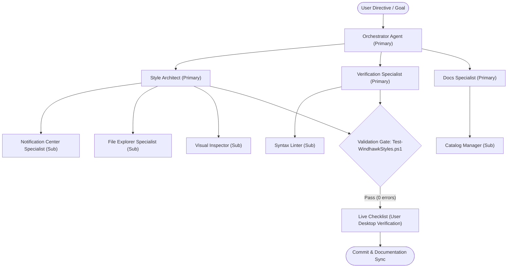

# 🤖 AI Agent Ecosystem (`.agents/`)

This directory contains the operational specifications, mandatory engineering rules, domain skills, and code templates for AI agents, coding assistants, and contributors working on **Windhawk Command Center Suite**.

> 📖 **Primary Operating Manual**: For high-level project status, architectural mandates, and current issue tracking, refer to the root entry point: [**`AGENTS.md`**](../AGENTS.md).  
> 📝 **Tracking Files**: `PLAN.md` (current sprint plan), `TODO.md` (workstream checklist), `BUGS.md` (bug & issue tracker), and `ROADMAP.md` (vision & release milestones) hold active workstream state.

---

## 📁 Ecosystem Structure

| Directory | Purpose | Primary Focus | Link |
|---|---|---|---|
| [**`agents/`**](agents/) | **Agent Roles Catalog** | Focus-area agent teams: primary agents with sub-agents (coordination, engineering, quality, documentation) | [Browse Agents](agents/README.md) |
| [**`rules/`**](rules/) | **Mandatory Rules** | Non-negotiable safety, syntax, design language, and verification rules (Rules 00–09) | [Browse Rules](rules/README.md) |
| [**`skills/`**](skills/) | **Domain Skills** | In-depth technical guides for Windhawk engine, materials, and surface visual trees | [Browse Skills](skills/README.md) |
| [**`templates/`**](templates/) | **Code & Workflow Templates** | Blueprints for themes, target evidence, live checklists, and root tracking files | [Browse Templates](templates/README.md) |

---

## 🔄 Agent Collaboration Workflow

---

## 🛡️ Core Governance & Principles

1. **Safety First (Rule 00)**: Zero irreversible damage to files or live shell sessions; no unverified bulk overwrites.
2. **Zero Unsolicited Injection (Rule 01)**: No unapproved third-party tools, packages, or mods. The suite strictly targets the four approved styler mods.
3. **Command Center Glass Standard (Rule 03)**: Canonical glass materials (`WindhawkBlur`), vertical gradient rim borders, and standard radius tiers across all surfaces.
4. **Target Evidence Protocol (Rule 04)**: No guessed selectors. Every selector must trace to documented visual tree evidence in `docs/targets/`.
5. **Mandatory Static Gate (Rule 07)**: All changes must pass `tools/Test-WindhawkStyles.ps1` before completion.
