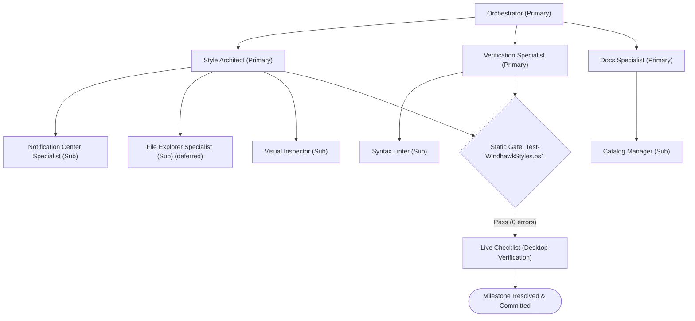

# 👥 Agent Ecosystem Specifications (`.agents/agents/`)

This directory defines the agent team specifications for **Windhawk Theme Repositories**, organized as **primary agents** with **sub-agents** grouped by focus area.

---

## 🏗️ Structure

```
.agents/agents/
├── orchestrator/                    # Coordination (Primary)
├── engineering/                     # Style architecture & XAML mods (Primary + Sub-Agents)
│   └── sub-agents/
├── quality/                         # Static gate & live verification (Primary + Sub-Agents)
│   └── sub-agents/
└── documentation/                   # Tracking files, evidence ledgers, docs (Primary + Sub-Agents)
    └── sub-agents/
```

---

## 🔄 Focus-Area Team Structure



---

## 📋 Agent Catalog

### Primary Agents

| Agent | Focus Area | Key Responsibilities | Specification |
|---|---|---|---|
| **Orchestrator** | Coordination | Task decomposition, roadmap execution, gate enforcement, rollback | [orchestrator/orchestrator](orchestrator/orchestrator.md) |
| **Style Architect** | Engineering | Design token integrity, Rule 03 compliance, XAML grammar, sub-agent ownership | [engineering/style-architect](engineering/style-architect.md) |
| **Verification Specialist** | Quality | Static validation gate, quality checklists, regression prevention | [quality/verification-specialist](quality/verification-specialist.md) |
| **Docs Specialist** | Documentation | Root tracking files, target evidence records, surface documentation | [documentation/docs-specialist](documentation/docs-specialist.md) |

### Sub-Agents

| Sub-Agent | Primary | Key Responsibilities | Specification |
|---|---|---|---|
| **Notification Center Specialist** | Style Architect | `projects/<project>/windows-11-notification-center-styler.yml` (Generated & Verified — polish active), UWP XAML visual tree | [engineering/sub-agents/notification-center-specialist](engineering/sub-agents/notification-center-specialist.md) |
| **File Explorer Specialist** | Style Architect | **Deferred (ROADMAP M.03 — no styler file)**; dormant WinUI 3 XAML tabs, nav, command bar reference | [engineering/sub-agents/file-explorer-specialist](engineering/sub-agents/file-explorer-specialist.md) |
| **Settings Specialist** | Style Architect | Windows 11 Settings Styler (`windows-11-settings-styler`), `SystemSettings.exe` visual tree & cards | [engineering/sub-agents/settings-specialist](engineering/sub-agents/settings-specialist.md) |
| **Visual Inspector** | Style Architect | Live visual tree discovery, hybrid C++/Python TAP inspection, ShareX screenshots | [engineering/sub-agents/visual-inspector](engineering/sub-agents/visual-inspector.md) |
| **Syntax Linter** | Verification Specialist | `tools/Test-WindhawkStyles.ps1` checks, constant ordering, syntax | [quality/sub-agents/syntax-linter](quality/sub-agents/syntax-linter.md) |
| **Catalog Manager** | Docs Specialist | Folder `README.md` catalog sync, tracking file template adherence, milestone summaries | [documentation/sub-agents/catalog-manager](documentation/sub-agents/catalog-manager.md) |

---

## 🎯 Surface Ownership Matrix

| Surface / Styler File | Windhawk Mod | Status | Owner |
|---|---|---|---|
| `projects/<project>/windows-11-taskbar-styler.yml` | `windows-11-taskbar-styler` | Supported reference | Style Architect |
| `projects/<project>/windows-11-start-menu-styler.yml` | `windows-11-start-menu-styler` | Supported reference | Style Architect |
| `projects/<project>/windows-11-notification-center-styler.yml` | `windows-11-notification-center-styler` | Generated & Verified (polish M.02b) | Notification Center Specialist (under Style Architect) |
| File Explorer surface | `windows-11-file-explorer-styler` | Deferred (ROADMAP M.03) — no styler file | File Explorer Specialist (retained for future resumption) |
| Settings surface | `windows-11-settings-styler` | In Base Scope (Tooling & Inspection Supported) | Settings Specialist (under Style Architect) |

> Five styler mods form the canonical base scope under the universal architecture; styler files are organized per theme in `projects/<project>/`. File Explorer is deferred, and Settings is supported in the toolchain.
