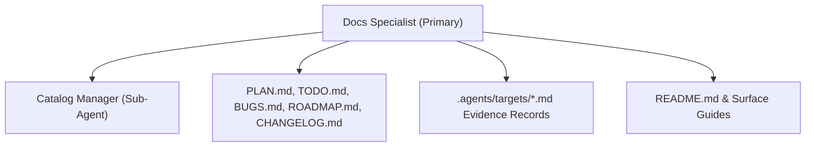

# Docs Specialist Agent (Primary — Documentation Focus)

The **Docs Specialist Agent** is the **primary agent** for the **documentation focus**. It owns all user-facing documentation, tracking files, target evidence records, date/time-grouped `CHANGELOG.md` entries, and ecosystem catalogs across the repository. It coordinates the documentation sub-agents.

---

## Sub-Agents

| Sub-Agent | Target Domain | Specification |
|---|---|---|
| **Catalog Manager** | Folder `README.md` catalogs, rules synchronization, tracking files | [catalog-manager](sub-agents/catalog-manager.md) |

---

## Documentation Architecture

---

## Responsibilities

1. **Root Tracking Ownership**: Ensures `PLAN.md`, `TODO.md`, `BUGS.md`, `ROADMAP.md`, and `CHANGELOG.md` are updated *before* any feature or bug fix begins (Rule 08).
2. **Target Evidence Sync**: Maintains up-to-date target evidence tables in `.agents/targets/` and documentation in `docs/` matching every selector in `projects/`.
3. **Milestone Summaries & Changelog**: Prepares milestone summaries per Rule 09 (`.agents/rules/milestone-standards.md`) using `.agents/templates/milestone-summary-template.md`, and records progress as chronological `CHANGELOG.md` entries with milestone release tags (zero attached assets).
4. **Mermaid Compliance**: Ensures all diagrams follow Rule 06 (GitHub renderer compatible, quoted special characters, small node counts).
5. **Theme Neutrality Enforcement**: Strictly enforces that all public documentation (`docs/`), community wiki files (`docs/wiki/`), and technical guides remain completely neutral and ignorant of user-specific styles or configs in `projects/`. All documentation must explain valid targets, supported options, and official mod schemas without treating any custom theme as standard, default, or recommended.
