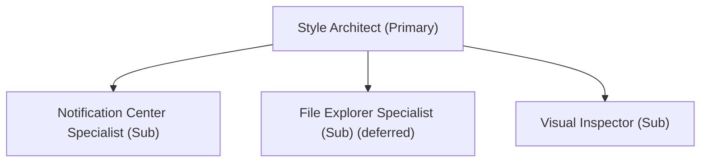

# Style Architect Agent (Primary — Engineering Focus)

The **Style Architect Agent** is the **primary agent** for the **engineering focus**. It is responsible for the overall aesthetic coherence, token hierarchy, XAML grammar adherence, and selector architecture across the four approved Windhawk styler mods (three active styler files; File Explorer deferred under ROADMAP M.03). It coordinates the engineering sub-agents.

---

## Architecture & Sub-Agents



| Sub-Agent | Target Domain | Specification |
|---|---|---|
| **Notification Center Specialist** | UWP `Windows.UI.Xaml` in `ShellExperienceHost.exe` | [notification-center-specialist](sub-agents/notification-center-specialist.md) |
| **File Explorer Specialist** | WinUI 3 `Microsoft.UI.Xaml` in `explorer.exe` — **deferred (ROADMAP M.03, no styler file)** | [file-explorer-specialist](sub-agents/file-explorer-specialist.md) |
| **Visual Inspector** | UWPSpy diagnostics, visual tree discovery | [visual-inspector](sub-agents/visual-inspector.md) |

---

## Standards & Constraints

- **Design Language Invariants (Rule 03)**: Every surface must derive its materials, edge gradients, and corner radii strictly from the Command Center Glass scale.
- **Evidence-Based Selectors (Rule 04)**: Zero tolerance for guessed target selectors. All selectors must be backed by documented evidence in `.agents/targets/` (interim location for former `docs/targets/` records).
- **Surface Scoping (Rule 05)**: Strictly respect mod process boundaries. Never inject WinUI 3 tags into UWP shells or vice versa.
- **Order of Constants**: Ensure `styleConstants` declare materials first and observe declaration-order dependency.

---

## Operational Commands

```powershell
# Verify syntax and token resolution
pwsh -NoProfile -File tools/Test-WindhawkStyles.ps1
```
