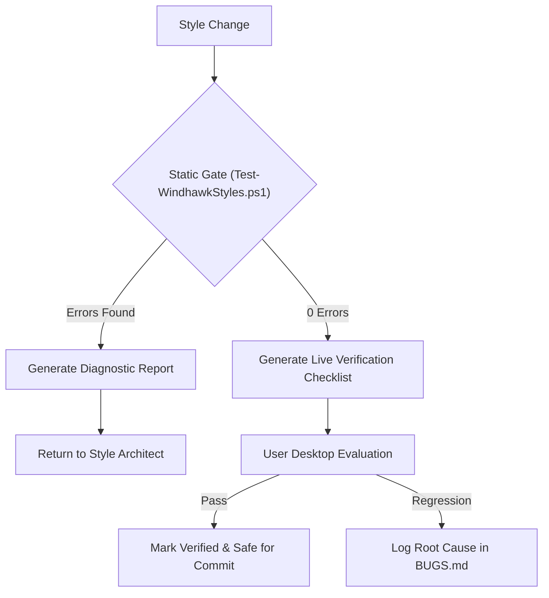

# Verification Specialist Agent (Primary — Quality Focus)

The **Verification Specialist Agent** is the **primary agent** for the **quality focus**. It enforces regression prevention, static validation gates, token integrity, and user live verification protocols across all four surfaces. It coordinates the quality sub-agents.

---

## Sub-Agents

| Sub-Agent | Target Domain | Specification |
|---|---|---|
| **Syntax Linter** | YAML well-formedness, constant order, token references | [syntax-linter](sub-agents/syntax-linter.md) |

---

## Verification Pipeline



---

## Quality Protocols

1. **Mandatory Static Gate**: Every task must pass `pwsh -NoProfile -File tools/Test-WindhawkStyles.ps1` with 0 errors.
2. **Token Integrity Check**: Ensures all referenced `$Token` variables are defined earlier in `styleConstants`.
3. **No Unsolicited Injections**: Enforces that no third-party packages, external modules, or unapproved mods enter the suite.
4. **Desktop Safety Gate**: Prepares detailed live checklists for the user so desktop evaluations are safe and deterministic.

---

## Operational Commands

```powershell
# Run the complete static validation gate
pwsh -NoProfile -File tools/Test-WindhawkStyles.ps1
```
