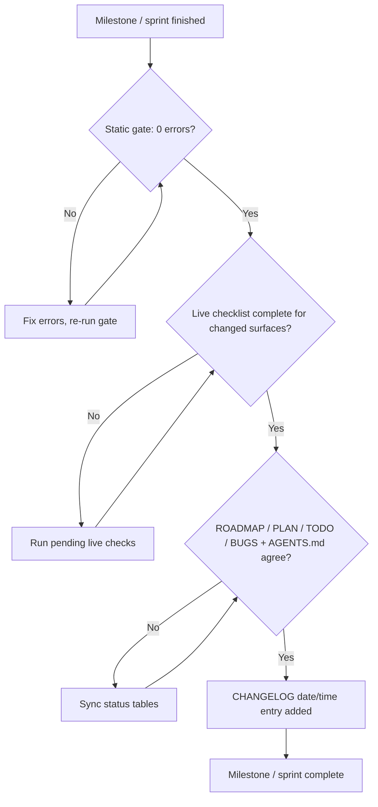

# Rule 09: Milestone & Sprint Tracking Standards

## Purpose

The suite has **no version numbers and no releases**: no SemVer, no `vX.Y.Z`, no `-preview` labels, and no release language anywhere in this repository. Progress is tracked as **milestones and sprints** in the root tracking files and recorded in **date/time-grouped `CHANGELOG.md` entries** (e.g. `## 2026-10-07 - 21:36`). The only version numbers allowed anywhere are **external Windhawk mod versions** (e.g. Taskbar Styler `1.10+`, Notification Center Styler `1.7+`, File Explorer Styler `1.7+`) and **Windows builds** (e.g. 23H2 / 24H2, build 26100.x).

---

## 1. Tracking Model

| Tracking File | Unit | Identifier | Records |
|---|---|---|---|
| `ROADMAP.md` | Milestone | `M.NN` (e.g. `M.02b`, `M.03`) | Suite milestones, status (Planned / Active / Complete / Shelved) |
| `PLAN.md` | Sprint | `Sprint N` (e.g. `Sprint 2`) | The currently executing sprints and their task breakdown |
| `TODO.md` | Workstream | `W.NN` (e.g. `W.03`, `W.04`) | Task checklists per workstream, including locked user directives |
| `BUGS.md` | Issue | Dated entry (`YYYY-MM-DD - Title`) | Bugs and problems; only still-open entries are listed |
| `CHANGELOG.md` | Dated entry | `## YYYY-MM-DD - HH:MM` (e.g. `2026-10-07 - 21:36`) | What changed, grouped by completion date and time — never by version |

1. Every unit of work maps to exactly one `ROADMAP.md` milestone **before** execution starts, and the tracking files are updated first (Rule 08 §3).
2. `CHANGELOG.md` entries are date/time-grouped only, newest first. Each entry carries at most one `Added`, one `Removed`, one `Changed`, and one `Fixed` section (omit empty ones; never repeat a section type within an entry), with items formatted `- **Title**: description`. Never write `v1.2.3`, `-preview`, "release", "released", or a suite version number anywhere in the repository.
3. Progress is milestones/sprints, not versions: "done" means the completion gate (§4) passed — there is nothing to version, tag, or publish.
4. External Windhawk mod versions and Windows builds are recorded where relevant (§2) but are never presented as suite versions.

---

## 2. Per-Surface Compatibility Record

Every milestone/sprint summary and every `CHANGELOG.md` entry that touches a surface keeps a per-surface compatibility record: one row per styler file, never omitted.

| Styler File | Windhawk Mod (ID) | Mod Version Verified Against | Windows 11 Build(s) | Suite Status |
|---|---|---|---|---|
| `src/windows-11-taskbar-styler.yml` | Taskbar Styler (`windows-11-taskbar-styler`) | Taskbar Styler `1.10+` | unverified | ✅ Shipped |
| `src/windows-11-start-menu-styler.yml` | Start Menu Styler (`windows-11-start-menu-styler`) | Start Menu Styler `1.7+` | unverified | ✅ Shipped |
| `src/windows-11-notification-center-styler.yml` | Notification Center Styler (`windows-11-notification-center-styler`) | Notification Center Styler `1.7+` | unverified | ✅ Generated & Verified (follow-up polish: ROADMAP M.02b / TODO W.04) |
| *No styler file — deferred* | File Explorer Styler (`windows-11-file-explorer-styler`) | File Explorer Styler `1.7+` | unverified | ⏸️ Deferred — no file (ROADMAP M.03, TODO W.03) |

1. **Mod versions are external Windhawk mod versions**, never suite versions.
2. **Windows builds** are the builds a surface was actually live-verified on (e.g. `24H2 (build 26100.x)`), as reported by the user's completed live checklist. Until a build is recorded, the cell is written **`unverified`** — never left blank and never dropped.
3. The **File Explorer row stays in the table permanently**: the mod is approved under Rule 01's four-mod boundary, but no styler file exists (it was generated, then discontinued — git 1cc49e9) and none may be created without a new explicit user directive (deferred rationale recorded in ROADMAP M.03 / TODO W.03).
4. Row statuses must agree with Rule 01's status table, the `AGENTS.md` status tables, and `ROADMAP.md` (§4).

---

## 3. Milestone Summaries

1. When a milestone (`M.NN`) or sprint (`Sprint N`) completes, write a summary using [`milestone-summary-template`](../templates/milestone-summary-template.md).
2. The summary records the milestone/sprint id and date, the §2 per-surface compatibility record, verification results (static gate + live checklist), and known issues linked to `BUGS.md`.
3. Summaries contain **no version numbers** — only milestone/sprint ids, dates, external mod versions, and Windows builds.

---

## 4. Milestone/Sprint Completion Gate

A milestone or sprint is complete only when all four conditions hold:

1. **Static gate: 0 errors** — `pwsh -NoProfile -File tools/Test-WindhawkStyles.ps1` passes with zero errors (Rule 07 §1); warnings are resolved or justified in the handoff.
2. **Live checklist complete** — [`.agents/templates/live-verification-checklist.md`](../templates/live-verification-checklist.md) is completed by the user for **every surface changed** in the milestone/sprint (Rule 07 §2).
3. **Tracker agreement** — `ROADMAP.md`, `PLAN.md`, `TODO.md`, `BUGS.md`, and the `AGENTS.md` status tables agree on every surface and milestone status they share.
4. **CHANGELOG entry** — a date/time-grouped entry (`## YYYY-MM-DD - HH:MM`) is added to `CHANGELOG.md` describing the change, with no version or release language.

