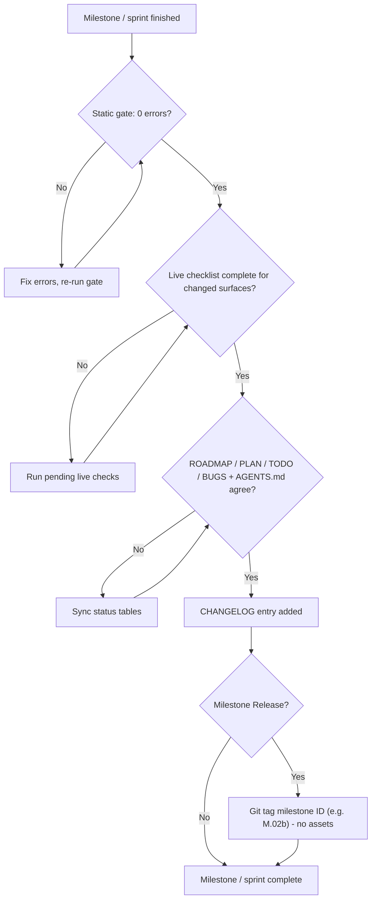

# Rule 09: Milestone & Release Standards

## Purpose

This project does not use normal semantic versioning (`vX.Y.Z`). Instead, everything in this project is tracked by **Milestones** with **Sprint tracking** for active tasks:
- **Milestones as Major Units**: Milestones (`M.NN`) are the major milestones of progress, architecture, and feature sets.
- **Sprints as Step Progress**: Sprints (`Sprint N` / `W.NN`) are how we track progress on each individual step within a milestone.
- **Milestone-Based Releases**: Because all progress is tracked by Milestones rather than arbitrary version numbers, our releases are **milestone-based rather than version-based**. Release tags and versions use the milestone identifier directly (e.g., `M.01`, `M.02`, `M.02b`, `M.03`).
- **Occasional Checkpoints**: Releases are performed occasionally upon milestone completion to maintain clean, traceable version control and historical checkpoints.
- **Zero Asset Attachments**: Releases carry **no attached assets** (no zip files, packages, or compiled binaries). The release is strictly the git tag and the verified repository state.
- **External Versions Only**: The only other version numbers referenced anywhere are external Windhawk mod versions (e.g., Taskbar Styler `1.10+`, Notification Center Styler `1.7+`, Settings Styler `1.0+`) and Windows 11 builds (e.g., `24H2 build 26100.x`).

---

## 1. Tracking Model

| Tracking File | Unit | Identifier | Records |
|---|---|---|---|
| `ROADMAP.md` | Milestone | `M.NN` (e.g. `M.02b`, `M.03`) | Suite milestones, release status (Planned / Active / Complete / Shelved) |
| `PLAN.md` | Sprint | `Sprint N` (e.g. `Sprint 2`) | The currently executing sprints and their task breakdown |
| `TODO.md` | Workstream | `W.NN` (e.g. `W.03`, `W.04`) | Task checklists per workstream, including locked user directives |
| `BUGS.md` | Issue | Dated entry (`YYYY-MM-DD - Title`) | Bugs and problems; only still-open entries are listed |
| `CHANGELOG.md` | Dated entry | `## YYYY-MM-DD - HH:MM` (e.g. `2026-10-09 - 11:25`) | Chronological changes grouped by completion date, time, and milestone release tag |

1. Every unit of work maps to exactly one `ROADMAP.md` milestone **before** execution starts, and tracking files are updated first (Rule 08 §3).
2. `CHANGELOG.md` entries are chronological, newest first. Each entry carries at most one `Added`, one `Removed`, one `Changed`, and one `Fixed` section (omit empty ones), with items formatted `- **Title**: description`. Entries can reference the milestone release tag when a release is made.
3. When a milestone completes and passes all quality gates (§4), an occasional release tag matching the milestone ID (e.g. `M.02b`) can be created for version control, with no attached assets.
4. External Windhawk mod versions and Windows builds are recorded in compatibility records (§2) but are never confused with suite milestone tags.

---

## 2. Per-Surface Compatibility Record

Every milestone/sprint summary and every `CHANGELOG.md` entry that touches a surface keeps a per-surface compatibility record: one row per base styler mod, never omitted.

| Styler File | Windhawk Mod (ID) | Mod Version Verified Against | Windows 11 Build(s) | Status |
|---|---|---|---|---|
| `projects/<project>/windows-11-taskbar-styler.yml` | Taskbar Styler (`windows-11-taskbar-styler`) | Taskbar Styler `1.10+` | unverified | ✅ Supported reference |
| `projects/<project>/windows-11-start-menu-styler.yml` | Start Menu Styler (`windows-11-start-menu-styler`) | Start Menu Styler `1.7+` | unverified | ✅ Supported reference |
| `projects/<project>/windows-11-notification-center-styler.yml` | Notification Center Styler (`windows-11-notification-center-styler`) | Notification Center Styler `1.7+` | unverified | ✅ Supported reference |
| *— (styler file optional)* | Settings Styler (`windows-11-settings-styler`) | Settings Styler `1.0+` | unverified | 🌐 In base scope |
| *— (styler file optional)* | File Explorer Styler (`windows-11-file-explorer-styler`) | File Explorer Styler `1.7+` | unverified | ⏸️ Deferred (ROADMAP M.03) |

1. **Mod versions are external Windhawk mod versions**, never suite milestone versions.
2. **Windows builds** are the builds a surface was actually live-verified on (e.g. `24H2 (build 26100.x)`), as reported by the user's completed live checklist. Until a build is recorded, the cell is written **`unverified`** — never left blank and never dropped.
3. Row statuses must agree with Rule 01's status table, the `AGENTS.md` status tables, and `ROADMAP.md` (§4).

---

## 3. Milestone Summaries & Release Notes

1. When a milestone (`M.NN`) or sprint (`Sprint N`) completes, write a summary using [`milestone-summary-template`](../templates/milestone-summary-template.md).
2. The summary records the milestone id, date, release tag (if tagged), §2 per-surface compatibility record, verification results (static gate + live checklist), and known issues linked to `BUGS.md`.
3. When creating an occasional GitHub Release, use the milestone summary as the release notes, with **zero attached assets**.

---

## 4. Milestone/Sprint Completion & Release Gate

A milestone or sprint is complete and eligible for release tagging only when all four conditions hold:

1. **Static gate: 0 errors** — `pwsh -NoProfile -File tools/Test-WindhawkStyles.ps1` passes with zero errors (Rule 07 §1); warnings are resolved or justified.
2. **Live checklist complete** — [`.agents/templates/live-verification-checklist.md`](../templates/live-verification-checklist.md) is completed by the user for **every surface changed** in the milestone/sprint (Rule 07 §2).
3. **Tracker agreement** — `ROADMAP.md`, `PLAN.md`, `TODO.md`, `BUGS.md`, and the `AGENTS.md` status tables agree on every surface and milestone status they share.
4. **CHANGELOG entry** — a date/time-grouped entry (`## YYYY-MM-DD - HH:MM`) is added to `CHANGELOG.md` describing the change, noting the milestone release tag when tagged.

