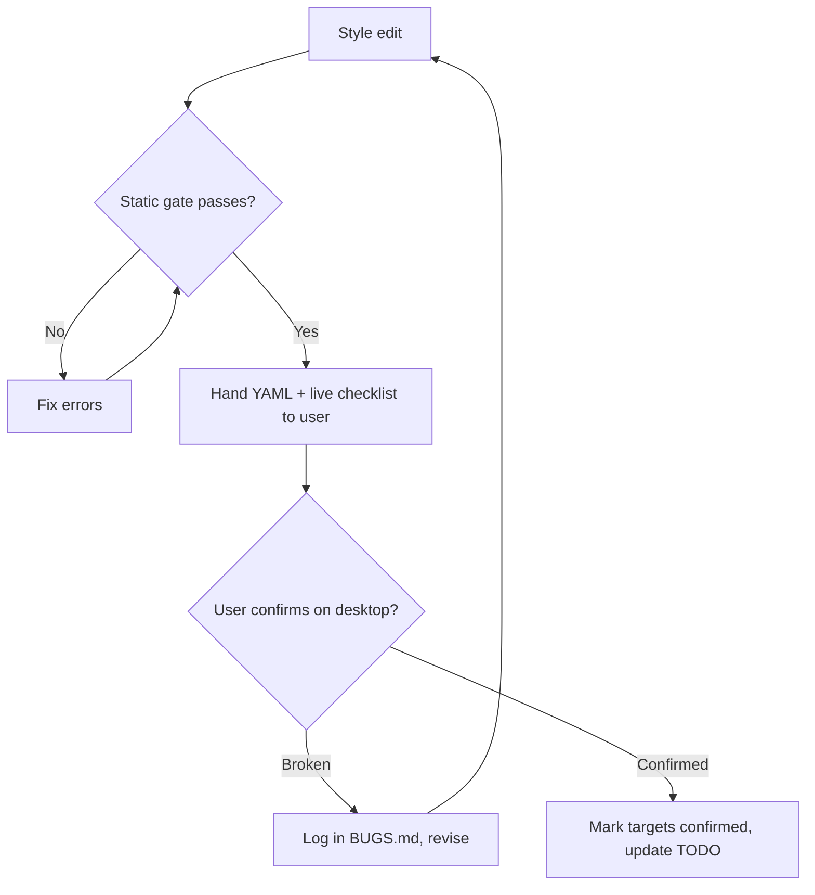

# Rule 07: Verification Standards (Static Gate + Live Checklist)

## Purpose

Styles cannot be unit-tested — they render inside Windows shell processes on the user's desktop, which agents cannot see. Verification is therefore split into a **static gate** agents run themselves and a **live checklist** the user runs. Both are mandatory; neither may be faked.



---

## 1. Static Gate (agent-run, mandatory)

```powershell
pwsh -NoProfile -File tools/Test-WindhawkStyles.ps1            # all in-scope styler files
pwsh -NoProfile -File tools/Test-WindhawkStyles.ps1 -Path projects/command-center/windows-11-notification-center-styler.yml
```

The gate enforces:

| Code | Severity | Check |
|---|---|---|
| `E001` | Error | File contains tab characters |
| `E002` | Error | Mixed line endings (suite standard is CRLF) |
| `E003` | Error | `$Token` referenced but never declared in `styleConstants` |
| `E004` | Error | Constant declared with a leading `$` in its name (`- $BB1=…`) |
| `E005` | Error | `controlStyles` entry has a `target` but no `styles` items |
| `E006` | Error | Unknown top-level key for that mod (see [Rule 05](surface-scope-standards.md)) |
| `E007` | Error | Personal path or user-profile data (`C:\Users\…`) |
| `E008` | Error | Constant declared twice |
| `W101` | Warning | Duplicate `target` selector in one file |
| `W102` | Warning | Declared constant never referenced (materials exempt) |
| `W103` | Warning | `CornerRadius` literal outside the Rule 03 scale |
| `W104` | Warning | Material constants missing or not canonical (Rule 03 §2.1) |
| `W105` | Warning | Empty style placeholder (`- ''`) still present |
| `W106` | Warning | Localized `AutomationProperties.Name` selector (EN-only, Rule 04 §2.3) |

1. **Errors fail the gate.** Warnings must be resolved or justified in the handoff.
2. Pre-existing issues in **shipped** files are listed in `tools/style-baseline.ini` and tracked in `BUGS.md`. The baseline may only shrink; adding an entry to hide a new problem is a Rule 00 violation.
3. YAML well-formedness: the gate performs a structural line check (no PowerShell Gallery YAML module is permitted — Rule 01). Because of that, agents must also keep files in the strict house format of [Rule 02](windhawk-styler-syntax.md) so the line check is meaningful.

---

## 2. Live Checklist (user-run, mandatory for "done")

1. Every style handoff includes a filled-in [`live-verification-checklist`](../templates/live-verification-checklist.md): how to apply, which windows/states to open, what each region should look like, and what to report back.
2. Checks must cover **light and dark mode**, at least one **accent color change**, and every visual state the edit touched (hover, pressed, selected, disabled, expanded/collapsed).
3. Notification Center checks include: notifications present vs. empty, calendar expanded vs. collapsed, Quick Settings main page vs. a sub-page (Wi-Fi/Bluetooth/volume output), media controls active vs. absent, a live toast.
4. File Explorer checks *(reference only — File Explorer deferred, ROADMAP M.03; apply only if a styler file is ever created under a new explicit user directive)*: single vs. multiple tabs, Home vs. a folder vs. Gallery, address bar edit mode, search box focused, details/preview pane open, a context menu, window focused vs. unfocused.

---

## 3. Reporting Language

| Say | Never say |
|---|---|
| "Static gate passed (0 errors, 2 justified warnings). Live checklist pending." | "Tested and working." |
| "User confirmed regions 1–6 on build 26100; region 7 pending." | "Should look great." |
| "Target is T5 inference; needs T1 confirmation." | "This is the correct target." |
