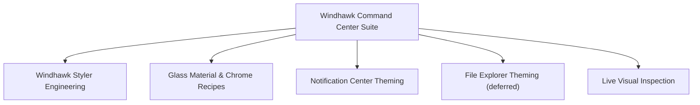

# 🧠 Agent Technical Skills & Domain Guides (`.agents/skills/`)

This directory contains technical skill guides, visual tree domain architectures, and styling recipes for the **Windhawk Command Center Suite**.

---

## 📋 Skills Catalog

| Skill | Target Domain | Core Focus | Guide File |
|---|---|---|---|
| **Windhawk Styler Engineering** | Core Engine | Dynamic visual tree hook, selector resolution, precedence | [windhawk-styler-engineering](windhawk-styler-engineering.md) |
| **Glass Material & Chrome Recipes** | Visual Aesthetics | `WindhawkBlur`, `AcrylicBrush`, gradient rims, inner resets | [glass-material-recipes](glass-material-recipes.md) |
| **Notification Center Theming** | Surface S1 | UWP visual tree, Quick Settings, calendar, media, jump lists | [notification-center-theming](notification-center-theming.md) |
| **File Explorer Theming** *(deferred — reference)* | Surface S2 | WinUI 3 tabs, nav bar, command bar, Win32 file list boundary | [file-explorer-theming](file-explorer-theming.md) |
| **Live Visual Inspection** | Tooling | UWPSpy procedures, process selection, selector extraction | [live-visual-inspection](live-visual-inspection.md) |

---

## 🗺️ Subsystem Architecture Mapping

