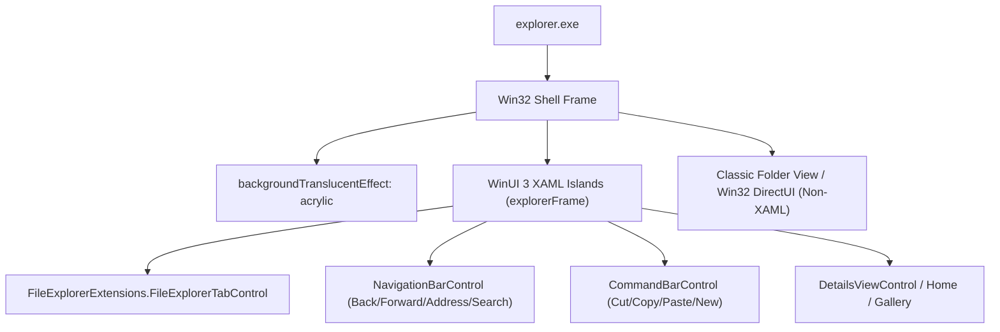

# Skill: File Explorer Theming

## Purpose

Domain-specific technical architecture and visual tree guide for theming Windows 11 File Explorer using `windows-11-file-explorer-styler`.

---

## 1. Process & Architecture

- **Host Process**: `explorer.exe`.
- **Framework**: WinUI 3 `Microsoft.UI.Xaml`.
- **Mod Version**: 1.7.



---

## 2. The Win32 DirectUI File List Boundary

> [!IMPORTANT]
> The classic file list (where files, folders, and details columns appear) and the left tree view are **Win32 DirectUI controls**, NOT XAML elements.
> - They cannot be selected or styled with `controlStyles`.
> - To make the entire File Explorer window translucent, the mod provides:
>   ```yaml
>   backgroundTranslucentEffect: acrylic
>   backgroundTranslucentEffectRegion: "" # Entire window
>   ```
> - In mod v1.7+, this applies whole-window GDI alpha rendering with AccentBlurBehind across both light and dark modes.

---

## 3. Key XAML Visual Tree Elements & Targets

### 3.1 Tab Control & Tabs
- `FileExplorerExtensions.FileExplorerTabControl`: Root tab control.
- `Grid#TabContainerGrid`: Tab strip container.
- `TabViewItem`: Individual tab item.
- `TabViewItem > Grid#LayoutRoot@CommonStates`: Tab background and states (`Normal`, `PointerOver`, `Selected`, `PointerOverSelected`).
- `TabViewItem > Grid#LayoutRoot > Canvas > Path#SelectedBackgroundPath`: Selected tab active background shape.
- `Grid#TabContainerGrid > Border > Button#AddButton`: "+" new tab button.

### 3.2 Navigation & Address Bar
- `FileExplorerExtensions.NavigationBarControl#NavigationBarControl > Grid#NavigationBarControlGrid`: Nav bar row.
- `AppBarButton#backButton`, `AppBarButton#forwardButton`, `AppBarButton#upButton`: History navigation buttons.
- `Grid#FileExplorerAddressBarGrid`: Address bar container.
- `FileExplorerExtensions.AddressBarControl`: Breadcrumb navigation control.
- `AutoSuggestBox#PART_AutoSuggestBox > Grid#LayoutRoot > TextBox#TextBox`: Editable address text box.

### 3.3 Search Box
- `AutoSuggestBox#FileExplorerSearchBox`: Search box control.
- `AutoSuggestBox#FileExplorerSearchBox > Grid#LayoutRoot > TextBox#TextBox`: Search input field.

### 3.4 Command Bar
- `CommandBar#FileExplorerCommandBar`: Main command bar.
- `FileExplorerExtensions.CommandBarControl_Wave1 > Grid`: Command bar row container (older/variant builds).
- `Grid#CommandBarControlRootGrid`: Modern command bar root grid.
- `AppBarButton[ToolTipService.ToolTip = Cut]`: Specific action button targeted by tooltip.
- `Button#MoreButton`: "..." overflow menu button.

### 3.5 Context Menus & Details Pane
- `CommandBarOverflowPresenter#SecondaryItemsControl > Grid#LayoutRoot`: Command bar overflow menu border.
- `Microsoft.UI.Xaml.Controls.Primitives.CommandBarFlyoutCommandBar`: Modern context menu top row.
- `Grid#DetailsViewControlRootGrid`: Details pane container.
- `Grid#HomeViewRootGrid`: "Home" start page root.
- `FileExplorerExtensions.GalleryViewControl#GalleryViewControl`: "Gallery" view root.
