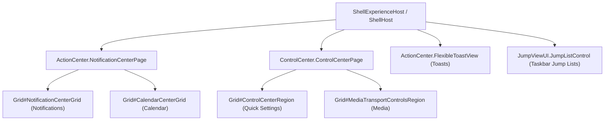

# Skill: Notification Center & Action Center Theming

## Purpose

Domain-specific technical architecture and visual tree guide for theming Windows 11 Notification Center, Action Center / Quick Settings, Calendar, Media Controls, and Toasts using `windows-11-notification-center-styler`.

---

## 1. Process & Architecture

- **Host Process**: `ShellExperienceHost.exe` (Win11 21H2–23H2) and `ShellHost.exe` (Win11 24H2).
- **Framework**: UWP `Windows.UI.Xaml`.
- **Mod Version**: 1.7.

---

## 2. Key Visual Tree Elements & Targets

### 2.1 Main Flyout Containers
- `Grid#NotificationCenterGrid`: Main notifications panel.
- `Grid#CalendarCenterGrid`: Lower calendar flyout panel.
- `Grid#ControlCenterRegion`: Quick Settings flyout panel (Wi-Fi, Bluetooth, volume, etc.).
- `Grid#NotificationCenterTopBanner`: Top banner above notifications.

### 2.2 Notifications & Toasts
- `Border#ToastBackgroundBorder`, `Border#ToastBackgroundBorder2`: Background cards for popup toasts.
- `ActionCenter.FlexibleToastView#FlexibleNormalToastView`: Notification toast wrapper.
- `ActionCenter.NotificationListViewItem`: Notification entry in the history list.
- `Button#DismissButton`: Dismiss notification button.
- `Button#ClearAll`: "Clear all" notifications button.

### 2.3 Calendar Center
- `ScrollViewer#CalendarControlScrollViewer`: Calendar scroll/view area.
- `CalendarViewDayItem > Border`: Day cell background in month grid.
- `Button#ExpandCollapseButton`: Chevron toggling calendar view size.
- `StackPanel#CalendarHeader`: Month and year navigation header.

### 2.4 Control Center & Quick Actions (L1 & L2)
- `Grid#L1Grid > Border`: Quick action toggles grid background.
- `ControlCenter.PaginatedToggleButton#ToggleButton`: Quick action toggle button (Wi-Fi, Bluetooth).
- `ControlCenter.AsyncSlider`, `Grid#SliderContainer`: Volume and Brightness slider container.
- `Rectangle#HorizontalTrackRect`: Inactive slider track (`$OverlayColor`).
- `Rectangle#HorizontalDecreaseRect`: Active slider fill (`$AccentColor`).
- `Primitives.Thumb#HorizontalThumb`: Slider draggable thumb.
- `QuickActions.ControlCenter.AccessibleWindow#PageWindow > ContentPresenter > Grid#FullScreenPageRoot`: Secondary (L2) page (e.g. Wi-Fi network picker, Sound output selector).

### 2.5 Media Transport Controls
- `Grid#MediaTransportControlsRegion`: Media player card container.
- `Grid#ThumbnailImage`: Album art container.
- `StackPanel#PrimaryAndSecondaryTextContainer > TextBlock#Title`: Track title.
- `Button#PlayPauseButton`, `RepeatButton#PreviousButton`, `RepeatButton#NextButton`: Playback buttons.

### 2.6 Taskbar Jump Lists
- `Border#JumpListRestyledAcrylic`: Flyout border for taskbar right-click jump lists.
- `JumpViewUI.JumpListListViewItem > Grid#LayoutRoot > Border#BackgroundBorder`: Individual jump list item.
