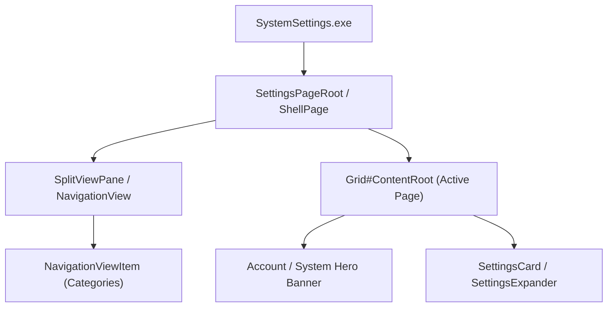

# Skill: Windows 11 Settings Theming

## Purpose

Domain-specific technical architecture and visual tree guide for styling Windows 11 Settings (`SystemSettings.exe`) using `windows-11-settings-styler`.

---

## 1. Process & Framework Scope

- **Host Process**: `SystemSettings.exe`
- **Framework**: UWP / WinUI 2/3 `Windows.UI.Xaml`
- **Surface Key**: `settings` (Keyboard shortcut: `Win+I`)
- **Inspection**: Supported natively via `python tools/inspect_xaml.py -p SystemSettings.exe`

---

## 2. Key Visual Tree Elements & Targets

### 2.1 Navigation & Shell Structure
- `SplitView#RootSplitView`: Master split view separating navigation pane from content.
- `SplitViewPane`: Left navigation sidebar background and frame.
- `NavigationViewItem`: Individual category navigation pills (System, Bluetooth & devices, Network & internet, Personalization, etc.).
- `AutoSuggestBox#SearchBox`: Settings search pill.

### 2.2 Content Layout & Page Containers
- `Grid#ContentRoot`: Main content host for the selected category.
- `ScrollViewer`: Vertical scrolling host for page contents.
- `Page`: Active category page component.

### 2.3 Settings Cards & Groups
- `SettingsCard`: Individual setting row card (toggles, links, status indicators).
- `SettingsExpander`: Expandable setting card revealing nested configuration options.
- `StackPanel#SettingsGroup`: Vertical container grouping related setting cards.

### 2.4 Hero & Account Badges
- Top hero banner displaying computer name, Windows build, rename PC button, and Microsoft Account avatar.

---

## 3. Glass & Acrylic Theming Principles

1. **Collapsing Opaque Native Fills**: Reset native opaque panel backgrounds (`Background:=Transparent`) to allow foundation `WindhawkBlur` to shine through.
2. **Layered Card Elevation**: Apply `$ElementBackground` and `$BorderBrush` (top-lit gradient rim) to `SettingsCard` and `SettingsExpander` to establish floating glass cards.
3. **Harmonized Corner Radii**:
   - Navigation search box: `$SearchRadius` (L / 25)
   - Settings cards and expanders: `$CardRadius` (S / 10)
   - Flyouts and contextual menus: `$MenuRadius` (XS / 6)
