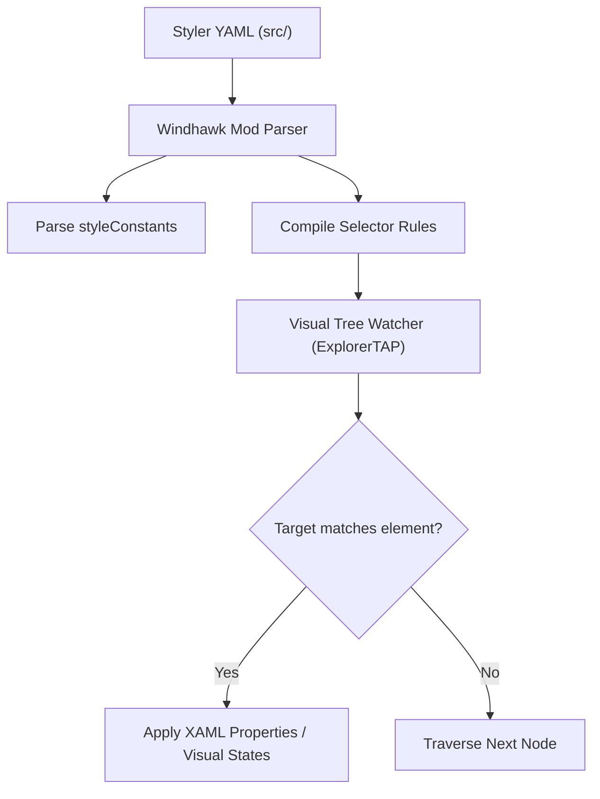

# Skill: Windhawk Styler Engineering

## Purpose

Comprehensive technical guide for engineering, modifying, and troubleshooting style files for Windhawk styler mods (`windows-11-taskbar-styler`, `windows-11-start-menu-styler`, `windows-11-notification-center-styler`, `windows-11-file-explorer-styler`).

---

## 1. Windhawk Styler Architecture

Windhawk stylers work by injecting a dynamic XAML visual tree watcher into target Windows shell processes (via Microsoft Detours and Windows XAML Diagnostics hooks).
- When a window or flyout opens, the styler traverses the visual tree.
- For every element matching a `target` selector, it assigns properties or visual state triggers.
- Updates apply **live** without recompilation.

---

## 2. Style Resolution & Execution Rules

1. **Evaluation Timing**:
   - A target selector is evaluated when a control enters the visual tree or completes template expansion.
   - If properties change dynamically later without triggering a visual state transition, the selector is **not** re-evaluated.
2. **Order of Precedence**:
   - Styles appearing later in `controlStyles` override earlier conflicting styles for the same property.
   - User `styleConstants` override built-in theme constants of the same name.
3. **Empty Property Clearing**:
   - Assigning `Shadow:=` or `Background:=` with an empty value clears that property to null/default.

---

## 3. Selector Engineering Best Practices

1. **Avoid Overly Broad Targets**:
   - Never use bare generic types like `Grid` or `Border` without `#Name`, `[Property=Value]`, or strict parent chaining.
2. **Use Wildcards Sparingly**:
   - `Parent > * > Child` is useful for traversing dynamic wrapper controls, but introduces evaluation overhead. Use direct child chains `>` whenever the hierarchy is known.
3. **Targeting Visual State Groups**:
   - To style hover or pressed states, attach `@VisualStateGroupName` to the target (e.g. `TabViewItem > Grid#LayoutRoot@CommonStates`).
   - Then apply styles using `Property@StateName:=...` (e.g. `Background@PointerOver:=$OverlayColor`).
