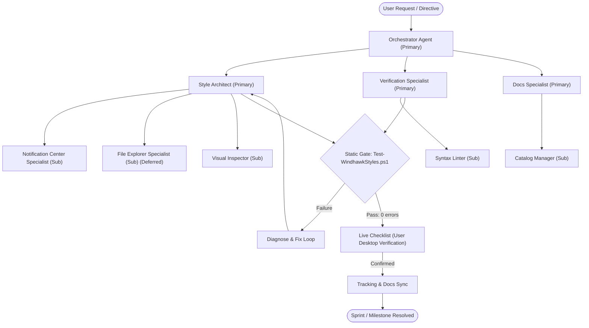

# AGENTS

This document is the central entry point and operating manual for all AI agents, coding assistants, and automated agents working on **Windhawk Styler Theme Repositories**.

> **Tracking Files**: `PLAN.md` (current sprint plan), `TODO.md` (task checklist), `BUGS.md` (bug & issue tracker), `ROADMAP.md` (suite milestones), and `CHANGELOG.md` (date/time-grouped history) hold active workstream state. All architecture rules, standards, and permanent documentation reside in root Markdown files, `AGENTS.md`, and `.agents/`.
>
> **Project-Specific Overlays**: Theme-specific assets, custom recipes, and design token overlays (e.g. Command Center tokens) reside in `.agents/projects/<project>/` (gitignored to maintain universal portability).

---

## Universal Multi-Mod Theming Architecture

The ecosystem provides a unified, structured workflow for engineering, validating, and maintaining cohesive themes across Windows 11 using official Windhawk styler mods.

### Base Intended Styler Mods

The agent ecosystem and hybrid C++/Python toolset are engineered as a **universal, portable standard** for any repository managing Windhawk themes. While extensible to other Windhawk mods as needed, the architecture defines **five primary official Windhawk styler mods** as its canonical base scope:

| Styler File | Windhawk Mod ID | Target Process | Framework | Status |
|---|---|---|---|---|
| `projects/command-center/windows-11-taskbar-styler.yml` | `windows-11-taskbar-styler` | `explorer.exe` | WinUI 3 / XAML | ✅ Supported reference |
| `projects/command-center/windows-11-start-menu-styler.yml` | `windows-11-start-menu-styler` | `StartMenuExperienceHost.exe` | UWP / WinUI 2 | ✅ Supported reference |
| `projects/command-center/windows-11-notification-center-styler.yml` | `windows-11-notification-center-styler` | `ShellExperienceHost.exe` / `ShellHost.exe` | UWP `Windows.UI.Xaml` | ✅ Supported reference |
| *— (styler file optional)* | `windows-11-file-explorer-styler` | `explorer.exe` | WinUI 3 `Microsoft.UI.Xaml` | 🌐 In base scope (WinUI 3 chrome theming) |
| *— (styler file optional)* | `windows-11-settings-styler` | `SystemSettings.exe` | UWP / WinUI 2/3 `Windows.UI.Xaml` | 🌐 In base scope (inspection & tooling supported) |

### Core Theming Principles
- **Unified Frosted Blur**: Consistent `WindhawkBlur` and tinting providing the foundation glass surface across all shell windows.
- **Top-Lit Rim Lighting**: Vertical gradient border brushes establishing crisp glass edges against diverse wallpapers.
- **Harmonized Radii Scale**: Proportional scale tiers (XL for top-level panels, L for search pills, M for groups, S for tiles/buttons, XS for context menus).
- **Intentional Depth Layering**: Foundation surfaces host layered glassy cards, pills, and tiles to establish rich depth and hierarchy; native opaque system fills and hard drop shadows are collapsed.

---

## Agent Ecosystem Architecture & Orchestration

The repository operates on a multi-agent team model where agents collaborate, decompose tasks, enforce evidence-backed selectors, and validate against static and live quality gates.



---

## Agent Team Catalog & Capabilities

Agents are organized as **primary agents with sub-agents** grouped by focus area under `.agents/agents/` (see [`.agents/agents/README.md`](.agents/agents/README.md)).

| Agent | Focus Area | Key Responsibilities | Specification File |
|---|---|---|---|
| **Orchestrator** | Coordination (Primary) | Task decomposition, roadmap execution, primary coordination, gating, rollback | [orchestrator](.agents/agents/orchestrator/orchestrator.md) |
| **Style Architect** | Engineering (Primary) | Design token integrity, Rule 03 compliance, XAML grammar, sub-agent ownership | [style-architect](.agents/agents/engineering/style-architect.md) |
| **Notification Center Specialist** | Engineering (Sub) | `projects/command-center/windows-11-notification-center-styler.yml`, UWP visual tree, Quick Settings, calendar, toasts | [notification-center-specialist](.agents/agents/engineering/sub-agents/notification-center-specialist.md) |
| **File Explorer Specialist** | Engineering (Sub) | ⏸️ Deferred (ROADMAP M.03) — dormant domain reference for a future `projects/command-center/windows-11-file-explorer-styler.yml` | [file-explorer-specialist](.agents/agents/engineering/sub-agents/file-explorer-specialist.md) |
| **Settings Specialist** | Engineering (Sub) | Windows 11 Settings Styler (`windows-11-settings-styler`), `SystemSettings.exe` visual tree & cards | [settings-specialist](.agents/agents/engineering/sub-agents/settings-specialist.md) |
| **Visual Inspector** | Engineering (Sub) | Visual tree discovery, hybrid C++/Python TAP inspection, ShareX screenshots | [visual-inspector](.agents/agents/engineering/sub-agents/visual-inspector.md) |
| **Verification Specialist** | Quality (Primary) | Static validation gate, quality checklists, regression prevention | [verification-specialist](.agents/agents/quality/verification-specialist.md) |
| **Syntax Linter** | Quality (Sub) | `tools/Test-WindhawkStyles.ps1` checks, constant ordering, syntax hygiene | [syntax-linter](.agents/agents/quality/sub-agents/syntax-linter.md) |
| **Docs Specialist** | Documentation (Primary) | Root tracking files, target evidence records, surface documentation | [docs-specialist](.agents/agents/documentation/docs-specialist.md) |
| **Catalog Manager** | Documentation (Sub) | Folder README catalogs, tracking file template adherence, milestone summaries | [catalog-manager](.agents/agents/documentation/sub-agents/catalog-manager.md) |

---

## Standard Agent Execution Capabilities

All agents have access to and must leverage the repository's standard execution toolset:
1. **File System Operations**: Read, write, and patch YAML and Markdown files with surgical precision.
2. **Static Gate Execution**: Run the automated syntax and token validation tool:
   ```powershell
   pwsh -NoProfile -File tools/Test-WindhawkStyles.ps1
   ```
3. **Live Checklist Preparation**: Generate comprehensive desktop verification checklists using `.agents/templates/live-verification-checklist.md`.
4. **Target Evidence Sourcing**: Source all target selectors from official Windhawk mod source code, settings schemas, and community theme references without manual UWPSpy inspection burden.
5. **Hybrid XAML Visual Tree Inspection**: Programmatically capture and query the live UWP / WinUI 3 trees of the approved shell processes using the hybrid C++/Python toolchain. The tool automatically opens surfaces (`start`, `action-center`, `notification-center`, `search`) via UI automation to ensure background UWP trees are populated, closes them automatically, features generous 30s connection heartbeat loops for OS permission prompts, and supports ShareX screenshot captures (`--screenshot`) via the user's custom keybinds:
   ```powershell
   python tools/inspect_xaml.py --list
   python tools/inspect_xaml.py -p StartMenuExperienceHost.exe --find ActionsBar
   python tools/inspect_xaml.py -p ShellHost.exe --surface notification-center --screenshot
   ```
   See [`tools/README.md`](tools/README.md) for full options. Lock screen (`LockApp.exe`) is never automated.
6. **Scratch Workspace Organization**: All temporary, local-only scratch files (`scratch/`) must be sorted into dedicated format subfolders (`powershell/`, `python/`, `json/`, `images/`, `docs/`, `text/`, `cpp/`, `yml/`). New format subfolders are created dynamically as needed.

---

## Agent Rules (`.agents/rules/`)

All agent actions are bound by `.agents/rules/`:
- **Rule 00 (`agent-safety-compliance`)**: Safety invariants, zero irreversible damage, no unauthorized Explorer restarts.
- **Rule 01 (`zero-unsolicited-injection`)**: Runtime boundary — five base approved styler mods (Start Menu, Taskbar, Notification Center, Settings, File Explorer); no unapproved packages or injection tools.
- **Rule 02 (`windhawk-styler-syntax`)**: YAML and XAML syntax standards, quoting, constant declaration order.
- **Rule 03 (`design-language-standards`)**: Canonical theme tokens, materials, layered glass hierarchy, and radius scales.
- **Rule 04 (`target-evidence-protocol`)**: Sourced selectors only (official mod themes & source code). No guessing.
- **Rule 05 (`surface-scope-standards`)**: Process targets (`explorer.exe`, `ShellExperienceHost.exe`, `SystemSettings.exe`), WinUI 3 vs UWP.
- **Rule 06 (`mermaid-standards`)**: GitHub-compatible Mermaid diagrams, quoted special characters, max 12 nodes.
- **Rule 07 (`verification-standards`)**: Mandatory static gate (`tools/Test-WindhawkStyles.ps1`) and user live checklist.
- **Rule 08 (`documentation-standards`)**: Documentation architecture (root Markdown files, GitHub Pages site in `docs/`, `projects/<project>/extras/README.md`, and `.agents/` ecosystem; folder `README.md` files are the canonical indexes — no `index.md` files).
- **Rule 09 (`milestone-standards`)**: Milestone-based releases and version control (using milestone tags such as `M.01`, `M.02b`; no attached assets), per-surface compatibility records, and completion gates.
