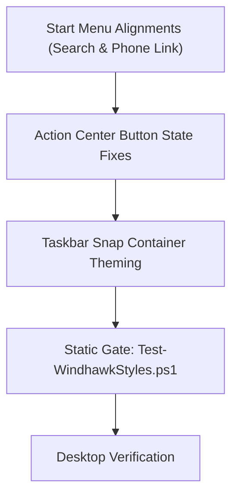

# Windhawk Command Center Suite — Active Sprint Planning

> 🗺️ **Living Source of Truth**: Active sprint roadmap and task breakdown for Windhawk Command Center Suite.

> [!IMPORTANT]
> AI agents strictly required to update this page and all related pages **before** working on any new bug fixes or features and push it to the remote first, without exception. Failure to do so may result in working with outdated information and potentially introducing conflicts or redundant work. 

---

## 📜 Tracking Rules

- **No Typo Duplication**: When recording user reports, clean and fix all typos to preserve professional quality.
- **Consistent Formatting**: Maintain consistent formatting and style throughout all documentation to ensure readability and professionalism.
- **Clear Sectioning**: Use clear and descriptive headers for each section to improve navigation and readability.
- **Active Items First**: The currently active milestone, sprint, task, or workstream must always be placed at the top of the content sections.
- **Regular Updates**: Ensure that the roadmap is regularly updated to reflect the latest developments and changes in the project.
- **Improve User Directives**: Continuously refine and clarify user directives to ensure they are easily understood and actionable.
- **Accessibility Invariant**: Accommodate the user's poor eyesight by exhausting official mod sources and community themes first to avoid manual visual tree inspection.
- **Always Track Everything**: Every new feature request, enhancement, or bug report must be logged in [`BUGS.md`](./BUGS.md), [`TODO.md`](./TODO.md), and [`ROADMAP.md`](./ROADMAP.md) before execution.

---

## 🎯 Active Sprints

### 🚀 Sprint 2: Start Menu Alignment Refinements, Action Center Quick Settings Fixes & Snap Containers Theming

> High-precision alignment of Start Menu search and companion toggle, geometry tightening between panels, Action Center split-button theming fixes, and taskbar snap container glass styling.

#### 📝 Tasks



1. **Start Menu Search & Phone Link Geometry Alignment**:
    - **Top Card Vertical Alignment**: Move Phone Link companion cards up so they align flush with the top of the menu (bringing the search box into perfect horizontal alignment to their left).
    - **Inter-Panel Gap Reduction**: Reduce extra horizontal spacing between the Start Menu main content and Phone Link companion section for a cohesive single-surface aesthetic.
    - **Search Box & Toggle Sizing**: Shrink the search box width and adjust margins so that:
        - The **left edge of the search box** aligns flush with the **left edge of the pinned apps section**.
        - The **right edge of the companion toggle button** (`ToggleButton#ShowHideCompanion`) aligns flush with the **right edge of the pinned apps section**.
2. **Notification / Action Center Button Color & Split Button Refinement**:
    - Fix Quick Settings toggle buttons and split buttons (`SplitL2Button`, chevron button, toggle button) where colors are inconsistently applied across states (ref: `media_1791431699608_c575da8b.png`).
    - Resolve the split-button mismatch where one half displays accent color and the chevron half displays bright high-contrast blue.
    - Ensure unified `$ElementBackground`, `$BorderBrush`, and `$AccentColor` state styling across all quick action tiles (Wi-Fi, Bluetooth, Airplane mode, Accessibility, Energy saver, Live captions).
3. **Taskbar Snap Layout Containers Theming**:
    - Inspect and theme internal elements of the Snap Layout container (`SnapLayoutControl`, `LayoutBorder`, `LayoutGrid`) to ensure full Command Center glass cohesion without disrupting layout calculation coordinates.
4. **Taskbar System Tray Overflow Grid Glass Background**:
    - Restore frosted glass background (`$Background`), top-lit border (`$BorderBrush`), and matching corner radius to the system tray overflow flyout (`Grid#OverflowRootGrid > Border` and `Border#OverflowFlyoutBackgroundBorder`), repairing the missing background shown in `media_1791432063085_e18460b5.png`.

---

## ✅ Completed Sprints

### ✅ Sprint 1.5: Windows 11 Notification Center Styler Initial Generation
- Full initial generation of `src/windows-11-notification-center-styler.yml` targeting `windows-11-notification-center-styler`.
- Frosted glass and rim highlights applied across Notification Center panel, Calendar grid, Quick Actions, Sliders, and Toasts.
- Static gate validation (`tools/Test-WindhawkStyles.ps1`) verified passing with 0 errors and 0 warnings.
- *Active follow-up polish, split-button theming, and chevron state fixes are actively tracked in Sprint 2.*

### ✅ Sprint 1: Agent Ecosystem Foundation & Static Gate Establishment
- Established Rules 00–09, Domain Skills, Agent Specifications, and Governance Templates.
- Automated static validation gate (`tools/Test-WindhawkStyles.ps1`) and baseline ledger.
- Root tracking files initialized and synchronized with repository.

---

## 🛠️ Verification Commands

```powershell
# Run the complete static validation gate
pwsh -NoProfile -File tools/Test-WindhawkStyles.ps1
```

---

## 🔖 Metadata

- **Project**: Windhawk Command Center Suite · **version** 1.0.0-preview
- **Agent Ecosystem:** [`AGENTS.md`](./AGENTS.md) and [`.agents/`](.agents/) are tracked directly in repository git tracking.
