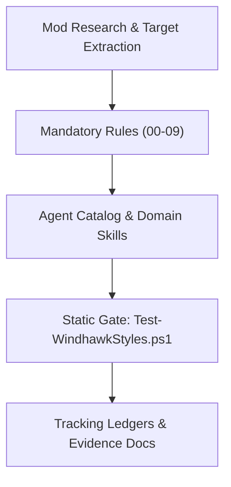

# Windhawk Command Center Suite — Active Sprint Planning

> 🗺️ **Living Source of Truth**: Active sprint roadmap and task breakdown for Windhawk Command Center Suite.

> [!IMPORTANT]
> AI agents strictly required to update this page and all related pages **before** working on any new bug fixes or features and push it to the remote first, without exception. Failure to do so may result in working with outdated information and potentially introducing conflicts or redundant work. 

---

## 📜 Tracking Rules

- **No Typo Duplication**: When recording user reports, clean and fix all typos to preserve professional quality.
- **Consistent Formatting**: Maintain consistent formatting and style throughout all documentation to ensure readability and professionalism.
- **Clear Sectioning**: Use clear and descriptive headers for each section to improve navigation and readability.
- **Active Items First**: The currently active milestone, sprint, task, or workstream must always be placed at the top of the content sections.
- **Regular Updates**: Ensure that the roadmap is regularly updated to reflect the latest developments and changes in the project.
- **Improve User Directives**: Continuously refine and clarify user directives to ensure they are easily understood and actionable.
- **Accessibility Invariant**: Accommodate the user's poor eyesight by exhausting official mod sources and community themes first to avoid manual visual tree inspection.
- **Always Track Everything**: Every new feature request, enhancement, or bug report must be logged in [`BUGS.md`](./BUGS.md), [`TODO.md`](./TODO.md), and [`ROADMAP.md`](./ROADMAP.md) before execution.

---

## 🎯 Active Sprints

### 🚀 Sprint 1: Agent Ecosystem Foundation & Static Gate Establishment

> Complete the comprehensive agent ecosystem modeled after `D:\Projects`, establish mandatory rules and skills, compile target evidence records without requiring manual UWPSpy inspection, and establish static validation tooling.

#### 📝 Tasks 



1. **Multi-Agent Governance Architecture**:
    - Establish Rules 00 through 09 under `.agents/rules/` covering safety, syntax, design language, target evidence, surface scope, Mermaid diagrams, validation, and documentation.
    - Establish Domain Skills in `.agents/skills/` covering styler engineering, glass materials, notification center theming, file explorer theming, and visual inspection.
    - Establish Focus-Area Primary & Sub-Agent specifications in `.agents/agents/`.
    - Create root `AGENTS.md` operating manual.
2. **Quality Gate & Evidence Compilation**:
    - Implement `tools/Test-WindhawkStyles.ps1` static validation gate.
    - Create baseline ledger `tools/style-baseline.txt`.
    - Compile target evidence records in `docs/targets/` from official mod source code, eliminating manual UWPSpy requirements.
    - Instantiate root tracking files (`TODO.md`, `PLAN.md`, `BUGS.md`, `ROADMAP.md`).

---

## ✅ Completed Sprints

*(Sprint 1 is completing with this turn).*

---

## 🛠️ Verification Commands

```powershell
# Run the complete static validation gate
pwsh -NoProfile -File tools/Test-WindhawkStyles.ps1
```

---

## 🔖 Metadata

- **Project**: Windhawk Command Center Suite · **version** 1.0.0-preview
- **Agent Ecosystem:** [`AGENTS.md`](./AGENTS.md) and [`.agents/`](.agents/) are tracked directly in repository git tracking.
