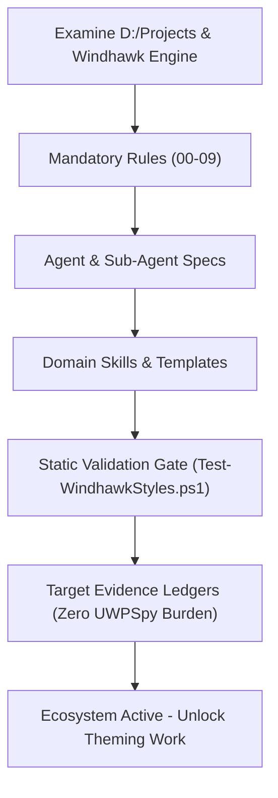

# Windhawk Command Center Suite — Suite Roadmap & Release Milestones

> 🗺️ **Living Source of Truth**: Comprehensive roadmap, phased delivery milestones, and version status for the Windhawk Command Center Suite.

> [!IMPORTANT]
> AI agents strictly required to update this page and all related pages **before** working on any new bug fixes or features and push it to the remote first, without exception. Failure to do so may result in working with outdated information and potentially introducing conflicts or redundant work. 

---

## 📜 Tracking Rules

- **No Typo Duplication**: When recording user reports, clean and fix all typos to preserve professional quality.
- **Consistent Formatting**: Maintain consistent formatting and style throughout all documentation to ensure readability and professionalism.
- **Clear Sectioning**: Use clear and descriptive headers for each section to improve navigation and readability.
- **Active Items First**: The currently active milestone, sprint, task, or workstream must always be placed at the top of the content sections.
- **Regular Updates**: Ensure that the roadmap is regularly updated to reflect the latest developments and changes in the project.
- **Improve User Directives**: Continuously refine and clarify user directives to ensure they are easily understood and actionable.
- **Accessibility Invariant**: Accommodate the user's poor eyesight by exhausting official mod sources and community themes first to avoid manual visual tree inspection.
- **Always Track Everything**: Every new feature request, enhancement, or bug report must be logged in [`BUGS.md`](./BUGS.md), [`TODO.md`](./TODO.md), and [`ROADMAP.md`](./ROADMAP.md) before execution.

---

## 🗺️ Repository Milestone Overview

| Milestone | Target Version | Category | Status | Primary Focus |
| :--- | :--- | :--- | :--- | :--- |
| **M.01** | `v1.0.0-preview` | Governance | 🚧 Active | Multi-Agent Ecosystem, Mandatory Rules & Static Gate |
| **M.02** | `v1.1.0-preview` | Theming | ⏳ Planned | Windows 11 Notification Center Styler Generation |
| **M.03** | `v1.2.0-preview` | Theming | ⏳ Planned | Windows 11 File Explorer Styler Generation |
| **M.04** | `v1.3.0` | Release | ⏳ Planned | Unified Suite General Availability & Live Verification |

---

## 🚀 Active Milestones

### Milestone M.01: Agent Ecosystem Foundation & Static Gate Establishment



Build a complete, production-grade agent ecosystem matching the patterns in `D:\Projects`, complete with 10 mandatory rules, domain skills, focus-area agent specifications, templates, static gate tooling, and sourced target evidence to establish an impenetrable foundation before theme generation begins.

#### 🧭 Architecture & Implementation Phases

1. **Governance & Architectural Invariants**:
    - Establish Rules 00–09: Safety, Zero Unsolicited Injection, Syntax Standards, Command Center Glass tokens, Target Evidence, Surface Scope, Mermaid Diagrams, Verification, Documentation, and SemVer.
    - Provide accessibility accommodation for the user's eyesight by eliminating manual UWPSpy requirements.
2. **Domain Skills & Templates**:
    - Provide 5 technical skill guides covering Windhawk engine hooks, glass recipes, Notification Center, File Explorer, and inspection.
    - Implement blueprints, checklists, and tracking schemas.
3. **Primary & Sub-Agent Specifications**:
    - Define Orchestrator, Style Architect (with NC, FE, and Visual Inspector sub-agents), Verification Specialist (with Syntax Linter), and Docs Specialist (with Catalog Manager).
4. **Automated Static Gate**:
    - Create `tools/Test-WindhawkStyles.ps1` enforcing all syntax and token invariants without external modules.
    - Create baseline tracking ledger `tools/style-baseline.txt`.

---

## 📋 Planned Milestones

### Milestone M.02: Windows 11 Notification Center Styler Generation

- Implementation of `src/windows-11-notification-center-styler.yml`.
- Frosted glass and rim border applied to Notification Center, Calendar, Control Center (Quick Actions), Media Controls, Toasts, and Taskbar Jump Lists.
- Static gate validation and desktop verification checklist.

### Milestone M.03: Windows 11 File Explorer Styler Generation

- Implementation of `src/windows-11-file-explorer-styler.yml`.
- Whole-window translucent acrylic effect (`backgroundTranslucentEffectRegion: ""`) to theme the Win32 file list.
- Frosted glass styling for WinUI 3 tabs, nav bar, breadcrumbs, search box, command bar, and modern context menus.
- Static gate validation and desktop verification checklist.

### Milestone M.04: Unified Suite Release & Verification

- Full suite verification across all four mods on Windows 11.
- Release notes publication and documentation completion.

---

## 🛠️ Verification Commands

```powershell
# Run the complete static validation gate
pwsh -NoProfile -File tools/Test-WindhawkStyles.ps1
```

---

## 🔖 Metadata

- **Project**: Windhawk Command Center Suite · **version** 1.0.0-preview
- **Agent Ecosystem:** [`AGENTS.md`](./AGENTS.md) and [`.agents/`](.agents/) are tracked directly in repository git tracking.
