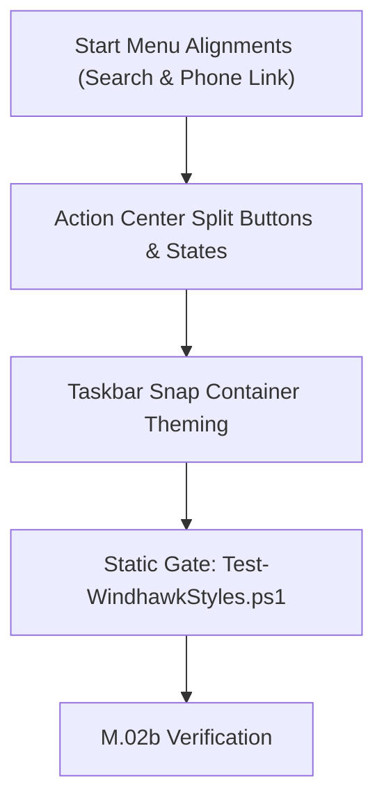

# Windhawk Command Center Suite — Suite Roadmap & Milestones

> 🗺️ **Living Source of Truth**: Comprehensive roadmap, phased delivery milestones, and progress status for the Windhawk Command Center Suite. The project tracks progress via milestones and sprints — it does not use versioned releases.

> [!IMPORTANT]
> AI agents strictly required to update this page and all related pages **before** working on any new bug fixes or features and push it to the remote first, without exception. Failure to do so may result in working with outdated information and potentially introducing conflicts or redundant work. 

---

## 📜 Tracking Rules

- **No Typo Duplication**: When recording user reports, clean and fix all typos to preserve professional quality.
- **Consistent Formatting**: Maintain consistent formatting and style throughout all documentation to ensure readability and professionalism.
- **Clear Sectioning**: Use clear and descriptive headers for each section to improve navigation and readability.
- **Active Items First**: The currently active milestone, sprint, task, or workstream must always be placed at the top of the content sections.
- **Regular Updates**: Ensure that the roadmap is regularly updated to reflect the latest developments and changes in the project.
- **Improve User Directives**: Continuously refine and clarify user directives to ensure they are easily understood and actionable.
- **Accessibility Invariant**: Accommodate the user's poor eyesight by exhausting official mod sources and community themes first to avoid manual visual tree inspection.
- **Always Track Everything**: Every new feature request, enhancement, or bug report must be logged in [`BUGS.md`](./BUGS.md), [`TODO.md`](./TODO.md), and [`ROADMAP.md`](./ROADMAP.md) before execution.

---

## 🗺️ Repository Milestone Overview

| Milestone | Category | Status | Primary Focus |
| :--- | :--- | :--- | :--- |
| **M.01** | Governance | ✅ Complete | Multi-Agent Ecosystem, Mandatory Rules & Static Gate |
| **M.02** | Theming | ✅ Complete | Windows 11 Notification Center Styler Generation |
| **M.02b** | Refinement | 🚀 Active | Suite Polish: Start Menu Header Alignment, Action Center Split Buttons & Snap Theming |
| **M.03** | Theming | ⏸️ Shelved | Windows 11 File Explorer Styler (Deferred per user decision) |
| **M.04** | Verification | ⏳ Planned | Unified Suite Verification & Documentation Completion |

---

## 🚀 Active Milestones

### Milestone M.02b: Suite Polish & Cross-Styler Geometry Alignment



Refine spatial alignments, panel margins, split-button visual states, and internal container styling across the active styler mods:
1. **Start Menu Header Geometry**: Move Phone Link companion cards up flush with menu top; tighten inter-panel horizontal gap; align search box left edge and companion toggle right edge flush with the pinned apps card.
2. **Action Center Quick Settings**: Resolve split-button color mismatch (Wi-Fi/Bluetooth chevrons) and harmonize unselected button states (`media_1791431699608_c575da8b.png`).
3. **Taskbar Snap Layout Containers**: Theme internal snap layout containers with Command Center glass while preserving layout calculations.

---

## 📋 Milestones Status

### ✅ Milestone M.01: Agent Ecosystem Foundation & Static Gate Establishment (Completed)
- Established Rules 00–09, Domain Skills, Agent Roles, Templates, and Static Gate.

---

### ✅ Milestone M.02: Windows 11 Notification Center Styler Generation (Completed)

- Implementation of `src/windows-11-notification-center-styler.yml` targeting `windows-11-notification-center-styler`.
- Frosted glass and rim border applied to Notification Center, Calendar, Control Center (Quick Actions), Media Controls, Toasts, and Taskbar Jump Lists.
- Compact media layout, ElementBackground tokens, and verified hover borders.
- Static gate validation (0 errors, 0 warnings) and user desktop verification complete.
- *Active follow-up polish, split-button theming, and button color fixes are actively tracked in Milestone M.02b.*

### ⏸️ Milestone M.03: Windows 11 File Explorer Styler Generation (Shelved / Deferred)

- Evaluated live styling on Windows 11 File Explorer; styler file was generated, then discontinued (git `1cc49e9`).
- Shelved per user directive (2026-10-07): deferred due to a lack of plausible customizations — other already-existing styles are too similar, so there is no real benefit to maintaining our own File Explorer style just yet.
- Additional standing constraint: any future attempt must avoid intrusive third-party translucency injectors (e.g. TranslucentWindows) that affect other programs.
- File Explorer styler generation remains deferred until a differentiated design direction is identified.

### ⏳ Milestone M.04: Unified Suite Verification & Completion

- Full suite verification across all four mods on Windows 11.
- Changelog entries and documentation completion.

---

## 🛠️ Verification Commands

```powershell
# Run the complete static validation gate
pwsh -NoProfile -File tools/Test-WindhawkStyles.ps1
```

---

## 🔖 Metadata

- **Project**: Windhawk Command Center Suite · tracked via milestones/sprints (no versioned releases)
- **Agent Ecosystem:** [`AGENTS.md`](./AGENTS.md) and [`.agents/`](.agents/) are tracked directly in repository git tracking.
