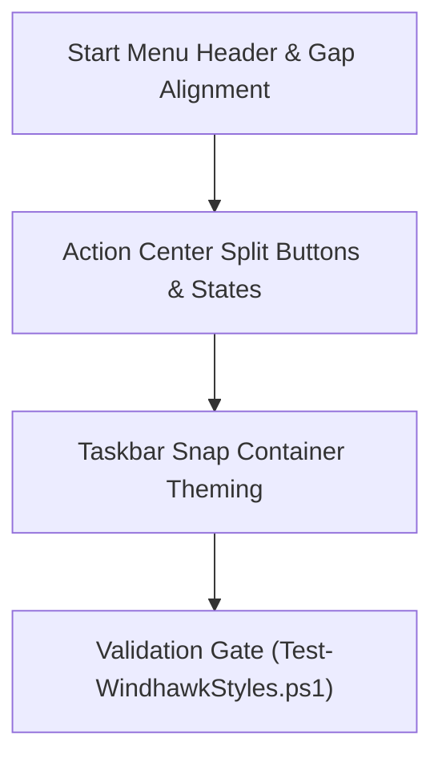
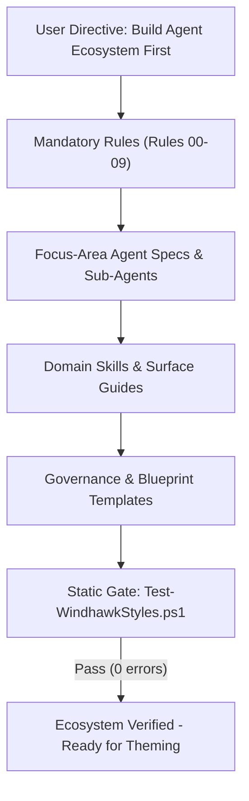
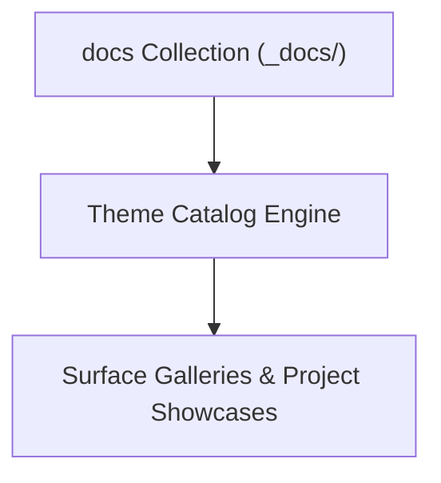
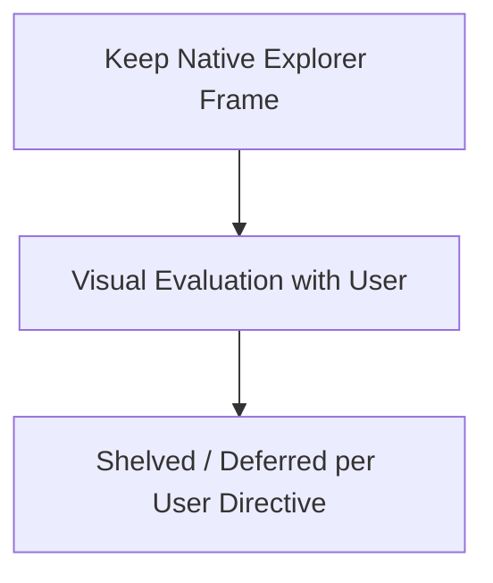
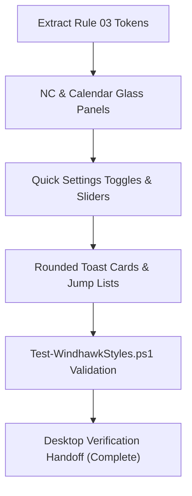

# Windhawk Themes — Task Checklist & Workstream Tracking

> 📋 **Living Source of Truth**: Active workstream checklist for the Windhawk Themes framework, theme projects, agent ecosystem governance, and quality verification.

> [!IMPORTANT]
> AI agents strictly required to update this page and all related pages **before** working on any new bug fixes or features and push it to the remote first, without exception. Failure to do so may result in working with outdated information and potentially introducing conflicts or redundant work. 

---

## 📜 Tracking Rules

- **No Typo Duplication**: When recording user reports, clean and fix all typos to preserve professional quality.
- **Consistent Formatting**: Maintain consistent formatting and style throughout all documentation to ensure readability and professionalism.
- **Clear Sectioning**: Use clear and descriptive headers for each section to improve navigation and readability.
- **Active Items First**: The currently active milestone, sprint, task, or workstream must always be placed at the top of the content sections.
- **Regular Updates**: Ensure that the roadmap is regularly updated to reflect the latest developments and changes in the project.
- **Improve User Directives**: Continuously refine and clarify user directives to ensure they are easily understood and actionable.
- **Accessibility Invariant**: Accommodate the user's poor eyesight by exhausting official mod sources and community themes first to avoid manual visual tree inspection.
- **Always Track Everything**: Every new feature request, enhancement, or bug report must be logged in [`BUGS.md`](./BUGS.md), [`TODO.md`](./TODO.md), and [`ROADMAP.md`](./ROADMAP.md) before execution.

---

## 🔥 Active Workstreams

### 🎯 Workstream W.04: Suite Refinements — Start Menu Alignment, Action Center Quick Settings Fixes & Snap Theming



Refine spatial alignment in the Start Menu and companion pane, resolve color mismatches on Action Center Quick Settings split buttons, and theme internal Snap Layout elements.

**Locked user directives:**
- "The phone link cards should be moved up so they align with the top of the menu (this way the search box is perfectly aligned to the left of them as well)."
- "The extra space between the start menu sections and phone link sections needs to be reduced for improved visuals."
- "The search box needs to have its width shrunk so the toggle button is evenly lined up with the pinned app section under it."
- "Basically the left edge of the search box needs to align with the left edge of the pinned apps section while the right edge of the phone link toggle button should align with the right edge of the pinned apps section."
- "The notification/action center needs a bit of fixing. some areas are not applied correctly... section buttons are not getting the correct colors due to how things are applied."
- "Snap containers internal elements still aren't themed... we need to get that styled to match our styling."

**Implementation checklist:**
- [ ] **Start Menu Search & Companion Alignment & Layering**:
    - [x] Restore compact panel width (470px MainMenu, 3-column pins, 2-column categories) per user preference.
    - [x] Eliminate right drift and center pinned apps within card with balanced padding.
    - [x] Align search box width and spacing to avoid clipping into Phone Link toggle button.
    - [x] Adjust overall height (`MaxHeight=790`) so panel is slightly taller than wide.
    - [x] Preserve all custom styling, cards, and status icons intact.
- [ ] **Notification / Action Center Split Buttons & Colors**:
    - [ ] Unify backgrounds and borders across both segments of Quick Settings split buttons (`SplitL2Button`, chevron button, toggle button).
    - [ ] Fix color mismatch where one half displays `$AccentColor` and the chevron half displays bright high-contrast blue (`media_1791431699608_c575da8b.png`).
    - [ ] Apply canonical `$ElementBackground` and `$BorderBrush` to unselected/inactive state tiles (Wi-Fi, Bluetooth, Airplane mode, Accessibility, Energy saver, Live captions).
- [ ] **Taskbar Snap Layout Containers Theming**:
    - [ ] Style internal snap containers (`SnapLayoutControl`, `LayoutBorder`, `Grid#LayoutGrid > Button`) with frosted glass and subtle borders without breaking tile coordinate calculations.
- [ ] **Taskbar System Tray Overflow Grid Glass Background**:
    - [ ] Restore frosted glass background (`$Background`), top-lit border (`$BorderBrush`), and matching corner radius to the system tray overflow flyout (`Grid#OverflowRootGrid > Border` and `Border#OverflowFlyoutBackgroundBorder`) per `media_1791432063085_e18460b5.png`.
- [ ] **Validation & Quality Gate**:
    - [ ] Pass `tools/Test-WindhawkStyles.ps1` with 0 errors and 0 warnings.
    - [ ] Conduct live verification on user desktop.



Build the comprehensive, production-grade AI agent ecosystem modeled after the multi-agent patterns in `D:\Projects`, complete with mandatory rules, focus-area agent specifications, domain skills, governance templates, static validation gates, and tracking infrastructure.

**Locked user directives:**

- "The file-explorer and notification-center styles need to be built. that is our plan for this project. but we need our agents ecosystem first so we don't mess up."
- "This repository's purpose will be for maintaining my Command Center suite for the following Windhawk mods: Windows 11 Notification Center Styler, Windows 11 Start Menu Styler, Windows 11 Taskbar Styler, Windows 11 File Explorer Styler."
- "I also have UWPSpy added to system path. However, I would prefer not having to work with it myself since I have poor eyesight. So if it is needed, it will be used, but if you are able to work without it, I would prefer that."
- "Look at the start-menu-styler.yml and taskbar-styler.yml files to know what the style I am going for is. Note, these are Windhawk styles for specific Windhawk mods. So your first step MUST be to build a detailed and extensive agents ecosystem matching the structure used in my other projects located in D:\Projects. Until that is built and completed, we don't generate the yml code at all."
- "Due to File Explorer limitations, we won't be able to provide the transparent main bg without heavy Windows modification. That is something we want to avoid. So we will have to improvise and find a command center style for File Explorer that doesn't require us to make certain elements invisible or hidden."
- "We also want to avoid using Translucent Windows, since it causes issues with some programs. So all of our styles need to use methods that don't require the TranslucentWindows mod to work."

**Implementation checklist:**

- [x] Survey existing agent ecosystem architectures across `D:\Projects` (`HELIX-Discord-Bot`, `Magick-Studio`, `NH-Reader`, `Universal-Game-Launcher`).
- [x] Research Windhawk mod engines, settings keys, target selectors, and XAML frameworks via official repositories (`ramensoftware/windhawk-mods`).
- [x] Establish Mandatory Agent Rules (`.agents/rules/`):
    - [x] Rule 00: Agent Safety, Instruction Compliance & Damage Prevention (`agent-safety-compliance.md`).
    - [x] Rule 01: Dependency, Mod & Asset Approval (Zero Unsolicited Injection) (`zero-unsolicited-injection.md`).
    - [x] Rule 02: Windhawk Styler YAML & XAML Syntax Standards (`windhawk-styler-syntax.md`).
    - [x] Rule 03: Suite Design Language — "Command Center Glass" (`design-language-standards.md`).
    - [x] Rule 04: Target Evidence Protocol (No Guessed Selectors) & Accessibility Accommodations (`target-evidence-protocol.md`).
    - [x] Rule 05: Surface Scope, Mod Capabilities & Invariants (`surface-scope-standards.md`).
    - [x] Rule 06: GitHub-Flavored Mermaid & Diagram Standards (`mermaid-standards.md`).
    - [x] Rule 07: Verification Standards (Static Gate + Live Checklist) (`verification-standards.md`).
    - [x] Rule 08: Documentation Standards & Ecosystem Synchronization (`documentation-standards.md`).
    - [x] Rule 09: Milestone & Sprint Tracking Standards (`milestone-standards.md`; originally `release-standards.md`, reworked 2026-10-07 — the project uses milestones/sprints, not versioned releases).
    - [x] Rules catalog (`README.md`; `index.md` files were removed repo-wide — folder `README.md` files are the canonical indexes).
- [x] Establish Engineering Governance Templates (`.agents/templates/`):
    - [x] Styler Theme Blueprint Template (`styler-theme-template.md`).
    - [x] Target Evidence Ledger Template (`target-evidence-template.md`).
    - [x] Live Desktop Verification Checklist Template (`live-verification-checklist.md`).
    - [x] Commit Message & PR Title Guide (`commit-message-guide.md`).
    - [x] Milestone Summary Template (`milestone-summary-template.md`; originally `release-notes-template.md`, renamed 2026-10-07).
    - [x] Root Tracking Templates (`root-plan-file-template.md`, `root-todo-file-template.md`, `root-bugs-file-template.md`, `root-roadmap-file-template.md`, `root-changelog-file-template.md`).
    - [x] Templates catalog (`README.md`; `index.md` removed repo-wide).
- [x] Establish Domain Skills Guides (`.agents/skills/`):
    - [x] Windhawk Styler Engineering (`windhawk-styler-engineering.md`).
    - [x] Glass Material & Chrome Recipes (`glass-material-recipes.md`).
    - [x] Notification Center Theming (`notification-center-theming.md`).
    - [x] File Explorer Theming (`file-explorer-theming.md`).
    - [x] Live Visual Inspection (`live-visual-inspection.md`).
    - [x] Skills catalog (`README.md`; `index.md` removed repo-wide).
- [x] Establish Focus-Area Agent Specifications (`.agents/agents/`):
    - [x] Orchestrator Primary Agent (`orchestrator/orchestrator.md`).
    - [x] Style Architect Primary Agent (`engineering/style-architect.md`).
        - [x] Notification Center Specialist Sub-Agent (`engineering/sub-agents/notification-center-specialist.md`).
        - [x] File Explorer Specialist Sub-Agent (`engineering/sub-agents/file-explorer-specialist.md`).
        - [x] Visual Inspector Sub-Agent (`engineering/sub-agents/visual-inspector.md`).
    - [x] Verification Specialist Primary Agent (`quality/verification-specialist.md`).
        - [x] Syntax Linter Sub-Agent (`quality/sub-agents/syntax-linter.md`).
    - [x] Docs Specialist Primary Agent (`documentation/docs-specialist.md`).
        - [x] Catalog Manager Sub-Agent (`documentation/sub-agents/catalog-manager.md`).
    - [x] Agent team catalog (`README.md`; `index.md` removed repo-wide — Surface Ownership Matrix merged into `README.md`).
- [x] Source verified target selectors from official Windhawk mod source code and community themes without manual UWPSpy inspection burden.
- [x] Instantiate Central Operating Manual (`AGENTS.md`), companion mod documentation (`projects/command-center/extras/README.md`), and Root Tracking Ledgers (`TODO.md`, `PLAN.md`, `BUGS.md`, `ROADMAP.md`, `README.md`).

### ⏳ Workstream W.05: Theme Catalog Architecture & Showcase Integration (Planned)



- [ ] **Docs Collection Catalog Engine**: Utilize the Jekyll `docs` collection (`docs/_docs/`) in future updates to author and publish multi-suite theme catalogs, visual showcases, and surface galleries.
- [ ] **Project Asset Integration**: Support referencing theme suite assets, color tokens, and preview captures within catalog pages while preserving public theme neutrality in core guides.

---

## ⏸️ Shelved / Deferred Workstreams

### 📁 Workstream W.03: Windows 11 File Explorer Styler Generation (Shelved / Deferred)

> ⏸️ **Status: Shelved / Deferred**: User directive (2026-10-07): File Explorer styling is deferred due to a lack of plausible customizations — other already-existing styles are too similar, so there is no real benefit to having our own File Explorer style just yet. The styler file was generated, then discontinued (git `1cc49e9`). Standing constraint for any future attempt: avoid intrusive third-party translucency injectors (like TranslucentWindows) that affect the entire OS.



Historical note: the styler file was generated, then discontinued (git `1cc49e9`). This workstream is retained as a dormant record; any resumed work targets a future `projects/command-center/windows-11-file-explorer-styler.yml` adhering strictly to the Safe Glass Chrome principle.

**Locked user directives:**

- "The file-explorer and notification-center styles need to be built. that is our plan for this project."
- "Look at the start-menu-styler.yml and taskbar-styler.yml files to know what the style I am going for is."
- "Due to File Explorer limitations, we won't be able to provide the transparent main bg without heavy Windows modification. That is something we want to avoid. So we will have to improvise and find a command center style for File Explorer that doesn't require us to make certain elements invisible or hidden."
- "We also want to avoid using Translucent Windows, since it causes issues with some programs. So all of our styles need to use methods that don't require the TranslucentWindows mod to work."

**Implementation checklist:**

- [x] Implement canonical Rule 03 tokens in `projects/command-center/windows-11-file-explorer-styler.yml` (materials, rim gradients, radii scale).
- [x] Preserve the native Explorer window frame and file list (avoid heavy/unstable Windows modifications).
- [x] Ensure **zero** structural UI elements are made invisible or hidden (`Visibility=1` forbidden on functional controls).
- [x] Style tab strip, active tab, inactive tab, and "+" button (`FileExplorerExtensions.FileExplorerTabControl`, `TabViewItem`) as floating glass tabs.
- [x] Style navigation bar and history buttons (`NavigationBarControl`, `AppBarButton#backButton`).
- [x] Style address bar and search pill (`Grid#FileExplorerAddressBarGrid`, `AutoSuggestBox#FileExplorerSearchBox`) with rounded Command Center pill borders (`$CornerRadiusAlt1` / `$CornerRadiusAlt2`).
- [x] Style modern command bar row and action buttons (`Grid#CommandBarControlRootGrid`, `AppBarButton`) with subtle glass hover/press states.
- [x] Style modern context menus and flyouts (`CommandBarOverflowPresenter`, `CommandBarFlyoutCommandBar`) with frosted glass and rim highlight.
- [x] Validate with `tools/Test-WindhawkStyles.ps1` (0 errors, 0 warnings).
- [ ] Complete live desktop verification checklist with user.

---

## 📋 Upcoming Workstreams

### ⏳ Workstream W.05: Unified Suite General Availability & Packaging
- Harmonized multi-styler deployment validation across supported Windows 11 builds.
- Unified documentation, screenshot gallery, and user-facing installation instructions.
- Styler theme bundling and suite-level distribution.

---

## ✅ Completed Workstreams

### ✅ Workstream W.02: Windows 11 Notification Center Styler Generation

> ✅ **Status: Completed**: Initial theme generation of `projects/command-center/windows-11-notification-center-styler.yml` is complete and verified. Active follow-up fixes and polish (Quick Settings split-button state colors and chevron styling) are actively tracked under **Workstream W.04** / **Sprint 2**.



Implement the full Command Center Glass theme for `projects/command-center/windows-11-notification-center-styler.yml` targeting the `windows-11-notification-center-styler` mod.

**Locked user directives:**

- "The file-explorer and notification-center styles need to be built. that is our plan for this project."
- "Look at the start-menu-styler.yml and taskbar-styler.yml files to know what the style I am going for is."
- "Until the agents ecosystem is built and completed, we don't generate the yml code at all."

**Implementation checklist:**

- [x] Complete `projects/command-center/windows-11-notification-center-styler.yml` with canonical Rule 03 tokens and materials.
- [x] Implement glass styling and rim borders on `Grid#NotificationCenterGrid` and `Grid#CalendarCenterGrid`.
- [x] Collapse native acrylic borders and double-shadows (`Border#CalendarHeaderMinimizedOverlay`, `Shadow:=`).
- [x] Style Quick Actions grid (`Grid#L1Grid > Border`, `PaginatedToggleButton`, `SplitL2Button`).
- [x] Implement styled volume and brightness sliders (`Rectangle#HorizontalTrackRect`, `Rectangle#HorizontalDecreaseRect`).
- [x] Style Media Transport controls (`Grid#MediaTransportControlsRegion`, thumbnail art, transport buttons).
- [x] Style notification popup toasts and taskbar jump lists (`Border#ToastBackgroundBorder`, `Border#JumpListRestyledAcrylic`).
- [x] Validate with `tools/Test-WindhawkStyles.ps1` (0 errors, 0 warnings).
- [x] Complete live desktop verification checklist with user (rebased on Matter selectors, ElementBackground, compact media, hover borders).

---

### ✅ Workstream W.01: Agent Ecosystem Foundation & Governance Architecture
- Complete AI agent ecosystem ([`.agents/`](.agents/)) with Rules 00–09, Domain Skills, Agent Roles, and Templates.
- Sourced target selectors from official Windhawk mod source code and community themes.
- Automated static validation gate ([`tools/Test-WindhawkStyles.ps1`](tools/Test-WindhawkStyles.ps1)).
- Central Operating Manual ([`AGENTS.md`](AGENTS.md)), companion docs ([`projects/command-center/extras/README.md`](projects/command-center/extras/README.md)), and root tracking ledgers ([`TODO.md`](TODO.md), [`PLAN.md`](PLAN.md), [`BUGS.md`](BUGS.md), [`ROADMAP.md`](ROADMAP.md), [`README.md`](README.md)).
- Remote GitHub repository initialized and synchronized at `https://github.com/HELIX-Origin/Windhawk-Command-Center-Suite`.

---

## 🛠️ Verification Commands

```powershell
# Run the complete static validation gate
pwsh -NoProfile -File tools/Test-WindhawkStyles.ps1

# Run validation on a specific styler file
pwsh -NoProfile -File tools/Test-WindhawkStyles.ps1 -Path projects/command-center/windows-11-notification-center-styler.yml
```

---

## 🔖 Metadata

- **Project**: Windhawk Command Center Suite · tracked via milestones/sprints with milestone-based releases (zero attached assets)
- **Agent Ecosystem:** [`AGENTS.md`](./AGENTS.md) and [`.agents/`](.agents/) are tracked directly in repository git tracking.
