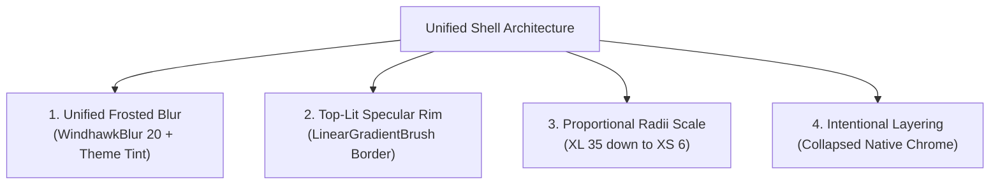

# Architecture & Design Philosophy

The **Windhawk Themes** framework approaches Windows 11 customization through a universal engineering model: structured XAML style injection, predictable token systems, and modular visual layers.

Rather than applying ad-hoc visual tweaks that look inconsistent or break across shell updates, themes engineered with this framework adhere to a strict visual contract governed by core styling pillars.

---

## 1. The Four Core Pillars



### 1. Unified Frosted Blur
- The base panel surface uses the direct composition `WindhawkBlur` shader with an amount of `20`.
- Tints dynamically derive from `{ThemeResource SystemChromeMediumColor}` (panels) or `{ThemeResource SystemAltLowColor}` (cards and flyouts) so the surface adapts seamlessly between light and dark Windows themes.

### 2. Top-Lit Glass Rim
- Outer panels and floating cards carry a specular vertical rim lighting effect:
  ```yaml
  BorderBrush:=<LinearGradientBrush StartPoint="0,0" EndPoint="0,1">
    <GradientStop Color="#60808080" Offset="0.0"/>
    <GradientStop Color="#50404040" Offset="0.5"/>
    <GradientStop Color="#40808080" Offset="1.0"/>
  </LinearGradientBrush>
  ```
- Specular thickness is asymmetric (`0.3,1,0.3,1`), giving the physical illusion of ambient light catching the upper and lower edges of glass sheets.

### 3. Harmonized Radii Scale
Corner radii strictly follow a proportional scale hierarchy:
- **XL (35px)**: Top-level root flyout frames (Start Menu, Notification Center, Calendar grid).
- **L (25px)**: Search boxes and prominent input pills.
- **M (15px)**: Section grouping containers and secondary flyout cards.
- **S (10px)**: Interactive action tiles, buttons, toast cards, and day cells.
- **XS (6px)**: Context menus, tooltips, and compact indicator badges.

### 4. Intentional Layering & Collapsed Chrome
- Native Windows 11 chrome features heavy opaque background fills and aggressive hard drop shadows that muddy translucent themes.
- Our styles deliberately collapse native shadows (`Shadow:=`, `BorderThickness=0`) and set opaque panel fills to transparent (`Visibility=1` or `Background:=Transparent`), allowing our high-performance glass panes and layered frosted cards to float crisply.

---

## 2. Process & Framework Boundaries

Each styler mod runs inside a distinct Windows host process and operates within a specific XAML framework runtime:

| Surface | Host Process | XAML Framework |
|---|---|---|
| **Start Menu** | `StartMenuExperienceHost.exe` | UWP / WinUI 2 (`Windows.UI.Xaml`) |
| **Taskbar** | `explorer.exe` | WinUI 3 / XAML |
| **Notification Center & Quick Settings** | `ShellExperienceHost.exe` / `ShellHost.exe` | UWP `Windows.UI.Xaml` |
| **Settings** | `SystemSettings.exe` | UWP / WinUI `Windows.UI.Xaml` |
| **File Explorer** | `explorer.exe` | WinUI 3 `Microsoft.UI.Xaml` |

Selectors and properties cannot be blindly copied between mods:
- UWP surfaces use Windows.UI.Xaml types and syntax conventions.
- WinUI 3 surfaces use Microsoft.UI.Xaml types.
- Mod-specific top-level keys (such as `webContentStyles` or `backgroundTranslucentEffect`) are isolated to the mods that support them.
