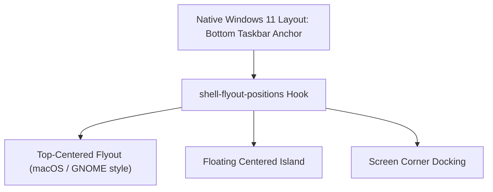

# Shell Flyouts & Positions

This guide explores Windhawk companion mods that manage window positioning, flyout coordinates, and custom shell widgets across Windows 11.

---

## 1. Shell Flyout Positions

**Mod ID**: `shell-flyout-positions`  
**Target Processes**: `explorer.exe`, `StartMenuExperienceHost.exe`, `ShellExperienceHost.exe`, `ShellHost.exe`, `SearchHost.exe`  
**Scope**: Win32 window positioning hooks for top-level shell flyouts

### Overview
By default, Windows 11 pins the Start Menu, Quick Settings, and Notification Center to the bottom edge of the display, aligned relative to the taskbar. `shell-flyout-positions` intercepts the Win32 window placement logic, allowing you to anchor shell flyouts to arbitrary locations on screen:

* **Top / Center Docking**: Position the Start Menu or Quick Settings panel at the top edge or true center of your monitor.
* **Offset Margins**: Add custom X/Y pixel offsets between the screen edge or taskbar and the flyout window border.
* **Monitor-Specific Overrides**: Assign different anchor behaviors depending on primary vs secondary displays.
* **Independent Flyout Rules**: Configure Start Menu, Action Center, Notification Center, Network/Sound flyouts, and Search independently.

### Styler Compatibility Rules
When pairing `shell-flyout-positions` with `windows-11-start-menu-styler.yml` or `windows-11-notification-center-styler.yml`:
1. **Remove Competing Margins**: Ensure root panel margins (e.g. `Margin: "0,0,0,12"`) in styler configurations do not fight the external window offset set in `shell-flyout-positions`.
2. **Flyout Shadow Alignment**: When shifting flyouts away from the taskbar, enable top/bottom border strokes in your styler theme to maintain balanced rim lighting around all four edges.

---

## 2. Dynamic Island for Windows

**Mod ID**: `dynamic-island`  
**Target Process**: `explorer.exe`  
**Scope**: Shell floating widget layer

### Overview
Inspired by mobile dynamic status pills, `dynamic-island` injects an interactive top-docked pill widget onto your primary monitor. It surfaces:
* **Active Media Playback**: Song title, artist, play/pause controls, and interactive volume scrubs.
* **System Status & Telemetry**: Volume adjustments, brightness sliders, microphone/camera activity indicators.
* **Compact Notification Badges**: Non-intrusive notification badges without triggering full toast cards.

### Visual Harmony
To align `dynamic-island` with the Command Center frosted glass design language:
* Match the corner radius scale (**L / M tier**, 12–16px).
* Align the dark glass tint (`#07111F` or `#0D1B2D`) and border highlight (`#25FFFFFF`) with taskbar and start menu panels.

---

## 3. Start Button Colorizer

**Mod ID**: `start-button-colorizer`  
**Target Process**: `explorer.exe`  
**Scope**: Windows Start logo icon glyph within the taskbar

### Overview
Allows dynamic tinting, custom color gradients, or accent-driven color changes for the native Windows Start button icon. 

### Key Capabilities
* **Custom Static Color**: Force the Start button to a designated hex color (e.g., cyan `#48D8F2` or magenta `#FF007F`).
* **Accent Color Sync**: Dynamically inherit the current Windows system accent color.
* **Hover State Brightness**: Increase luminescence or glow when the cursor hovers over the Start button.
