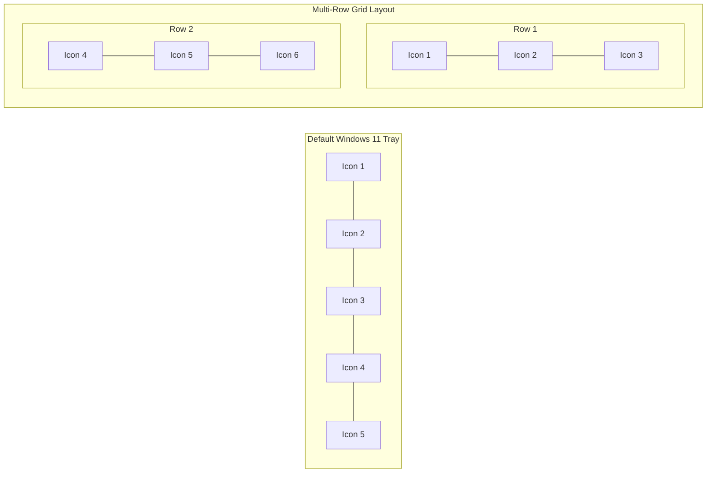

# Taskbar Utility Mods

This guide details the specialized Windhawk companion mods that operate alongside the **Windows 11 Taskbar Styler** (`windows-11-taskbar-styler`) to refine taskbar geometry, clock formatting, tray icon layouts, and button uncombining.

---

## 1. Taskbar Clock Customization

**Mod ID**: `taskbar-clock-customization`  
**Target Process**: `explorer.exe`  
**Scope**: Taskbar notification area clock element (`Windows.UI.Xaml.Controls.TextBlock` within `ClockFlyout`)

### Overview
Windows 11 restricts system clock formatting options in Settings. The `taskbar-clock-customization` mod hooks the taskbar clock text generation to allow custom date/time formats, arbitrary formatting strings, custom fonts, multi-line layouts, and millisecond counters.

### Common Configuration Scenarios

| Feature | Configuration Pattern | Example Output |
|---|---|---|
| **Custom Format String** | `Format: "HH:mm:ss ddd, MMM d"` | `14:25:30 Fri, Oct 9` |
| **Two-Line Compact** | `Format: "HH:mm\nMM/dd/yyyy"` | Stacked time and date |
| **Custom Font** | `Font: "Segoe UI Variable Display", Size: 12` | Clean typographic hierarchy |
| **Seconds Display** | `ShowSeconds: true` | Real-time seconds ticking |

### Interoperability with Taskbar Styler
When using `windows-11-taskbar-styler.yml`, target the clock container for background and padding styling, while delegating text content generation to this mod:
```yaml
# In windows-11-taskbar-styler.yml
controlStyles:
  - target: "Taskbar.TrayCorner#CornerView > ContentPresenter#DateTimePresenter"
    styles:
      - Padding: "4,2,4,2"
      - Margin: "2,0,2,0"
```

---

## 2. Taskbar Tray and Icon Tweaks

**Mod ID**: `taskbar-tray-and-icon-tweaks`  
**Target Process**: `explorer.exe`  
**Scope**: System tray notification area, chevron button, hidden icons flyout

### Overview
This mod provides fine-grained control over the visibility, behavior, and margins of system tray elements. It allows users to hide the notification center badge, remove the show desktop strip, adjust chevron flyout behaviors, and customize individual system tray icons.

### Key Capabilities
* **Hide Show Desktop Strip**: Completely remove the tiny hit-test area at the far right edge of the taskbar.
* **Chevron Visibility**: Always show or auto-hide the system tray overflow arrow button.
* **Notification Bell Toggle**: Hide the notification bell count badge or entire notification trigger.
* **Flyout Animations**: Modify or accelerate opening animations for system tray flyouts.

---

## 3. Taskbar Tray Icon Spacing and Grid

**Mod ID**: `taskbar-tray-icon-spacing-and-grid`  
**Target Process**: `explorer.exe`  
**Scope**: `TrayNotifyFlyout`, `NotifyIconOverflowWindow`, `SystemTrayIcon` items

### Overview
By default, Windows 11 lays out tray icons in a single horizontal sequence with generous touch-friendly padding. On multi-monitor setups or high-density displays, this consumes excessive taskbar width. `taskbar-tray-icon-spacing-and-grid` introduces:

1. **Multi-Row Grid Layout**: Arrange notification icons into 2, 3, or more rows within a standard taskbar height.
2. **Horizontal/Vertical Spacing**: Set custom pixel spacing between individual tray icons (e.g., 2px instead of default 12px).
3. **Square vs Compact Packing**: Force tray items to adopt square bounding boxes for dense layouts.



---

## 4. Taskbar Height and Icon Size

**Mod ID**: `taskbar-height-and-icon-size`  
**Target Process**: `explorer.exe`  
**Scope**: Shell taskbar root metrics, `TaskbarFrame`, app icon scaling

### Overview
While `windows-11-taskbar-styler.yml` can set `Height` on `Taskbar.TaskbarFrame`, changing height via XAML alone does not always resize the underlying Win32 app button hit boxes or rescale running application icons. `taskbar-height-and-icon-size` adjusts:
* **Taskbar Thickness**: Set overall taskbar height (e.g., 36px compact, 48px standard, 64px tall).
* **Icon Size**: Scale taskbar application icons independently (e.g., 20px, 24px, 32px).
* **Vertical Alignment**: Center pinned and running app icons precisely within custom taskbar heights.

> [!TIP]
> If using this companion mod, avoid specifying conflicting static `Height` properties on `Taskbar.TaskbarFrame` in your `windows-11-taskbar-styler.yml` to prevent layout clipping.

---

## 5. Taskbar Labels for Windows 11

**Mod ID**: `taskbar-labels-for-windows-11`  
**Target Process**: `explorer.exe`  
**Scope**: Running application taskbar items (`Taskbar.TaskListButtonPanel`)

### Overview
Restores the classic Windows 7/10 taskbar behavior where running window titles are displayed beside icons ("uncombined" buttons) with customizable label widths, font styles, and truncation settings.

### Styling Pairing
Combine with `windows-11-taskbar-styler.yml` to apply frosted glass pills to uncombined application buttons:
```yaml
controlStyles:
  - target: "Taskbar.TaskListButtonPanel"
    styles:
      - CornerRadius: "6"
      - Background: "#1AFFFFFF"
      - BorderBrush: "#25FFFFFF"
      - BorderThickness: "1"
```
