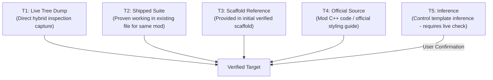

# Target Evidence Protocol (No Guessed Selectors)

A Windhawk styler target that matches nothing **fails silently**. A wrong-but-matching target is even more dangerous: it silently breaks unrelated elements across the shell.

To ensure stability, every selector added to this framework must be backed by empirical evidence.

---

## 1. Evidence Tiers

| Tier | Name | Description |
|---|---|---|
| **T1** | Live Tree | Directly observed in a running process visual tree via the hybrid C++/Python inspector or diagnostic logs. |
| **T2** | Shipped Suite | Already proven working in a shipped style file **for the exact same mod**. |
| **T3** | User Scaffold | Confirmed in a working scaffold provided by the maintainer. |
| **T4** | Official Source | Sourced from `ramensoftware/windhawk-mods` source code or official styling guides. |
| **T5** | Inference | Inferred from standard UWP/WinUI control templates. Allowed only with live checklist confirmation. |

> [!IMPORTANT]
> Evidence **does not transfer across mods**. A target selector that works in the Start Menu Styler is only T5 inference for Notification Center, even if the element name looks identical.

---

## 2. Selector Hygiene Guidelines

1. **Anchor broad types**: Never write a bare common type (`Grid`, `Border`, `ContentPresenter`) without a `#Name`, `[Property=Value]`, or parent combinator chain.
2. **Prefer names over positions**: `Grid#NotificationCenterGrid` is resilient; `Grid > Grid > Border` breaks whenever Windows updates an internal layout.
3. **Avoid localized text**: `[AutomationProperties.Name=Settings]` only matches English language installations. Prefer `AutomationId` or `x:Name` (`#Name`).
4. **No duplicate targets**: The same selector must never appear in two separate blocks in the same file. Duplicate blocks cause conflicting property overrides.
