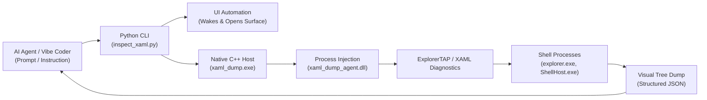

# Hybrid XAML Inspector Toolchain

The **Windhawk Themes** repository features a high-performance hybrid C++/Python inspection toolchain designed primarily for **AI-assisted workflows and developers who use AI tools to "vibe code" their projects**.

> [!IMPORTANT]
> **Not Intended for Manual Interactive Inspection**:  
> This hybrid toolchain is **not** a visual GUI debugger or a replacement for manual interactive inspection tools like [UWPSpy](UWPSpy.md). Instead, it is purpose-built for automated agentic loops: it leverages programmatic **UI automation** to wake background shell processes, activate target surfaces (Start, Action Center, Search), dump the live XAML visual trees directly into structured JSON, and close them cleanly. This allows AI assistants and automated scripts to discover, query, and verify selectors with zero human clicking.
>
> If you are a human designer wishing to manually click, point, and explore element hierarchies interactively on your desktop, use **[UWPSpy](UWPSpy.md)**.



---

## 1. Native C++ Core (`tools/native/`)

The inspection engine is built in native C++ using the MSVC toolchain:
- **`xaml_dump.exe`**: Process enumerator and DLL injector. Resolves target process IDs, establishes named pipe communication, and manages heartbeat timeouts.
- **`xaml_dump_agent.dll`**: Injected payload that connects to Windows XAML Visual Tree Diagnostics (`ExplorerTAP`). It walks the live element hierarchy and serializes types, names, bounds, and properties to JSON.
- **Heartbeat Resiliency**: Implements a generous 30-second heartbeat loop to accommodate OS elevation (UAC) prompts without aborting prematurely.
- **AppContainer Permissions**: Binaries are compiled and granted AppContainer Read & Execute permissions (`*S-1-15-2-1:(RX)`) to safely interact with sandboxed UWP processes (like `StartMenuExperienceHost.exe`).

---

## 2. Python CLI Wrapper (`tools/inspect_xaml.py`)

The unified CLI provides command-line inspection and offline visual tree querying:

```powershell
# List all discoverable shell processes
python tools/inspect_xaml.py --list

# Inspect Start Menu with automated activation
python tools/inspect_xaml.py -p StartMenuExperienceHost.exe --surface start

# Inspect Quick Settings / Action Center on Win11 24H2
python tools/inspect_xaml.py -p ShellHost.exe --surface action-center

# Search visual tree elements
python tools/inspect_xaml.py -p explorer.exe --find TaskListButtonPanel
```

---

## 3. Automated Surface Activation

UWP shell flyouts (Start Menu, Action Center, Notification Center) defer visual tree inflation until opened on screen. The CLI automates this process:
- Sends virtual key chords (`Win` for Start, `Win+A` for Quick Settings, `Win+N` for Notification Center, `Win+I` for Settings, `Win+S` for Search).
- Pauses briefly for tree rendering.
- Captures the populated visual tree.
- Restores desktop state by sending `Escape` automatically.
- *Safety invariant*: Lock screen (`LockApp.exe`) is strictly barred from automation.

---

## 4. ShareX Screenshot Automation

The CLI includes built-in integration with ShareX via the `--screenshot` (`-ss`) flag:
- Dynamically parses the user's `HotkeysConfig.json` and `ApplicationConfig.json`.
- Detects custom hardware keybinds (such as keyboards mapping PrintScreen to `VK_SLEEP`).
- Triggers active window or region capture chords automatically, saving screenshots directly to the user's configured destination.

---

## 5. Prerequisites & Environment Setup

To compile and execute the hybrid XAML inspection toolchain, the system requires Visual Studio development tools and Python 3.10+.

### Visual Studio Requirements (XAML Diagnostics & MSVC)
The native inspection agent (`xaml_dump_agent.dll`) and driver CLI (`xaml_dump.exe`) interface directly with Windows and Visual Studio's **XAML Diagnostics API** (`xamlOM.h` / `IVisualTreeServiceCallback2`).

To build and run the native tools:
1. **Visual Studio 2022 / 2026** (Community, Professional, Enterprise, or Build Tools).
2. **Workloads & Components to Install** (via Visual Studio Installer):
   - **Desktop development with C++** workload.
   - **MSVC v143 / v144 - VS C++ x64/x86 build tools** (latest).
   - **Windows 11 SDK** (10.0.22621.0 or newer) — provides `xamlom.h`, Windows Runtime headers, and AppContainer security headers (`sddl.h`).
   - Visual Studio XAML Diagnostics components (included by default with Desktop C++ / UWP development).
3. **Compilation Command**:
   ```powershell
   pwsh -NoProfile -File tools/native/build.ps1
   ```
   The build script automatically detects `vcvars64.bat` via `vswhere.exe`, compiles the binaries with `/std:c++17`, and applies the necessary AppContainer Read & Execute security descriptor (`*S-1-15-2-1:(RX)`) so sandboxed UWP processes can load `xaml_dump_agent.dll`.

### Python Requirements
The Python CLI (`tools/inspect_xaml.py`) requires:
- **Python 3.10+** (64-bit recommended).
- **Dependencies**: The CLI uses Python standard library modules (`ctypes`, `subprocess`, `json`, `argparse`, `pathlib`).
- Optional dependencies and environment details are tracked in `tools/requirements.txt`:
  ```powershell
  pip install -r tools/requirements.txt
  ```
