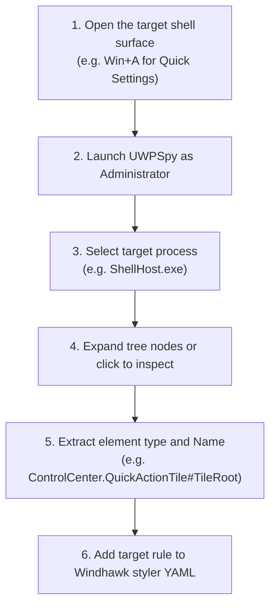

# UWPSpy Manual Visual Tree Inspection Guide

**UWPSpy** is an interactive graphical inspection utility designed for developers and designers who want to manually inspect and debug live UWP (`Windows.UI.Xaml`) and modern WinUI visual trees in Windows 11 shell processes.

> [!NOTE]
> **Manual Inspection vs. AI-Assisted Vibe Coding**:  
> In this repository, we provide two distinct inspection paradigms:
> - **[UWPSpy](UWPSpy.md)** *(this guide)*: Intended for **human designers** who prefer an interactive GUI to visually click on shell components, explore parent-child element hierarchies, and inspect properties live.
> - **[Hybrid C++/Python Toolchain](Toolchain.md)**: Intended for **developers who use AI tools to vibe code their projects**. It uses automated UI automation to wake up background shell processes, activate and render the surfaces, dump their complete XAML visual trees into structured JSON, and cleanly close them, allowing AI agents to query selectors autonomously without manual inspection burden.

---

## 1. What UWPSpy Does

UWPSpy hooks into a running target process's XAML compositor and provides:
- A live, interactive tree view of every XAML element (`Grid`, `Border`, `Button`, `TextBlock`, `ListView`, etc.).
- The exact element type and its `x:Name` attribute (if assigned in the control template).
- A properties panel showing layout bounds, margins, padding, visibility, foreground/background brushes, and opacity.
- Available `VisualStateGroup` collections (e.g. `CommonStates`, `FocusStates`, `ToggleStates`).

---

## 2. Target Processes & Version Nuances

When launching UWPSpy, attach to the appropriate process for the surface you want to inspect:

| Surface | Target Process to Select in UWPSpy | Notes |
|---|---|---|
| **Start Menu** | `StartMenuExperienceHost.exe` | Keep the Start Menu open or pin it while inspecting. |
| **Notification Center / Calendar** (Win11 21H2–23H2) | `ShellExperienceHost.exe` | Used on older Windows 11 builds. |
| **Notification Center / Action Center** (Win11 24H2) | `ShellHost.exe` | **Crucial**: On 24H2 (build 26100+), Action Center runs in `ShellHost.exe`. Attaching to `ShellExperienceHost.exe` will fail or show an empty tree. |
| **Settings App** | `SystemSettings.exe` | Modern Settings interface and cards. |
| **Taskbar** | `explorer.exe` | WinUI 3 taskbar components. |

---

## 3. Step-by-Step Inspection Procedure

### Step 1: Open the Surface First
UWP applications defer creating their visual tree until the surface is displayed on screen. Always open the surface (e.g. click the Start button or press `Win+A`) before attempting to inspect it.

### Step 2: Launch UWPSpy
Run `UWPSpy.exe` with Administrator privileges so it has permissions to attach to protected AppContainer shell processes.

### Step 3: Attach to the Process
In the process selection list, find the target process (e.g., `StartMenuExperienceHost.exe` or `ShellHost.exe`) and click **Attach**.

### Step 4: Locate Your Element
- **Expand the Tree**: Navigate down the visual tree to locate the region of interest (e.g. `NotificationCenterGrid`, `CalendarCenterGrid`, `L1Grid`).
- **Use Search/Filter**: If UWPSpy includes a search bar, type part of the element's suspected name or type (e.g. `Tile`, `Slider`, `Header`).
- **Inspect Properties**: Look at the right-hand properties inspector to view dimensions, visibility, and current brush colors.

### Step 5: Convert to a Windhawk Styler Selector
Once you find the element:
1. Note its **Type Name** (e.g., `Border`, `Grid`, `QuickActionTile`).
2. Note its **`Name`** (e.g., `RootGridBorder`, `TileRoot`).
3. Combine them using Windhawk styler syntax:
   - By Name: `#TileRoot`
   - By Typed Name: `Border#TileRoot`
   - Scoped to Parent: `ControlCenter.QuickActionTile > Border#TileRoot`
   - State-Specific: `Border#TileRoot@CommonStates`

---

## 4. Best Practices & Invariants

- **Never Guess Selectors**: Use UWPSpy or the hybrid C++/Python CLI to verify that an element name actually exists in the visual tree. Selectors that do not match fail silently without errors.
- **Prefer Resilient Names Over Deep Paths**: A named selector like `Grid#ControlCenterRegion` will survive minor Windows layout adjustments, whereas a long index chain like `Grid > Grid > Grid > Border` will break on the next Windows update.
- **Watch Out for Multi-Part Controls**: Split buttons (such as Wi-Fi and Bluetooth toggles) contain separate primary button and chevron flyout sub-elements. Inspect both halves to ensure consistent styling.
