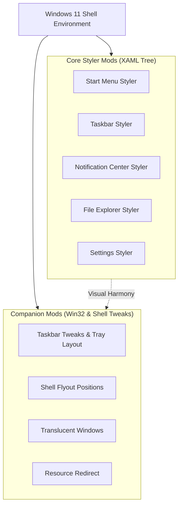

---
layout: docs
title: Companion Mods Overview
---

# Companion Mods Overview

While the **five core styler mods** provide deep visual tree customization through XAML injection and style overrides, the Windhawk ecosystem offers an array of specialized **companion mods** that complement these stylers. Companion mods address functional adjustments, window behaviors, tray layouts, metrics, and system-level visual effects that cannot be controlled via XAML styles alone.

---

## Architectural Role of Companion Mods

Core stylers alter the appearance and structure of XAML visual trees. In contrast, companion mods typically:
1. **Hook Win32 Shell APIs**: Modify flyout anchor coordinates, window creation flags, or taskbar sizing metrics before the XAML host renders.
2. **Handle Dynamic System Layouts**: Reorganize system tray notification icons into multi-row grids or adjust notification clock string formatting.
3. **Apply Window Composition Attributes**: Inject DWM blur (`DwmSetWindowAttribute`) or acrylic/translucency directly into classic Win32 windows and top-level shell hosts.
4. **Redirect Static Binary Assets**: Intercept resource lookups for system icons, glyphs, and audio files without replacing system binaries on disk.

---

## Companion Mod Catalog

The companion mods documented in this framework are grouped into three primary categories:

### 1. Taskbar Utility Mods
Detailed guide: [Taskbar Utility Mods](Companion-Taskbar.md)

* **Taskbar Clock Customization** (`taskbar-clock-customization`): Custom date/time formatting, custom fonts, multi-line clocks, and millisecond display.
* **Taskbar Tray and Icon Tweaks** (`taskbar-tray-and-icon-tweaks`): Customize padding, visibility, and behaviors of taskbar items and tray icons.
* **Taskbar Tray Icon Spacing and Grid** (`taskbar-tray-icon-spacing-and-grid`): Multi-row grid layout for system tray icons, custom spacing, and dense packing.
* **Taskbar Height and Icon Size** (`taskbar-height-and-icon-size`): Granular control over taskbar thickness, icon scale, and vertical centering.
* **Taskbar Labels for Windows 11** (`taskbar-labels-for-windows-11`): Classic taskbar button labels and uncombining options.

### 2. Shell Flyouts & Positions
Detailed guide: [Shell Flyouts & Positions](Companion-Shell.md)

* **Shell Flyout Positions** (`shell-flyout-positions`): Relocate Start Menu, Notification Center, Quick Settings, and search flyouts to custom screen positions, monitor corners, or centered docking.
* **Dynamic Island for Windows** (`dynamic-island`): Adaptive top-screen pill widget for media playback, notifications, and status monitoring.
* **Start Button Colorizer** (`start-button-colorizer`): Dynamic tinting and color effects for the native Start orb.

### 3. System & Translucency Mods
Detailed guide: [System & Translucency Mods](Companion-System.md)

* **Translucent Windows** (`translucent-windows`): Applies Acrylic, Mica, or transparent DWM blur to classic Win32 windows and non-WinUI applications.
* **Resource Redirect** (`resource-redirect`): Non-destructive DLL/EXE resource replacement for shell icons, cursors, bitmaps, and sounds.
* **File Operations Styler** (`file-operations-styler`): Visual styling and compact layouts for file copy/move progress dialogs.
* **Enhanced Disk Usage** (`enhanced-disk-usage`): Real-time I/O activity visualization directly in the taskbar or Explorer.
* **Fully Customizable Winver** (`fully-customizable-winver`): Theming and custom branding for the Windows version information dialog.

---

## Integration Workflow & Best Practices

When deploying companion mods alongside core styler themes:

1. **Rule of Separation**:
   * Style visual properties (backgrounds, borders, corner radii, fonts) in the styler mod (`windows-11-*-styler`).
   * Manage geometry metrics, multi-row tray layouts, and window anchoring in companion mods.
2. **Conflict Prevention**:
   * Do not set taskbar height in both `windows-11-taskbar-styler.yml` and `taskbar-height-and-icon-size` simultaneously. Prefer the dedicated sizing mod if custom icon scaling is required.
   * If using `Shell Flyout Positions` to move the Start Menu, verify that custom margins in `windows-11-start-menu-styler.yml` do not offset the window beyond screen borders.
3. **Execution Order**:
   * Windhawk automatically coordinates mod injection. Styler mods hook into XAML visual trees upon window creation, while companion hooks take effect at the Win32 message loop or API layer.
