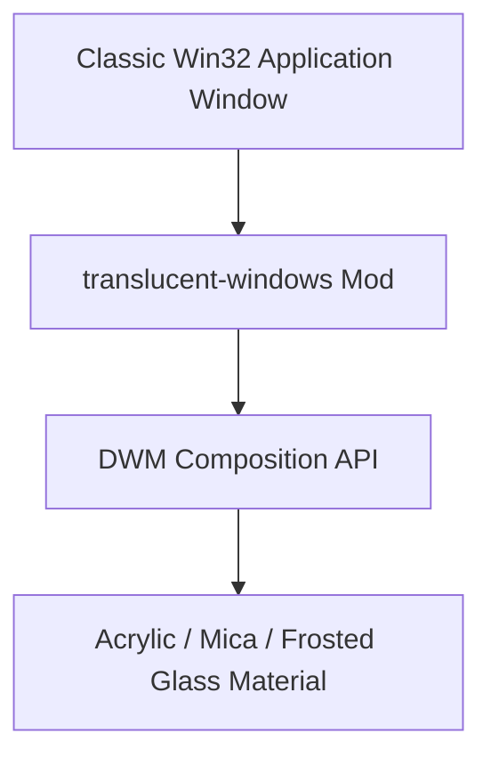
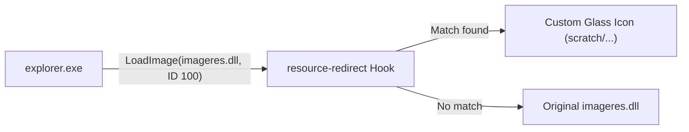

# System & Translucency Mods

This guide covers Windhawk companion mods that operate at the desktop composition, resource injection, and shell utility levels to achieve system-wide visual cohesion.

---

## 1. Translucent Windows

**Mod ID**: `translucent-windows`  
**Target Processes**: Global Win32 process hook (`*`, with configurable process inclusion/exclusion lists)  
**Scope**: Desktop Window Manager (DWM) composition attributes (`DwmSetWindowAttribute`)

### Overview
While Windhawk styler mods use `WindhawkBlur` inside XAML trees (WinUI 2, WinUI 3, and UWP), classic Win32 applications and standard dialogs do not expose XAML styling hooks. `translucent-windows` bridges this gap by intercepting window creation and applying modern DWM blur effects directly to Win32 window chrome:

* **Acrylic Blur**: Multi-layer blurred backdrop with noise texture.
* **Mica & Mica Alt**: Material effects that sample the desktop wallpaper directly behind the application window.
* **Classic BlurBehind**: Aeroglass-style frosted blur for legacy applications.
* **Per-Process Rules**: Include or exclude specific applications (e.g. `notepad.exe`, `cmd.exe`, `Taskmgr.exe`).

### Harmonizing with Styler Mods
When using `translucent-windows` in tandem with File Explorer or Settings stylers:
* Avoid double-blurring XAML surfaces: Exclude `StartMenuExperienceHost.exe` and `ShellExperienceHost.exe` from `translucent-windows`, as styler mods already handle blur natively via `WindhawkBlur` in XAML.
* Target legacy Win32 utility windows such as Run dialog (`explorer.exe`), Properties sheets, and classic dialogs.

---

## 2. Resource Redirect

**Mod ID**: `resource-redirect`  
**Target Processes**: System-wide or selected executable targets (`explorer.exe`, `shell32.dll`, `imageres.dll`)  
**Scope**: Win32 resource loading APIs (`FindResource`, `LoadResource`, `LoadImage`, etc.)

### Overview
Traditionally, replacing system icons, shell branding images, cursors, or notification sounds required patching protected Windows system files (`imageres.dll`, `shell32.dll`) or running third-party patchers that break during Windows cumulative updates.

`resource-redirect` provides a completely non-destructive virtual replacement layer:
1. Intercepts calls to Win32 resource extraction functions.
2. If a redirected resource ID is requested, serves the replacement `.ico`, `.png`, `.bmp`, or `.wav` from a local user directory.
3. If no replacement is specified, transparently forwards the request to the original system DLL.

### Application in Custom Themes
Use `resource-redirect` to replace:
* Drive icons and folder glyphs in File Explorer.
* Start orb bitmaps on legacy taskbars.
* System error and notification audio clips.

---

## 3. File Operations Styler

**Mod ID**: `file-operations-styler`  
**Target Process**: `explorer.exe`  
**Scope**: Windows Copy, Move, and Delete progress dialogs

### Overview
Re-styles the native Windows 11 file transfer and conflict resolution dialogs. Allows customizing:
* Compact vs expanded transfer view defaults.
* Progress bar accent colors and speed graph styling.
* Font sizes, border radii, and background panel shading.

---

## 4. Enhanced Disk Usage

**Mod ID**: `enhanced-disk-usage`  
**Target Process**: `explorer.exe`  
**Scope**: Drive storage capacity bars in File Explorer "This PC"

### Overview
Enhances standard drive usage progress bars in "This PC" by displaying granular metrics:
* Exact free gigabytes / terabytes remaining directly on the bar label.
* Configurable warning thresholds (e.g. dynamic color shifts from cyan to amber at 85% full, and red at 95% full).
* Custom gradients and corner radii for drive capacity indicators.

---

## 5. Fully Customizable Winver

**Mod ID**: `fully-customizable-winver`  
**Target Process**: `winver.exe`  
**Scope**: Windows Version dialog

### Overview
Enables complete visual theming of the `winver.exe` dialog:
* Custom OS branding banner image (e.g., custom distro or suite logo).
* Custom text fields for registered owner, organization, and build strings.
* Modern dark mode backdrop and frosted glass window styling.
