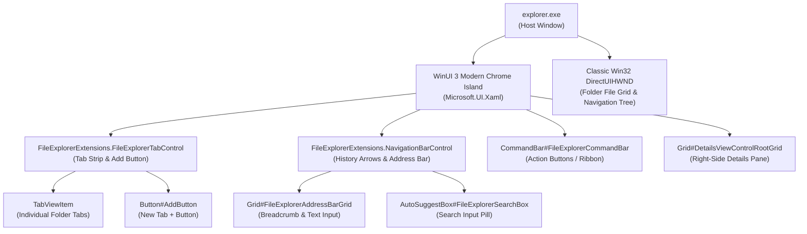

# File Explorer Visual Tree Element Targets

Complete technical reference and living catalog of verified WinUI 3 XAML visual tree element names, types, control hierarchies, and visual state behaviors in `explorer.exe` (Windows 11 File Explorer).

---

## Architecture & Visual Tree Topology

File Explorer on Windows 11 uses a hybrid architecture: modern top chrome (tabs, navigation bar, command bar, details pane) is rendered using **WinUI 3 (`Microsoft.UI.Xaml`)**, while the inner file list and folder tree are classic **Win32 (`DirectUIHWND`)** controls.

---

## 1. Tab Controls & Title Bar Targets

Controls managing open folder tabs, tab active/hover states, and new tab buttons.

| Element Selector | Class Type | Verified Builds | Behavior & Styling Notes |
|---|---|---|---|
| `FileExplorerExtensions.FileExplorerTabControl` | `FileExplorerTabControl` | Win11 22H2 – 24H2 | Root tab control container hosting open folder tabs. |
| `Grid#TabContainerGrid` | `Windows.UI.Xaml.Controls.Grid` | Win11 22H2 – 24H2 | Container grid holding the tab strip and "+" button. |
| `TabViewItem` | `TabViewItem` | Win11 22H2 – 24H2 | Individual tab control. |
| `TabViewItem > Grid#LayoutRoot@CommonStates` | `Windows.UI.Xaml.Controls.Grid` | Win11 22H2 – 24H2 | Tab layout root with interactive visual states (`Normal`, `PointerOver`, `Selected`, `Pressed`). |
| `TabViewItem > Grid#LayoutRoot > Canvas > Path#SelectedBackgroundPath` | `Windows.UI.Xaml.Shapes.Path` | Win11 22H2 – 24H2 | Active selected tab shape background fill. |
| `Grid#TabContainerGrid > Border > Button#AddButton` | `Button` | Win11 22H2 – 24H2 | New tab "+" button: `CornerRadius=4`, `Background:=Transparent`. |
| `Button#CloseButton` | `Button` | Win11 22H2 – 24H2 | Individual tab close ("X") button: `CornerRadius=4`. |

---

## 2. Navigation Bar & Address Bar Targets

Controls managing back/forward/up arrows and the breadcrumb address bar.

| Element Selector | Class Type | Verified Builds | Behavior & Styling Notes |
|---|---|---|---|
| `FileExplorerExtensions.NavigationBarControl#NavigationBarControl > Grid#NavigationBarControlGrid` | `Grid` | Win11 22H2 – 24H2 | History arrows and address bar row. |
| `AppBarButton#backButton` | `AppBarButton` | Win11 22H2 – 24H2 | Back navigation arrow button: `CornerRadius=4`. |
| `AppBarButton#forwardButton` | `AppBarButton` | Win11 22H2 – 24H2 | Forward navigation arrow button: `CornerRadius=4`. |
| `AppBarButton#upButton` | `AppBarButton` | Win11 22H2 – 24H2 | Up to parent folder arrow button: `CornerRadius=4`. |
| `Grid#FileExplorerAddressBarGrid` | `Grid` | Win11 22H2 – 24H2 | Address bar outer pill container: `Background:=$Background`, `BorderBrush:=$BorderBrush`, `CornerRadius=6`. |
| `FileExplorerExtensions.AddressBarControl` | `AddressBarControl` | Win11 22H2 – 24H2 | Breadcrumb trail navigation control. |
| `AutoSuggestBox#PART_AutoSuggestBox > Grid#LayoutRoot > TextBox#TextBox` | `TextBox` | Win11 22H2 – 24H2 | Editable address text field shown when clicked. |

---

## 3. Search Box Targets

The search box embedded in the upper-right corner of File Explorer.

| Element Selector | Class Type | Verified Builds | Behavior & Styling Notes |
|---|---|---|---|
| `AutoSuggestBox#FileExplorerSearchBox` | `AutoSuggestBox` | Win11 22H2 – 24H2 | File Explorer search bar container. |
| `AutoSuggestBox#FileExplorerSearchBox > Grid#LayoutRoot > TextBox#TextBox` | `TextBox` | Win11 22H2 – 24H2 | Search input text box: `Background:=$Background`, `BorderBrush:=$BorderBrush`, `CornerRadius=6`. |
| `TextBlock#PlaceholderText` | `TextBlock` | Win11 22H2 – 24H2 | "Search <FolderName>" placeholder hint string. |

---

## 4. Command Bar (Ribbon Replacement) Targets

The modern horizontal toolbar containing New, Cut, Copy, Paste, Rename, Share, and Delete actions.

| Element Selector | Class Type | Verified Builds | Behavior & Styling Notes |
|---|---|---|---|
| `CommandBar#FileExplorerCommandBar` | `CommandBar` | Win11 22H2 – 24H2 | Modern command bar control. |
| `Grid#CommandBarControlRootGrid` | `Grid` | Win11 23H2 – 24H2 | Command bar root layout grid on newer Windows builds. |
| `AppBarButton[ToolTipService.ToolTip = Cut]` | `AppBarButton` | Win11 22H2 – 24H2 | Cut action button targeted by tooltip string. |
| `AppBarButton[ToolTipService.ToolTip = Copy]` | `AppBarButton` | Win11 22H2 – 24H2 | Copy action button. |
| `AppBarButton[ToolTipService.ToolTip = Paste]` | `AppBarButton` | Win11 22H2 – 24H2 | Paste action button. |
| `AppBarButton[ToolTipService.ToolTip = Rename]` | `AppBarButton` | Win11 22H2 – 24H2 | Rename action button. |
| `Button#MoreButton` | `Button` | Win11 22H2 – 24H2 | "..." overflow menu button. |

---

## 5. Details Pane, Home View & Popups

Panes, metadata sidebars, and popup context flyouts.

| Element Selector | Class Type | Verified Builds | Behavior & Styling Notes |
|---|---|---|---|
| `Grid#DetailsViewControlRootGrid` | `Grid` | Win11 22H2 – 24H2 | Right-side details and metadata pane. Sized with custom glass border: `Background:=$Background`, `BorderBrush:=$BorderBrush`. |
| `Grid#HomeViewRootGrid` | `Grid` | Win11 22H2 – 24H2 | File Explorer Home landing page root grid. |
| `FileExplorerExtensions.GalleryViewControl#GalleryViewControl` | `GalleryViewControl` | Win11 23H2 – 24H2 | Windows Photos/Gallery view container. |
| `MenuFlyoutPresenter > Border` | `Border` | Win11 22H2 – 24H2 | Modern context menu popup border card: `Background:=$Background`, `BorderBrush:=$BorderBrush`, `CornerRadius=6`. |
| `ToolTip > ContentPresenter#LayoutRoot` | `ContentPresenter` | Win11 22H2 – 24H2 | Hover tooltip background pill: `Background:=$Background`, `CornerRadius=4`. |
