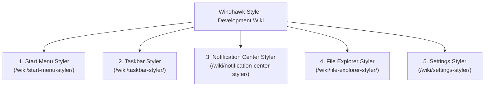

# Windhawk Styler Wiki: Development Knowledge Base

Welcome to the **Windhawk Themes Development Wiki**. This comprehensive knowledge base catalogs verified visual tree element targets, dependency properties, control hierarchies, configuration schemas, and companion mod settings across all Windows 11 shell surfaces supported by Windhawk styler mods.

> [!TIP]
> **Extensive Technical Reference**:  
> Every category in this wiki provides detailed architectural breakdowns, visual tree topology diagrams, complete selector tables with verified Windows 11 build ranges, top-level YAML configuration schemas, and companion mod settings with factory defaults.

---

## 📚 Primary Styler Categories

### 1. Start Menu Styler (`wiki/start-menu-styler/`)
* **[Start Menu Styler Overview](start-menu-styler/README.md)**: Mod architecture (`StartMenuExperienceHost.exe`), UWP visual tree hierarchy, and glass foundations.
* **[Visual Tree Element Targets](start-menu-styler/targets/elements.md)**: Verified selectors for root frames (`DropShadowDismissTarget`), search pills, pinned items grid, recommendations, bottom navigation pane, and Phone Link companion cards.
* **[Configuration Schema & Token Directives](start-menu-styler/configurations/schema.md)**: Complete YAML schema including `styleConstants`, `themeResourceVariables`, `controlStyles`, WebView2 CSS injection (`webContentStyles`), and Shell Flyout Positions integration.

### 2. Taskbar Styler (`wiki/taskbar-styler/`)
* **[Taskbar Styler Overview](taskbar-styler/README.md)**: WinUI 3 XAML island architecture (`explorer.exe`), floating dock geometry, and visual state lighting.
* **[Visual Tree Element Targets](taskbar-styler/targets/elements.md)**: Verified selectors for `TaskbarFrame`, task list button panels, active indicators, running progress bars, search boxes, system tray, and snap assist flyouts.
* **[Configuration Schema & Token Directives](taskbar-styler/configurations/schema.md)**: Complete YAML schema, `styleConstants` mechanics, multi-state `@CommonStates` rules, and click-through options.
* **[Companion Mods Settings Reference](taskbar-styler/companions/settings.md)**: Factory defaults and technical settings schemas for Taskbar Clock Customization, Taskbar Tray and Icon Tweaks, Dynamic Island for Windows, and Start Button Colorizer.

### 3. Notification Center Styler (`wiki/notification-center-styler/`)
* **[Notification Center Styler Overview](notification-center-styler/README.md)**: Process host migration (`ShellHost.exe` on 24H2 vs `ShellExperienceHost.exe` on older builds), Quick Settings, Calendar, and toast notifications.
* **[Visual Tree Element Targets](notification-center-styler/targets/elements.md)**: Verified selectors for `ControlCenterRegion`, toggle buttons, `AsyncSlider` volume/brightness tracks, media player cards, calendar day items, and toast popups.
* **[Configuration Schema & Token Directives](notification-center-styler/configurations/schema.md)**: Complete YAML schema, token mechanics, dual-process handling, and double-blur mitigation patterns.

### 4. File Explorer Styler (`wiki/file-explorer-styler/`)
* **[File Explorer Styler Overview](file-explorer-styler/README.md)**: WinUI 3 top chrome architecture versus classic Win32 `DirectUIHWND` file lists.
* **[Visual Tree Element Targets](file-explorer-styler/targets/elements.md)**: Verified selectors for `FileExplorerTabControl`, tab item states, navigation arrows, address bar breadcrumbs, search box, command bar buttons, and details pane.
* **[Configuration Schema & Token Directives](file-explorer-styler/configurations/schema.md)**: Complete YAML schema, whole-window DWM backdrop effects (`backgroundTranslucentEffect`), and Win32 DirectUI boundary rules.
* **[Companion Mods Settings Reference](file-explorer-styler/companions/settings.md)**: Factory defaults and technical settings schemas for Enhanced Disk Usage, File Operations Styler, and Fully Customizable Winver.

### 5. Settings Styler (`wiki/settings-styler/`)
* **[Settings Styler Overview](settings-styler/README.md)**: `SystemSettings.exe` UWP host, `SplitView` navigation architecture, and card layouts.
* **[Visual Tree Element Targets](settings-styler/targets/elements.md)**: Verified selectors for `RootSplitView`, navigation items, `SettingCard`, `SettingExpander`, system hero banner, and input controls.
* **[Configuration Schema & Token Directives](settings-styler/configurations/schema.md)**: Complete YAML schema, token mechanics, and XAML material applications.

---

## 🛠️ Visual Tree Diagnostics & Inspection

* **[Hybrid C++/Python Toolchain Guide](../Toolchain.md)**: UI automation and structured JSON visual tree dumping for development and testing.
* **[Visual Tree Diagnostics](../Diagnostics.md)**: Process inspection rules and tree query examples.
* **[UWPSpy Manual Inspection Guide](../UWPSpy.md)**: Interactive GUI visual tree inspection for human designers.
* **[Target Evidence Protocol](../Evidence-Protocol.md)**: Sourced selector standards and verification tiers.
