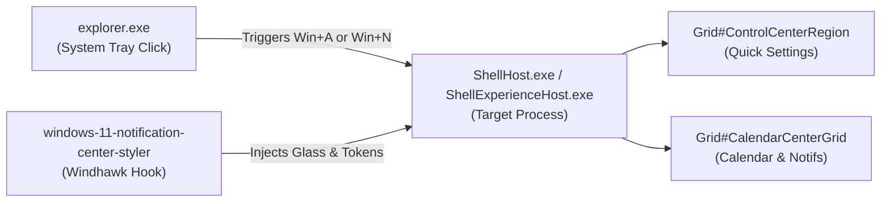

# Wiki: Windows 11 Notification Center Styler

Comprehensive development and styling guide for the **Windows 11 Notification Center Styler** mod (`windows-11-notification-center-styler`), Quick Settings, Calendar flyout, and system toasts.

---

## 1. Mod Overview & Architecture

| Specification Attribute | Detail | Technical Notes |
|---|---|---|
| **Mod ID** | `windows-11-notification-center-styler` | Official Windhawk repository mod |
| **Target Process (Win11 21H2–23H2)** | `ShellExperienceHost.exe` | Classic UWP shell experience host |
| **Target Process (Win11 24H2 build 26100+)** | `ShellHost.exe` | Dedicated Quick Settings and shell flyout host |
| **XAML Framework** | `Windows.UI.Xaml` | Standard UWP runtime |
| **Windhawk Mod Floor** | `v1.7+` | Direct `WindhawkBlur` composition support |
| **Live Reload Capability** | Supported | Updates apply dynamically on settings save |



---

## 2. Detailed Wiki Subsections

For in-depth technical reference documentation, explore the dedicated subcategories:

* 🎯 **[Visual Tree Element Targets](targets/elements.md)**: Exhaustive catalog of every verified root frame, Quick Settings tile, `AsyncSlider` track/thumb, media player card, calendar day cell, and toast notification target.
* ⚙️ **[Configuration Schema & Token Directives](configurations/schema.md)**: Complete specification of YAML top-level keys, dual-host process architecture (`ShellHost` vs `ShellExperienceHost`), token mechanics, and double-blur mitigation recipes.

---

## 3. High-Level Hierarchy & Key Control Anchors

1. **Quick Settings Outer Frame (`Grid#ControlCenterRegion`)**:
   * The foundation glass canvas. Setting `Background:=$Background`, `BorderBrush:=$BorderBrush`, and `Shadow:=` collapses the system drop shadow and sets up the frosted panel.
2. **Preventing Double-Blur Artifacts**:
   * Windows renders an internal solid plate: `ControlCenter.ControlCenterView > Grid#RootGrid > Border#RootGridBorder`. Clearing this element to `Background:=Transparent` is essential to prevent muddy visuals.
3. **Multi-State Quick Action Tiles**:
   * `ControlCenter.PaginatedToggleButton`: Wi-Fi, Bluetooth, and Airplane mode toggles. Targeted via `@CommonStates` (`Normal`, `PointerOver`, `Pressed`, `Checked`, `CheckedPointerOver`) to apply layered glass fills and accent glow on active tiles.
4. **Volume & Brightness Controls (`ControlCenter.AsyncSlider`)**:
   * Custom UWP slider wrappers where inactive tracks (`HorizontalTrackRect`) and active highlighted fills (`HorizontalDecreaseRect`) are styled into rounded pills.
5. **Media Player & Calendar Panels**:
   * `Grid#MediaTransportControlsRegion` embeds album art, track info, and playback buttons into a glass card.
   * `Grid#CalendarCenterGrid` structures the month view, day number grid, and Focus Session integration card.

---

## 4. Key Recipes: Applying Frosted Glass to Quick Settings

```yaml
styleConstants:
  - Frosted=<WindhawkBlur BlurAmount="20" TintColor="{ThemeResource SystemChromeMediumColor}" TintOpacity="0.7" />
  - Background=$Frosted
  - BorderBrush=<LinearGradientBrush StartPoint="0,0" EndPoint="0,1"><GradientStop Color="#60808080" Offset="0.0" /><GradientStop Color="#50404040" Offset="0.25" /><GradientStop Color="#40808080" Offset="1" /></LinearGradientBrush>
  - BorderThickness=0.3,1,0.3,1
  - PanelRadius=13

controlStyles:
  # Quick Settings outer frame
  - target: Grid#ControlCenterRegion
    styles:
      - Background:=$Background
      - BorderBrush:=$BorderBrush
      - BorderThickness=$BorderThickness
      - CornerRadius=$PanelRadius
      - Shadow:=

  # Clear inner plate to prevent double-blur
  - target: ControlCenter.ControlCenterView > Grid#RootGrid > Border#RootGridBorder
    styles:
      - Background:=<SolidColorBrush Color="Transparent"/>
```
