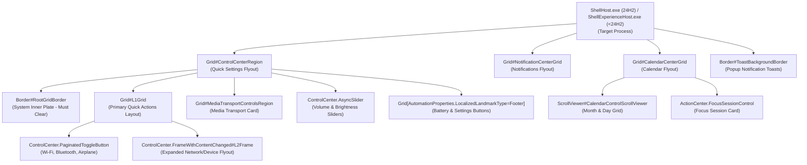

# Notification Center Visual Tree Element Targets

Complete technical reference and living catalog of verified XAML visual tree element names, types, control hierarchies, and visual state behaviors across `ShellExperienceHost.exe` (Win11 21H2–23H2) and `ShellHost.exe` (Win11 24H2 build 26100+).

---

## Architecture & Process Host Migration

Windows 11 Notification Center, Quick Settings (Win+A), Calendar (Win+N), and Toast notifications run within UWP shell hosts using `Windows.UI.Xaml`. In Windows 11 24H2 (build 26100+), Microsoft migrated the Quick Settings host from `ShellExperienceHost.exe` to `ShellHost.exe`.

---

## 1. Root Flyout Panels & Master Framing Targets

Controls managing outer flyout geometry, background blur plates, and drop-shadows.

| Element Selector | Class Type | Verified Builds | Behavior & Styling Notes |
|---|---|---|---|
| `Grid#ControlCenterRegion` | `Windows.UI.Xaml.Controls.Grid` | Win11 21H2 – 24H2 | Main Quick Settings (Win+A) outer window frame. Setting `Background:=$Background`, `BorderBrush:=$BorderBrush`, `BorderThickness=$BorderThickness`, `CornerRadius=$PanelRadius`, `Shadow:=`, and `Margin=0,0,0,-6` establishes the frosted glass foundation. |
| `Grid#NotificationCenterGrid` | `Windows.UI.Xaml.Controls.Grid` | Win11 21H2 – 24H2 | Main Notification Center window frame. Sized via `Background:=$Background`, `BorderBrush:=$BorderBrush`, `CornerRadius=$PanelRadius`, `Shadow:=`. |
| `Grid#CalendarCenterGrid` | `Windows.UI.Xaml.Controls.Grid` | Win11 21H2 – 24H2 | Calendar flyout container frame. Sized via `Background:=$Background`, `BorderBrush:=$BorderBrush`, `CornerRadius=$PanelRadius`, `Margin=0,6,0,6`, `MinHeight=40`. |
| `ControlCenter.ControlCenterView > Grid#RootGrid > Border#RootGridBorder` | `Windows.UI.Xaml.Controls.Border` | Win11 21H2 – 24H2 | System-painted inner background card. Must be cleared to `Background:=<SolidColorBrush Color="Transparent"/>` to prevent double-blur artifacts. |
| `Grid#L1Grid` | `Windows.UI.Xaml.Controls.Grid` | Win11 21H2 – 24H2 | Primary layout grid inside Quick Settings. Sibling of `RootGridBorder`. |
| `ContentPresenter#PageContent > Grid > Border` | `Windows.UI.Xaml.Controls.Border` | Win11 21H2 – 24H2 | Inner page content card border: `Background:=$ElementBackground`, `CornerRadius=$CardRadius`, `Margin=8,0,8,2`, `Shadow:=`. |
| `QuickActions.ControlCenter.AccessibleWindow#PageWindow > ContentPresenter > Grid#FullScreenPageRoot > ContentPresenter#PageHeader` | `Windows.UI.Xaml.Controls.ContentPresenter` | Win11 22H2 – 24H2 | Full-page flyout header card: `Background:=$ElementBackground`, `CornerRadius=$CardRadius`, `Margin=7,7,7,7`. |

---

## 2. Quick Settings Toggles & L2 Expanded Frames

Controls managing toggle buttons (Wi-Fi, Bluetooth, Airplane mode), split chevron buttons, and drill-down panels.

| Element Selector | Class Type | Verified Builds | Behavior & Styling Notes |
|---|---|---|---|
| `ControlCenter.PaginatedToggleButton#ToggleButton`, `QuickActions.AccessibleToggleButton#ToggleButton` | `ToggleButton` | Win11 21H2 – 24H2 | Primary quick action toggle button. Configured with `CornerRadius=$CardRadius`, `BorderThickness=$BorderThickness`, `BorderBrush:=$BorderBrush`, `BackgroundSizing=InnerBorderEdge`. |
| `ControlCenter.PaginatedToggleButton#SplitL2Button`, `Button#SplitL2Button` | `Button` | Win11 21H2 – 24H2 | Right-hand chevron button on split quick action tiles. Sized with `CornerRadius=$CardRadius`, `Margin=4,0,-4,0`, `BorderThickness=$BorderThickness`. |
| `ControlCenter.PaginatedToggleButton > ContentPresenter#ContentPresenter@CommonStates` | `ContentPresenter` | Win11 22H2 – 24H2 | Interactive state presenter for quick toggles: `Background@Normal:=$ElementBackground`, `Background@PointerOver:=$OverlayColor2`, `Background@Pressed:=$OverlayColor`, `Background@Checked:=$AccentColor`, `Background@CheckedPointerOver:=$AccentColor`. |
| `ControlCenter.FrameWithContentChanged#L2Frame` | `Frame` | Win11 22H2 – 24H2 | Secondary expanded panel frame (e.g. Wi-Fi network selection list or Bluetooth device list). |
| `Border#L2ContentBorder` | `Border` | Win11 22H2 – 24H2 | Background card for L2 drill-down views. |
| `Button#BackButton` | `Button` | Win11 21H2 – 24H2 | Back arrow chevron inside L2 drill-down views: `CornerRadius=$ChipRadius`, `BorderThickness=$BorderThickness`. |
| `NetworkUX.View.SettingsListViewItem > ListViewItemPresenter#Root` | `ListViewItemPresenter` | Win11 22H2 – 24H2 | Wi-Fi network list items in L2 panel: `CornerRadius=$CardRadius`. |

---

## 3. Volume & Brightness Sliders (`AsyncSlider`)

Controls managing audio volume and screen brightness slider bars.

| Element Selector | Class Type | Verified Builds | Behavior & Styling Notes |
|---|---|---|---|
| `ControlCenter.AsyncSlider` | Custom Slider Control | Win11 21H2 – 24H2 | Custom UWP wrapper around volume and display brightness sliders. |
| `Grid#SliderContainer` | `Windows.UI.Xaml.Controls.Grid` | Win11 21H2 – 24H2 | Slider track and thumb container within `AsyncSlider`. Positioned via `Margin=0,-2,0,0`. |
| `Windows.UI.Xaml.Shapes.Rectangle#HorizontalTrackRect` | `Windows.UI.Xaml.Shapes.Rectangle` | Win11 21H2 – 24H2 | Inactive slider track background rectangle: `Height=10`, `Fill:=$OverlayColor`, `RadiusX=3`, `RadiusY=3`. |
| `Windows.UI.Xaml.Shapes.Rectangle#HorizontalDecreaseRect` | `Windows.UI.Xaml.Shapes.Rectangle` | Win11 21H2 – 24H2 | Active highlighted portion of the slider track: `Height=10`, `Fill:=$AccentColor`, `RadiusX=3`, `RadiusY=3`. |
| `Windows.UI.Xaml.Controls.Primitives.Thumb#HorizontalThumb` | `Windows.UI.Xaml.Controls.Primitives.Thumb` | Win11 21H2 – 24H2 | Draggable slider thumb pill/circle. Collapsed (`Visibility=Collapsed` or `1`) for modern track-only appearance. |
| `Windows.UI.Xaml.Controls.Button[AutomationProperties.AutomationId = Microsoft.QuickAction.Volume]` | `Button` | Win11 21H2 – 24H2 | Volume icon button beside slider: `CornerRadius=$CardRadius`, `BorderThickness=$BorderThickness`. |
| `Windows.UI.Xaml.Controls.Button#VolumeL2Button` | `Button` | Win11 22H2 – 24H2 | Audio output device selector chevron button: `CornerRadius=$CardRadius`, `BorderThickness=$BorderThickness`. |

---

## 4. Media Transport Controls

Controls rendering the floating media player card inside Quick Settings.

| Element Selector | Class Type | Verified Builds | Behavior & Styling Notes |
|---|---|---|---|
| `Grid#MediaTransportControlsRegion` | `Windows.UI.Xaml.Controls.Grid` | Win11 21H2 – 24H2 | Media playback card container. Styled with `Height=Auto`, `CornerRadius=$PanelRadius`, `BorderBrush:=$BorderBrush`, `BorderThickness=$BorderThickness`, `Background:=$Background`, `Shadow:=`, `Margin=0,0,0,12`. |
| `Grid#MediaTransportControlsRoot` | `Windows.UI.Xaml.Controls.Grid` | Win11 21H2 – 24H2 | Layout root inside media card: `Background:=<SolidColorBrush Color="Transparent"/>`. |
| `Grid#ThumbnailImage` | `Windows.UI.Xaml.Controls.Grid` | Win11 21H2 – 24H2 | Album artwork thumbnail image container: `Width=$thumbnailImageSize`, `Height=$thumbnailImageSize`, `CornerRadius=$CardRadius`, `Grid.Column=1`, `Margin=0,0,8,0`. |
| `StackPanel#PrimaryAndSecondaryTextContainer` | `StackPanel` | Win11 21H2 – 24H2 | Title and artist label container: `VerticalAlignment=Center`, `Grid.Column=0`. |
| `ListView#MediaButtonsListView` | `ListView` | Win11 21H2 – 24H2 | Media playback buttons strip: `VerticalAlignment=Center`, `Height=40`, `Margin=0,4,0,0`. |
| `RepeatButton#PreviousButton > ContentPresenter@CommonStates` | `RepeatButton` | Win11 21H2 – 24H2 | Previous track button: `Background@Normal:=$OverlayColor2`, `Background@PointerOver:=$AccentColor`, `Width=36`, `Height=28`, `CornerRadius=$ChipRadius`. |
| `Button#PlayPauseButton > ContentPresenter@CommonStates` | `Button` | Win11 21H2 – 24H2 | Play / pause button: `Background@Normal:=$OverlayColor2`, `Background@PointerOver:=$AccentColor`, `Width=36`, `Height=36`, `CornerRadius=$ChipRadius`. |
| `RepeatButton#NextButton > ContentPresenter@CommonStates` | `RepeatButton` | Win11 21H2 – 24H2 | Next track button: `Background@Normal:=$OverlayColor2`, `Background@PointerOver:=$AccentColor`, `Width=36`, `Height=28`, `CornerRadius=$ChipRadius`. |

---

## 5. Calendar Flyout & Focus Session Controls

Controls organizing the month calendar grid, day numbers, and Focus Session cards.

| Element Selector | Class Type | Verified Builds | Behavior & Styling Notes |
|---|---|---|---|
| `ScrollViewer#CalendarControlScrollViewer` | `ScrollViewer` | Win11 21H2 – 24H2 | Calendar main scrollable container: `Background:=$ElementBackground`, `CornerRadius=$CardRadius`, `Margin=-10,11,-10,-14`, `Shadow:=`. |
| `Border#CalendarHeaderMinimizedOverlay` | `Border` | Win11 21H2 – 24H2 | Minimized calendar header overlay card: `Background:=$ElementBackground`, `CornerRadius=$CardRadius`, `Height=45`, `Shadow:=`. |
| `StackPanel#CalendarHeader` | `StackPanel` | Win11 21H2 – 24H2 | Month and year header label stack: `Margin=6,0,0,0`. |
| `Grid#WeekDayNames` | `Grid` | Win11 21H2 – 24H2 | Day of week abbreviations row (Su, Mo, Tu...): `CornerRadius=4`, `Margin=4,0,4,0`. |
| `CalendarViewDayItem`, `Windows.UI.Xaml.Controls.CalendarViewDayItem` | `CalendarViewDayItem` | Win11 21H2 – 24H2 | Individual day number cell: `CornerRadius=4`, `BorderThickness=$BorderThickness`, `BorderBrush:=$BorderBrush`, `Background:=$ElementBackground`, `Background@PointerOver:=$OverlayColor2`. |
| `ActionCenter.FocusSessionControl#FocusSessionControl > Grid#FocusGrid` | `Grid` | Win11 22H2 – 24H2 | Focus Session integration card: `Background:=$ElementBackground`, `CornerRadius=$CardRadius`, `Margin=6,7,6,6`, `Shadow:=`. |
| `Button#ExpandCollapseButton` | `Button` | Win11 21H2 – 24H2 | Chevron button toggling compact vs full calendar: `AccessKey=e`, `CornerRadius=$ChipRadius`. |

---

## 6. Toast Notifications & Jump Lists

System notification toast popup cards and taskbar right-click jump lists.

| Element Selector | Class Type | Verified Builds | Behavior & Styling Notes |
|---|---|---|---|
| `Border#ToastBackgroundBorder`, `Border#ToastBackgroundBorder2` | `Border` | Win11 21H2 – 24H2 | Popup notification toast cards: `Background:=$Background`, `BorderBrush:=$BorderBrush`, `BorderThickness=$BorderThickness`, `CornerRadius=$CardRadius`, `Shadow:=`. |
| `ActionCenter.FlexibleToastView#FlexibleNormalToastView` | Custom Control | Win11 21H2 – 24H2 | Toast interactive view hierarchy: `Background:=<SolidColorBrush Color="Transparent"/>`, `Shadow:=`. |
| `Grid#ToastPeekRegion` | `Grid` | Win11 21H2 – 24H2 | Toast peek placement region: `RenderTransform:=<TranslateTransform Y="-495" X="395" />`. |
| `ActionCenter.NotificationListViewItem` | `ListViewItem` | Win11 21H2 – 24H2 | Notification item in notification center: `Margin=5,2,5,3`, `CornerRadius=$CardRadius`. |
| `Button#ClearAll` | `Button` | Win11 21H2 – 24H2 | "Clear all" notifications button: `AccessKey=x`, `CornerRadius=$ChipRadius`, `BorderThickness=$BorderThickness`. |
| `Border#JumpListRestyledAcrylic` | `Border` | Win11 21H2 – 24H2 | Jump list acrylic frame: `Background:=$Background`, `BorderBrush:=$BorderBrush`, `CornerRadius=$ChipRadius`. |
| `JumpViewUI.JumpListListViewItem > Grid#LayoutRoot > Border#BackgroundBorder` | `Border` | Win11 21H2 – 24H2 | Jump list menu item card: `CornerRadius=$ChipRadius`. |

---

## 7. Quick Settings Footer Controls

Bottom utility row housing battery status and Settings shortcuts.

| Element Selector | Class Type | Verified Builds | Behavior & Styling Notes |
|---|---|---|---|
| `Grid[AutomationProperties.LocalizedLandmarkType = Footer]` | `Grid` | Win11 21H2 – 24H2 | Footer bar container: `BorderThickness=0`. |
| `Button#FooterButton[AutomationProperties.Name = Edit quick settings]` | `Button` | Win11 21H2 – 24H2 | Pencil edit icon button: `CornerRadius=$ChipRadius`, `Margin=0,0,8,0`. |
| `Button#FooterButton[AutomationProperties.Name = All settings]` | `Button` | Win11 21H2 – 24H2 | Settings gear button: `CornerRadius=$PanelRadius`, `Margin=0,0,-1,0`. |
| `Button[AutomationProperties.AutomationId = Microsoft.QuickAction.Battery]` | `Button` | Win11 21H2 – 24H2 | Battery status indicator button: `CornerRadius=$ChipRadius`, `Margin=2,0,0,0`. |
