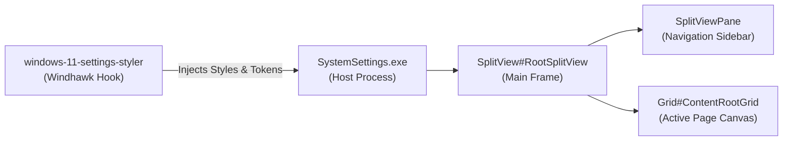

# Wiki: Windows 11 Settings Styler

Comprehensive development and styling guide for the **Windows 11 Settings Styler** mod (`windows-11-settings-styler`), navigation split views, setting cards, expander groups, and hero banners.

---

## 1. Mod Overview & Architecture

| Specification Attribute | Detail | Technical Notes |
|---|---|---|
| **Mod ID** | `windows-11-settings-styler` | Official Windhawk repository mod |
| **Target Process** | `SystemSettings.exe` | Main Windows 11 Settings application host |
| **XAML Framework** | `Windows.UI.Xaml` | UWP / WinUI XAML framework |
| **Windhawk Mod Floor** | `v1.0+` | Direct composition and `WindhawkBlur` support |
| **Live Reload Capability** | Supported | Updates apply live to active Settings windows |



---

## 2. Detailed Wiki Subsections

For in-depth technical reference documentation, explore the dedicated subcategories:

* 🎯 **[Visual Tree Element Targets](targets/elements.md)**: Exhaustive catalog of every verified root page, `SplitView` navigation item, `SettingCard`, `SettingExpander`, system hero banner, and input toggle target.
* ⚙️ **[Configuration Schema & Token Directives](configurations/schema.md)**: Complete specification of YAML top-level keys (`styleConstants`, `themeResourceVariables`, `controlStyles`), property operators, and XAML material definitions.

---

## 3. High-Level Hierarchy & Key Control Anchors

1. **Root Window Canvas (`Page#RootPage`)**:
   * The top-level host page for the entire Settings app. Setting `Background:=$Background` applies full frosted blur across the app canvas.
2. **Navigation Split View (`SplitView#RootSplitView`)**:
   * Separates the left navigation sidebar (`SplitViewPane`) from page content. Setting `SplitViewPane` to transparent provides a seamless unified window.
3. **Setting Cards & Groups (`SettingCard` & `SettingExpander`)**:
   * The primary building blocks of Windows 11 Settings pages. Cards feature interactive states (`Normal`, `PointerOver`, `Pressed`) targeted via `@CommonStates` to apply glass cards with subtle border rim strokes.
4. **Hero Banners (`Grid#SystemHeroBanner`)**:
   * Top banner displayed on the "System" settings page showcasing computer specifications, device name, and rename actions.

---

## 4. Key Recipes: Applying Frosted Glass to Settings

```yaml
styleConstants:
  - Frosted=<WindhawkBlur BlurAmount="20" TintColor="{ThemeResource SystemChromeMediumColor}" TintOpacity="0.7" />
  - Background=$Frosted
  - BorderBrush=<LinearGradientBrush StartPoint="0,0" EndPoint="0,1"><GradientStop Color="#60808080" Offset="0.0" /><GradientStop Color="#50404040" Offset="0.25" /><GradientStop Color="#40808080" Offset="1" /></LinearGradientBrush>
  - BorderThickness=0.3,1,0.3,1
  - CardRadius=10
  - ChipRadius=6

controlStyles:
  # App window background
  - target: Page#RootPage
    styles:
      - Background:=$Background

  # Transparent sidebar pane
  - target: SplitViewPane
    styles:
      - Background:=Transparent

  # Glass setting cards
  - target: SettingCard@CommonStates > Grid > Border#CardBackground
    styles:
      - Background:=$Background
      - BorderBrush:=$BorderBrush
      - BorderThickness=$BorderThickness
      - CornerRadius=$CardRadius

  # Glass setting expanders
  - target: SettingExpander@CommonStates > Grid > Border#HeaderBackground
    styles:
      - Background:=$Background
      - BorderBrush:=$BorderBrush
      - BorderThickness=$BorderThickness
      - CornerRadius=$CardRadius
```
