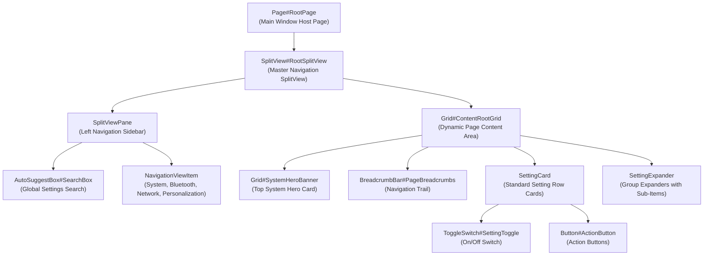

# Settings Visual Tree Element Targets

Complete technical reference and living catalog of verified XAML visual tree element names, types, control hierarchies, and visual state behaviors in `SystemSettings.exe` (Windows 11 Settings App).

---

## Architecture & Visual Tree Topology

The Windows 11 Settings app is built on UWP / WinUI using `Windows.UI.Xaml`. Its root layout organizes pages via a `SplitView`, hosting a persistent left navigation sidebar and a dynamic right-side content pane filled with `SettingCard` and `SettingExpander` controls.

---

## 1. Root Window & SplitView Navigation Targets

Controls managing the overall Settings window, navigation pane, and global search bar.

| Element Selector | Class Type | Verified Builds | Behavior & Styling Notes |
|---|---|---|---|
| `Page#RootPage` | `Windows.UI.Xaml.Controls.Page` | Win11 21H2 – 24H2 | Top-level host page for the entire Settings app. Setting `Background:=$Background` applies full frosted blur across the app canvas. |
| `SplitView#RootSplitView` | `Windows.UI.Xaml.Controls.SplitView` | Win11 21H2 – 24H2 | Main split view separating sidebar navigation from page content. |
| `SplitViewPane` | `Windows.UI.Xaml.Controls.Primitives.SplitViewPane` | Win11 21H2 – 24H2 | Left sidebar container hosting navigation items. Styled with `Background:=Transparent`. |
| `NavigationViewItem` | `NavigationViewItem` | Win11 21H2 – 24H2 | Individual navigation category items (System, Bluetooth, Network, Personalization, Apps, Accounts, etc.). |
| `NavigationViewItem@CommonStates > Grid > Border` | `Windows.UI.Xaml.Controls.Border` | Win11 21H2 – 24H2 | Background card of navigation items: `CornerRadius=$ChipRadius`, `Background@PointerOver:=$OverlayColor`, `Background@Selected:=$AccentColor`. |
| `AutoSuggestBox#SearchBox` | `Windows.UI.Xaml.Controls.AutoSuggestBox` | Win11 21H2 – 24H2 | Global settings search box at top of the navigation sidebar. Styled with `CornerRadius=6`, `Background:=$ElementBackground`. |

---

## 2. Header & Breadcrumb Navigation Targets

Controls managing category headers, sub-page navigation, and breadcrumb trails.

| Element Selector | Class Type | Verified Builds | Behavior & Styling Notes |
|---|---|---|---|
| `TextBlock#PageTitle` | `Windows.UI.Xaml.Controls.TextBlock` | Win11 21H2 – 24H2 | Primary category title at top of the page. Styled with `FontFamily=Segoe UI Variable Display`, `FontSize=28`. |
| `BreadcrumbBar#PageBreadcrumbs` | `BreadcrumbBar` | Win11 22H2 – 24H2 | Navigation breadcrumb trail on sub-setting pages. |
| `BreadcrumbBarItem` | `BreadcrumbBarItem` | Win11 22H2 – 24H2 | Individual clickable breadcrumb node link: `CornerRadius=4`. |

---

## 3. Setting Cards & Expander Groups

The primary interactive cards used across all Settings pages.

| Element Selector | Class Type | Verified Builds | Behavior & Styling Notes |
|---|---|---|---|
| `SettingCard` | Custom Setting Card | Win11 21H2 – 24H2 | Standard actionable setting card. |
| `SettingCard@CommonStates > Grid > Border#CardBackground` | `Windows.UI.Xaml.Controls.Border` | Win11 21H2 – 24H2 | Primary card background fill and border: `Background:=$ElementBackground`, `BorderBrush:=$BorderBrush`, `BorderThickness=$BorderThickness`, `CornerRadius=$CardRadius`. |
| `SettingExpander` | Custom Setting Expander | Win11 21H2 – 24H2 | Multi-item expandable setting group card. |
| `SettingExpander@CommonStates > Grid > Border#HeaderBackground` | `Windows.UI.Xaml.Controls.Border` | Win11 21H2 – 24H2 | Top header card of an expandable setting group: `Background:=$ElementBackground`, `BorderBrush:=$BorderBrush`, `CornerRadius=$CardRadius`. |
| `TextBlock#CardTitle` | `Windows.UI.Xaml.Controls.TextBlock` | Win11 21H2 – 24H2 | Setting label headline string. |
| `TextBlock#CardDescription` | `Windows.UI.Xaml.Controls.TextBlock` | Win11 21H2 – 24H2 | Sub-label explanatory description beneath the title. |

---

## 4. System Hero Banner & Device Information

Hero card rendered at the top of the "System" settings page.

| Element Selector | Class Type | Verified Builds | Behavior & Styling Notes |
|---|---|---|---|
| `Grid#SystemHeroBanner` | `Windows.UI.Xaml.Controls.Grid` | Win11 21H2 – 24H2 | Hero banner card (PC name, model, rename button). Sized with `CornerRadius=$CardRadius`, `Background:=$Background`. |
| `Border#DeviceCardBackground` | `Windows.UI.Xaml.Controls.Border` | Win11 21H2 – 24H2 | Device representation card border: `BorderBrush:=$BorderBrush`, `CornerRadius=$CardRadius`. |
| `TextBlock#DeviceName` | `Windows.UI.Xaml.Controls.TextBlock` | Win11 21H2 – 24H2 | Registered computer name label. |

---

## 5. Controls, Toggles & Dropdowns

Interactive inputs embedded inside setting cards.

| Element Selector | Class Type | Verified Builds | Behavior & Styling Notes |
|---|---|---|---|
| `ToggleSwitch#SettingToggle` | `Windows.UI.Xaml.Controls.ToggleSwitch` | Win11 21H2 – 24H2 | On/off feature toggle switch. |
| `Button#ActionButton` | `Windows.UI.Xaml.Controls.Button` | Win11 21H2 – 24H2 | Action button inside setting cards: `CornerRadius=$ChipRadius`, `BorderThickness=$BorderThickness`. |
| `ComboBox#OptionDropdown` | `Windows.UI.Xaml.Controls.ComboBox` | Win11 21H2 – 24H2 | Multi-choice dropdown selector within setting cards: `CornerRadius=$ChipRadius`. |
