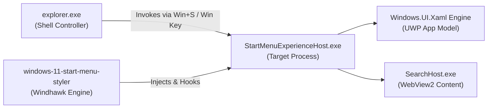

---
layout: wiki
title: "Wiki: Start Menu Styler"
---

# Wiki: Windows 11 Start Menu Styler

Comprehensive development and styling guide for the **Windows 11 Start Menu Styler** mod (`windows-11-start-menu-styler`), covering architecture, visual tree hierarchy, token systems, and companion integrations.

---

## 1. Mod Overview & Process Host Architecture

| Specification Attribute | Detail | Technical Notes |
|---|---|---|
| **Mod ID** | `windows-11-start-menu-styler` | Official Windhawk repository mod |
| **Target Process** | `StartMenuExperienceHost.exe` | Isolated UWP app package hosting the Start flyout |
| **Secondary Process** | `SearchHost.exe` / `SearchApp.exe` | Handles search input suggestions and WebView2 web views |
| **XAML Framework** | `Windows.UI.Xaml` | Standard UWP runtime (WinUI 2.8+ primitives) |
| **Windhawk Mod Floor** | `v1.7+` | Direct `WindhawkBlur` composition support introduced in v1.2+ |
| **Live Reload Capability** | Supported | Configuration changes apply dynamically without restarting the host |



---

## 2. Detailed Wiki Subsections

For in-depth reference documentation, consult the dedicated subcategories:

* 🎯 **[Visual Tree Element Targets](targets/elements.md)**: Exhaustive catalog of every verified root frame, search header, pinned grid, recommendations, bottom navigation pane, and Phone Link companion target.
* ⚙️ **[Configuration Schema & Token Directives](configurations/schema.md)**: Complete specification of YAML top-level keys (`styleConstants`, `themeResourceVariables`, `controlStyles`, `webContentStyles`), property operators, and XAML material definitions.

---

## 3. High-Level Hierarchy & Key Control Anchors

Understanding the structural hierarchy of `StartMenuExperienceHost.exe` is essential for crafting stable themes:

1. **Root Dismiss & Framing**:
   * `Border#DropShadowDismissTarget`: The outermost window host. Setting `Shadow:=` collapses the system dark silhouette, while `Background:=$Background` and `CornerRadius=$CardRadius` establish the unified floating glass panel.
   * `Border#AcrylicBorder`: The default system acrylic plate. Must be set to `Background:=Transparent` and `BorderThickness=0` when custom blur is applied to avoid opaque visual collisions.
2. **Two-Tone Acrylic Splitting**:
   * Windows 11 features a split background where the lower section (`Border#AcrylicOverlay`) has a darker tint. For a seamless single-panel aesthetic, this overlay can be collapsed (`Visibility=Collapsed`).
3. **Embedded Search Pill**:
   * Handled by `StartMenu.SearchBoxToggleButton`. Can be styled as a floating glass pill (`$ChipRadius`) with top-lit rim lighting and subtle hover illumination.
4. **Phone Link Companion Expansion**:
   * `StartDocked.StartMenuCompanion#RightCompanion > Grid#CompanionRoot`: Expanding cards docked to the right of the Start Menu. Asymmetric corner radii (`0,35,35,0`) allow it to join seamlessly with the main panel.

---

## 4. Key Recipes: Applying Frosted Glass Styling

Here is an architectural example demonstrating how to configure frosted glass foundations:

```yaml
styleConstants:
  - Frosted=<WindhawkBlur BlurAmount="20" TintColor="{ThemeResource SystemChromeMediumColor}" TintOpacity="0.7" />
  - Background=$Frosted
  - BorderBrush=<LinearGradientBrush StartPoint="0,0" EndPoint="0,1"><GradientStop Color="#60808080" Offset="0.0" /><GradientStop Color="#50404040" Offset="0.25" /><GradientStop Color="#40808080" Offset="1" /></LinearGradientBrush>
  - BorderThickness=0.3,1,0.3,1
  - CardRadius=15

controlStyles:
  # Collapse native drop shadow and inject frosted glass
  - target: Border#DropShadowDismissTarget
    styles:
      - Background:=$Background
      - BorderBrush:=$BorderBrush
      - BorderThickness=$BorderThickness
      - CornerRadius=$CardRadius
      - Margin=0
      - Padding=0

  # Collapse secondary system shadow layers
  - target: Border#StartDropShadow, Border#RightCompanionDropShadow, Border#RootGridDropShadow
    styles:
      - Visibility=Collapsed

  # Clear default system acrylic plate to prevent double-blurring
  - target: Border#AcrylicBorder, Grid#MainMenu > Border#AcrylicBorder
    styles:
      - Background:=Transparent
      - BorderBrush:=Transparent
      - BorderThickness=0

  # Eliminate two-tone split overlay
  - target: Border#AcrylicOverlay
    styles:
      - Visibility=Collapsed
```

---

## 5. Companion Mod Integration

* **Shell Flyout Positions (`shell-flyout-positions`)**: Regulates the vertical offset (`offsetY: 12`) and alignment of the Start Menu window above the taskbar.
* **Start Button Colorizer (`start-button-colorizer`)**: Synchronizes the taskbar Start icon glyph with the Windows system accent color.
