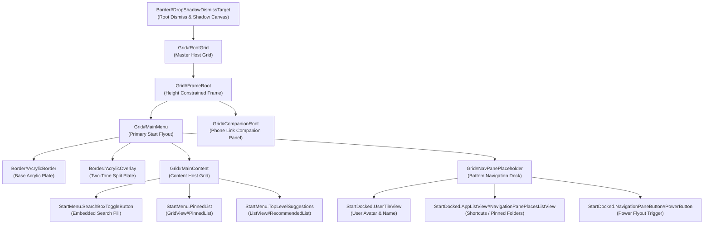

# Start Menu Visual Tree Element Targets

Complete technical reference and living catalog of verified XAML visual tree element names, types, control hierarchies, and visual state behaviors in `StartMenuExperienceHost.exe` (Windows 11 Start Menu).

---

## Architecture & Visual Tree Topology

The Windows 11 Start Menu runs as an isolated UWP app package hosted by `StartMenuExperienceHost.exe`. Its visual tree uses the standard UWP `Windows.UI.Xaml` framework, with secondary integration into `SearchHost.exe` / `SearchApp.exe` for embedded search flyouts and WebView2 edge content.

---

## 1. Root & Master Framing Targets

The outermost visual tree controls manage window bounds and shell drop-shadow generation.

| Element Selector | Class Type | Verified Builds | Behavior & Styling Notes |
|---|---|---|---|
| `Border#DropShadowDismissTarget` | `Windows.UI.Xaml.Controls.Border` | Win11 21H2 – 24H2 | Root drop-shadow and dismiss host. Setting `Shadow:=`, `BorderThickness=0.3,1,0.3,1`, `Background:=$Background`, and `CornerRadius=$CardRadius` applies unified glass styling and collapses the native dark halo. |
| `Border#StartDropShadow`, `Border#RightCompanionDropShadow`, `Border#RootGridDropShadow`, `Border#dropshadow` | `Windows.UI.Xaml.Controls.Border` | Win11 21H2 – 24H2 | Native system drop-shadow borders. Typically set to `Visibility=Collapsed` in custom themes to eliminate opaque black silhouettes behind transparent glass. |
| `Border#LayerBorder`, `Border#AccentLayerBorder`, `Border#AccentAppBorder` | `Windows.UI.Xaml.Controls.Border` | Win11 22H2 – 24H2 | Internal accent highlighting layers. Collapsed (`Visibility=Collapsed`) to eliminate unwanted solid color bars. |
| `Border#AcrylicBorder`, `Grid#MainMenu > Border#AcrylicBorder`, `Grid#CompanionRoot > Border#AcrylicBorder` | `Windows.UI.Xaml.Controls.Border` | Win11 21H2 – 24H2 | Default system acrylic background plate. When using `WindhawkBlur` on `DropShadowDismissTarget`, set this element to `Background:=Transparent`, `BorderBrush:=Transparent`, and `BorderThickness=0` to prevent opaque double-acrylic stacking. |
| `Border#AcrylicOverlay` | `Windows.UI.Xaml.Controls.Border` | Win11 21H2 – 24H2 | Two-tone navigation split overlay card that covers the bottom third of the Start Menu. Set to `Visibility=Collapsed` or `Background:=Transparent` for a seamless single-pane glass surface. |
| `Grid#FrameRoot` | `Windows.UI.Xaml.Controls.Grid` | Win11 21H2 – 24H2 | Top layout container enforcing maximum flyout dimensions. Property `MaxHeight=790` (or similar) ensures vertical bounds align cleanly on small displays. |
| `Grid#MainMenu` | `Windows.UI.Xaml.Controls.Grid` | Win11 21H2 – 24H2 | Main content column container. `MaxWidth=470` constrains the primary Start area when companion cards (Phone Link) expand to the right. |
| `Grid#MainContent` | `Windows.UI.Xaml.Controls.Grid` | Win11 21H2 – 24H2 | Houses search, pinned grid, and recommendations. Standard layout assignment: `Grid.Row=0`, `MinHeight=Auto`. |
| `Windows.UI.Xaml.Controls.Primitives.ScrollBar` | `ScrollBar` | Win11 21H2 – 24H2 | Root scrollbar elements. Collapsing (`Visibility=Collapsed`) hides intrusive vertical scrollbars during flyout animations. |

---

## 2. Embedded Search Bar Targets

The search box at the top of the Start Menu acts as an interactive button that triggers the full Windows Search experience or embeds an inline `AutoSuggestBox`.

| Element Selector | Class Type | Verified Builds | Behavior & Styling Notes |
|---|---|---|---|
| `StartMenu.SearchBoxToggleButton` | Custom Toggle Control | Win11 22H2 – 24H2 | Top search entry pill. Standard geometry: `Width=285`, `Height=34`, `HorizontalAlignment=Left`, `Margin=35,0,0,0`, `Background:=Transparent`, `BorderThickness=0`. |
| `StartMenu.SearchBoxToggleButton > Grid@CommonStates > Border#BorderElement` | `Windows.UI.Xaml.Controls.Border` | Win11 22H2 – 24H2 | Search pill background plate. Accepts `Background:=$ElementBackground`, `BorderBrush:=$BorderBrush`, `CornerRadius=$ChipRadius`, and interactive `@PointerOver` state overrides. |
| `StartMenu.SearchBoxToggleButton > Grid > Grid#UnderlineContainer` | `Windows.UI.Xaml.Controls.Grid` | Win11 22H2 – 24H2 | Native bottom accent focus underline. Set to `Visibility=Collapsed` for a clean pill aesthetic. |
| `StartMenu.SearchBoxToggleButton > Grid > FontIcon#SearchGlyph` | `Windows.UI.Xaml.Controls.FontIcon` | Win11 22H2 – 24H2 | Magnifying glass icon. Styled via `FontSize=13`, `Margin=12,0,8,0`, `VerticalAlignment=Center`. |
| `StartMenu.SearchBoxToggleButton > Grid > ContentPresenter > TextBlock#PlaceholderText` | `Windows.UI.Xaml.Controls.TextBlock` | Win11 22H2 – 24H2 | "Type here to search" placeholder label. Styled with `FontSize=11`, `VerticalAlignment=Center`. |
| `AutoSuggestBox#SearchBox` | `Windows.UI.Xaml.Controls.AutoSuggestBox` | Win11 21H2 | Legacy search input element on 21H2 builds. |
| `Border#SearchBoxBorder` | `Windows.UI.Xaml.Controls.Border` | Win11 21H2 | Legacy background plate on 21H2. |
| `TextBox#SearchTextBox` | `Windows.UI.Xaml.Controls.TextBox` | Win11 21H2 | Legacy input text box. |

---

## 3. Pinned Applications & Items Grid

Controls rendering pinned app shortcuts, grid dimensions, and item hover cards.

| Element Selector | Class Type | Verified Builds | Behavior & Styling Notes |
|---|---|---|---|
| `StartMenu.PinnedList` | Custom Items Control | Win11 22H2 – 24H2 | Container for pinned apps. Supports dynamic height binding using Windhawk state capture: `ActualHeight=>pinnedListHeight`, `Margin=-23,20,-7,150`, `MaxWidth=410`, `MinHeight=115`. |
| `StartMenu.PinnedList > Grid#Root > GridView#PinnedList > Border` | `Windows.UI.Xaml.Controls.Border` | Win11 22H2 – 24H2 | Background card wrapping the pinned icons grid. Accepts `Background:=$ElementBackground`, `BorderBrush:=$BorderBrush`, `CornerRadius=$CardRadius`, `Padding=22,10,22,10`. |
| `GridView#PinnedList` | `Windows.UI.Xaml.Controls.GridView` | Win11 21H2 – 24H2 | Primary grid view hosting pinned application icons. Center-aligned via `HorizontalAlignment=Center`. |
| `GridViewItem` | `Windows.UI.Xaml.Controls.GridViewItem` | Win11 21H2 – 24H2 | Item wrapper for individual pinned apps. |
| `TextBlock#PinnedListHeaderText` | `Windows.UI.Xaml.Controls.TextBlock` | Win11 21H2 – 24H2 | "Pinned" section header text. Set to `Text=""` to eliminate header clutter. |
| `StartMenu.CategoryControl` | Custom Control | Win11 24H2 | Category grouping control on new 24H2 grid layouts. Styled via `Margin=15,0,-15,0`. |
| `StartMenu.CategoryControl > Grid#RootGrid > Border` | `Windows.UI.Xaml.Controls.Border` | Win11 24H2 | Outer card border for category groups. Styled with `Background:=$ElementBackground`, `CornerRadius=$CardRadius`. |

---

## 4. Recommendations & Recent Files

Controls managing recent documents, recommended apps, and expander toggles.

| Element Selector | Class Type | Verified Builds | Behavior & Styling Notes |
|---|---|---|---|
| `Windows.UI.Xaml.Controls.GridView#RecommendedList` | `GridView` | Win11 21H2 – 24H2 | Recommended items list. In minimal layouts, collapse with `Visibility=Collapsed`. |
| `Grid#TopLevelSuggestionsRoot` | `Windows.UI.Xaml.Controls.Grid` | Win11 22H2 – 24H2 | Container hosting suggestion items. Layout: `Grid.Row=1`. |
| `Grid#ShowMoreSuggestions` | `Windows.UI.Xaml.Controls.Grid` | Win11 22H2 – 24H2 | Expander container. Supports reactive visibility binding: `Visibility={{showMoreSuggestionsVisible}}`. |
| `Button#ShowMoreSuggestionsButton` | `Windows.UI.Xaml.Controls.Button` | Win11 22H2 – 24H2 | "More" chevron button. Styled with `Margin=0,-77,335,0`, `Height=32`, and custom corner rounding. |
| `Button#ShowMoreSuggestionsButton > Windows.UI.Xaml.Controls.Grid@CommonStates` | `Windows.UI.Xaml.Controls.Grid` | Win11 22H2 – 24H2 | Interactive state border: `BorderBrush:=$RecommendedBorderBrush`, `BorderThickness=2,2,0,2`, `CornerRadius=15,0,0,15`. |
| `Button#HideMoreSuggestionsButton` | `Windows.UI.Xaml.Controls.Button` | Win11 22H2 – 24H2 | Back chevron button when recommendations are expanded. `Margin=33,30,0,0`, `Height=32`, `Width=32`, `CornerRadius=6`. |
| `Microsoft.UI.Xaml.Controls.DropDownButton` | WinUI DropDownButton | Win11 23H2 – 24H2 | Category drop-down button in recommendations header. Styled with `RenderTransform:=<TranslateTransform X="-235" Y="{{-224 - pinnedListHeight}}" />`. |

---

## 5. All Apps List & Alphabetical Navigation

Controls rendering the full list of installed programs.

| Element Selector | Class Type | Verified Builds | Behavior & Styling Notes |
|---|---|---|---|
| `Windows.UI.Xaml.Controls.Grid#AllAppsRoot` | `Grid` | Win11 21H2 – 24H2 | Root container for the full installed applications list. `Margin=0`. |
| `Grid#TopLevelHeader > Grid > Button[AutomationProperties.Name=Show all]` | `Button` | Win11 22H2 – 24H2 | "All apps" header pill button. Styled with `Width=85`, `Height=32`, `CornerRadius=0,15,15,0`, `Background@Normal:=$ElementBackground`. |
| `Windows.UI.Xaml.Controls.GridView#AllAppsGrid > Border > ScrollViewer > Border > Grid > ScrollContentPresenter > ItemsPresenter > ItemsWrapGrid` | `ItemsWrapGrid` | Win11 21H2 – 24H2 | Inner wrap grid layout for installed apps. Positioned with `Margin=45,-180,45,0`. |
| `TextBlock#AllListHeadingText` | `Windows.UI.Xaml.Controls.TextBlock` | Win11 21H2 – 24H2 | "All apps" section header label. Styled with `Margin=63,-184,12,0`, or set `Text=""` to hide. |
| `TextBlock#ZoomedOutHeading` | `Windows.UI.Xaml.Controls.TextBlock` | Win11 21H2 – 24H2 | Zoomed-out alphabet jump list heading. Collapsed via `Visibility=Collapsed`. |

---

## 6. Bottom Navigation Pane & Power Controls

The bottom navigation strip hosting the user avatar, folder shortcuts, and the power flyout button.

| Element Selector | Class Type | Verified Builds | Behavior & Styling Notes |
|---|---|---|---|
| `Grid#NavPanePlaceholder` | `Windows.UI.Xaml.Controls.Grid` | Win11 21H2 – 24H2 | Bottom navigation row placeholder. Constrained via `MaxHeight=60`. |
| `StartDocked.NavigationPaneView > Grid#RootPanel` | `Windows.UI.Xaml.Controls.Grid` | Win11 22H2 – 24H2 | Navigation pane layout root. Set to `Background:=Transparent`, `BorderBrush:=Transparent` to eliminate the dark bottom bar. |
| `StartDocked.UserTileView` | Custom Control | Win11 21H2 – 24H2 | User account avatar and username host. Constrained via `Height=32`. |
| `StartDocked.NavigationPaneButton#UserTileButton > Grid > Border#BackgroundBorder` | `Border` | Win11 21H2 – 24H2 | Avatar card pill background: `Background:=$ElementBackground`, `BorderBrush:=$BorderBrush`, `CornerRadius=$ChipRadius`. |
| `Grid#UserTileIcon` | `Windows.UI.Xaml.Controls.Grid` | Win11 21H2 – 24H2 | Circular user avatar container. Sized via `Height=24`, `Width=24`. |
| `TextBlock#UserTileNameText` | `Windows.UI.Xaml.Controls.TextBlock` | Win11 21H2 – 24H2 | Display name label. Styled via `FontSize=12`. |
| `StartDocked.AppListView#NavigationPanePlacesListView` | `AppListView` | Win11 21H2 – 24H2 | Pinned folder shortcut icons (Settings, File Explorer, Downloads, etc.). `Height=32`, `Margin=0,0,8,0`. |
| `StartDocked.AppListView#NavigationPanePlacesListView > Border` | `Border` | Win11 21H2 – 24H2 | Background card wrapping folder shortcuts. `CornerRadius=6`, `Background:=$ElementBackground`. |
| `StartDocked.PowerOptionsView` | Custom Control | Win11 21H2 – 24H2 | Power menu button container. `Height=32`. |
| `StartDocked.NavigationPaneButton#PowerButton` | `NavigationPaneButton` | Win11 21H2 – 24H2 | Power options trigger button. `Height=32`, `Width=32`, `CornerRadius=$ChipRadius`. |
| `StartDocked.NavigationPaneButton#PowerButton > Grid@CommonStates > Border#BackgroundBorder` | `Border` | Win11 21H2 – 24H2 | Power button interactive background card: `Background:=$ElementBackground`, `BorderBrush:=$BorderBrush`, `BorderThickness=$BorderThickness`. |
| `StartDocked.NavigationPaneButton#PowerButton > Grid > ContentPresenter > Grid > FontIcon` | `FontIcon` | Win11 21H2 – 24H2 | Power icon glyph. Sized via `FontSize=14`. |

---

## 7. Phone Link Companion Panel Targets

Windows 11 builds 23H2+ and 24H2 introduce a side companion panel docked to the right of the Start Menu displaying phone battery, recent photos, and messages.

| Element Selector | Class Type | Verified Builds | Behavior & Styling Notes |
|---|---|---|---|
| `StartDocked.StartMenuCompanion#RightCompanion > Grid#CompanionRoot`, `StartMenu.StartMenuCompanion#RightCompanion > Grid#CompanionRoot` | `Grid` | Win11 23H2 – 24H2 | Companion root card docked to Start. Styled with asymmetric corner rounding: `CornerRadius=0,35,35,0`, `Margin=-20,0,20,0`, `Padding=0`. |
| `ToggleButton#ShowHideCompanion` | `ToggleButton` | Win11 23H2 – 24H2 | Toggle button in header to collapse or expand the companion card. `Height=34`, `Width=42`, `CornerRadius=$ChipRadius`. |
| `ToggleButton#ShowHideCompanion > Border` | `Border` | Win11 23H2 – 24H2 | Interactive state background plate for the companion toggle: `Background:=$ElementBackground`, `Background@PointerOver:=$OverlayColor`, `Background@Pressed:=$OverlayColor`. |
| `ContentPresenter#PrimaryCardContainer` | `ContentPresenter` | Win11 23H2 – 24H2 | Container hosting Adaptive Cards for phone telemetry and messages. `Margin=4,12,8,12`. |
| `AdaptiveCards.Rendering.Uwp.WholeItemsPanel > Grid > Border > AdaptiveCards.Rendering.Uwp.WholeItemsPanel > Grid > ListView > Border` | `Border` | Win11 23H2 – 24H2 | Individual phone item cards. Styled with `Background:=$ElementBackground`, `BorderBrush:=$BorderBrush`, `CornerRadius=$CardRadius`. |
| `Grid#ActionsBar` | `Grid` | Win11 23H2 – 24H2 | Bottom quick actions bar within the companion panel. `Height=38`, `VerticalAlignment=Bottom`, `Margin=14,0,14,12`, `Background:=$ElementBackground`, `CornerRadius=$CardRadius`. |
| `Grid#ActionsBar > Button` | `Button` | Win11 23H2 – 24H2 | Action buttons inside companion bar. `Height=32`, `Width=40`, `Background:=Transparent`, `BorderThickness=0`. |

---

## 8. Folder Modals, Popups & Flyouts

Popups and flyout menus triggered within the Start Menu experience.

| Element Selector | Class Type | Verified Builds | Behavior & Styling Notes |
|---|---|---|---|
| `StartMenu.FolderModal#StartFolderModal > Grid#Root` | `Grid` | Win11 22H2 – 24H2 | Expanded app folder popup modal. Sized via `MaxHeight=420`, `MaxWidth=420`, `Height=Auto`, `Width=Auto`. |
| `StartMenu.UniversalTileContainer#UniversalTileContainer > Grid#GridViewContainer` | `Grid` | Win11 22H2 – 24H2 | Grid container inside folder modals. `Width=360`, `Height=Auto`. |
| `FlyoutPresenter > Border#BackgroundElement`, `FlyoutPresenter > Border` | `Border` | Win11 21H2 – 24H2 | Context popup flyout background card. Sized with `Background:=$Background`, `BorderBrush:=$BorderBrush`, `CornerRadius=$ChipRadius`, `Padding=-1`. |
| `MenuFlyoutPresenter > Border#BackgroundElement`, `MenuFlyoutPresenter > Border` | `Border` | Win11 21H2 – 24H2 | Context menu flyout container. Styled with `Background:=$Background`, `BorderBrush:=$BorderBrush`, `CornerRadius=$ChipRadius`. |
| `MenuFlyoutItem`, `ToggleMenuFlyoutItem` | Menu Items | Win11 21H2 – 24H2 | Individual context menu item rows. Styled with `CornerRadius=$ChipRadius`, `Margin=4,0,4,0`. |
| `ToolTip > ContentPresenter#LayoutRoot` | `ContentPresenter` | Win11 21H2 – 24H2 | Tooltip popup pill. Styled with `Background:=$Background`, `BorderBrush:=$BorderBrush`, `CornerRadius=$ChipRadius`. |
| `Border#BackgroundBorder, Grid#LayoutRoot` | `Border`, `Grid` | Win11 21H2 – 24H2 | Fluid hover transitions: `BackgroundTransition:=<BrushTransition Duration="0:0:0.083" />`. |
