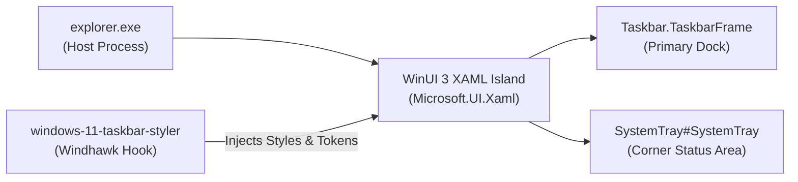

---
layout: wiki
title: "Wiki: Taskbar Styler"
---

# Wiki: Windows 11 Taskbar Styler

Comprehensive development and styling guide for the **Windows 11 Taskbar Styler** mod (`windows-11-taskbar-styler`) and integrated companion desktop enhancements.

---

## 1. Mod Overview & Architecture

| Specification Attribute | Detail | Technical Notes |
|---|---|---|
| **Mod ID** | `windows-11-taskbar-styler` | Official Windhawk repository mod |
| **Target Process** | `explorer.exe` | Main Windows shell process hosting the taskbar |
| **XAML Framework** | `Microsoft.UI.Xaml` | Modern WinUI 3 XAML island runtime |
| **Windhawk Mod Floor** | `v1.10+` | DirectComposition glass and visual state injection |
| **Live Reload Capability** | Supported | Direct updates apply live to the active shell |



---

## 2. Detailed Wiki Subsections

For exhaustive technical reference documentation, explore the dedicated subcategories:

* 🎯 **[Visual Tree Element Targets](targets/elements.md)**: Exhaustive catalog of every verified taskbar dock frame, task list button panel, active indicator pill, search box, system tray element, and snap assist flyout.
* ⚙️ **[Configuration Schema & Token Directives](configurations/schema.md)**: Complete specification of YAML top-level keys (`styleConstants`, `themeResourceVariables`, `controlStyles`, `clickThroughTaskbar`), property operators, and XAML material definitions.
* 🧩 **[Companion Mods & Settings Guide](companions/settings.md)**: Complete settings matrices for Taskbar Clock Customization, Taskbar Tray and Icon Tweaks, Dynamic Island for Windows, and Start Button Colorizer.

---

## 3. High-Level Hierarchy & Key Control Anchors

1. **Floating Dock Construction**:
   * `Taskbar.TaskbarFrame > Grid#RootGrid > Taskbar.TaskbarBackground > Grid`: Applying `Margin=8,4,8,4` and `CornerRadius=$CornerRadiusAlt1` detaches the taskbar from the display edges, transforming it into a floating dock.
   * `Rectangle#BackgroundFill` and `Rectangle#BackgroundStroke`: The native solid color fill and top border stroke. Both must be collapsed (`Visibility=Collapsed` or `1`) to reveal the custom frosted blur foundation underneath.
2. **App Button Visual State Matrix**:
   * Running apps are represented by `Taskbar.TaskListButtonPanel`. The `@CommonStates` visual state group can be targeted to deliver custom state lighting across `ActiveNormal`, `ActivePointerOver`, `ActivePressed`, `InactiveNormal`, `InactivePointerOver`, and `MultiWindow` variants.
3. **Corner System Tray & Clock**:
   * `StackPanel#SystemTrayFrameGrid`: Can be sized and centered vertically to align with a floating dock.
   * `Button#ShowDesktopButton`: The 1px edge strip can be collapsed or compressed to prevent accidental desktop reveals.

---

## 4. Key Recipes: Applying Floating Dock Glass

```yaml
styleConstants:
  - Frosted=<WindhawkBlur BlurAmount="20" TintColor="{ThemeResource SystemChromeMediumColor}" TintOpacity="0.7" />
  - Background=$Frosted
  - BorderBrush=<LinearGradientBrush StartPoint="0,0" EndPoint="0,1"><GradientStop Color="#60808080" Offset="0.0" /><GradientStop Color="#50404040" Offset="0.25" /><GradientStop Color="#40808080" Offset="1" /></LinearGradientBrush>
  - BorderThickness=0.3,1,0.3,1
  - CornerRadiusAlt1=20

controlStyles:
  # Floating taskbar dock background card
  - target: Taskbar.TaskbarFrame > Grid#RootGrid > Taskbar.TaskbarBackground > Grid, Taskbar.TaskbarBackground > Grid
    styles:
      - Margin=8,4,8,4
      - Background:=$Background
      - BorderBrush:=$BorderBrush
      - BorderThickness=$BorderThickness
      - CornerRadius=$CornerRadiusAlt1

  # Collapse native solid color fill and top stroke
  - target: Taskbar.TaskbarFrame > Grid#RootGrid > Taskbar.TaskbarBackground > Grid > Rectangle#BackgroundFill
    styles:
      - Visibility=1
  - target: Rectangle#BackgroundStroke
    styles:
      - Visibility=1
```
