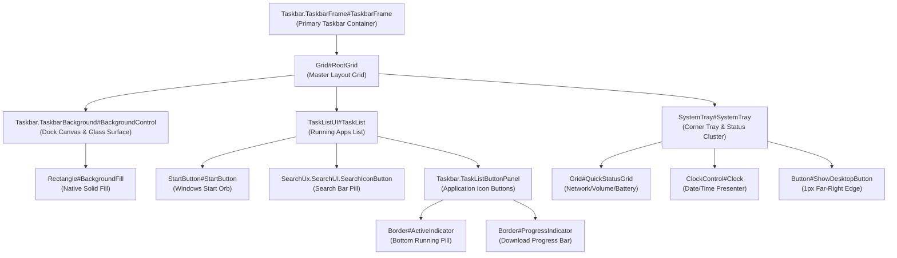

---
layout: wiki
title: "Wiki: Taskbar Element Targets"
---

# Taskbar Visual Tree Element Targets

Complete technical reference and living catalog of verified WinUI 3 XAML visual tree element names, types, control hierarchies, and visual state behaviors in `explorer.exe` (Windows 11 Taskbar).

---

## Architecture & Visual Tree Topology

The Windows 11 Taskbar is implemented as a modern WinUI 3 XAML island running directly within `explorer.exe`. It uses the `Microsoft.UI.Xaml` framework, featuring high-performance DirectComposition visual trees, advanced hardware-accelerated animations, and responsive adaptive layouts.

---

## 1. Root Taskbar Frame & Canvas Targets

Controls managing the overall dock boundaries, margins, corner rounding, and background glass surfaces.

| Element Selector | Class Type | Verified Builds | Behavior & Styling Notes |
|---|---|---|---|
| `Taskbar.TaskbarFrame > Grid#RootGrid > Taskbar.TaskbarBackground > Grid`, `Taskbar.TaskbarBackground > Grid`, `Taskbar.TaskbarBackground#BackgroundControl > Grid` | `Windows.UI.Xaml.Controls.Grid` | Win11 21H2 – 24H2 | Main background grid of the taskbar dock. Setting `Margin=8,4,8,4`, `Background:=$Background`, `BorderBrush:=$BorderBrush`, `BorderThickness=$BorderThickness`, and `CornerRadius=$CornerRadiusAlt1` creates the signature floating dock aesthetic. |
| `Taskbar.TaskbarFrame > Grid#RootGrid > Taskbar.TaskbarBackground > Grid > Rectangle#BackgroundFill`, `Taskbar.TaskbarBackground > Grid > Rectangle#BackgroundFill` | `Windows.UI.Xaml.Shapes.Rectangle` | Win11 21H2 – 24H2 | Native system taskbar solid fill rectangle. Set to `Visibility=Collapsed` (or `1`) to prevent opaque system colors from masking custom frosted glass. |
| `Rectangle#BackgroundStroke` | `Windows.UI.Xaml.Shapes.Rectangle` | Win11 21H2 – 24H2 | Native top border stroke line. Collapsed (`Visibility=Collapsed` or `1`) in custom themes to eliminate the harsh horizontal line. |
| `Taskbar.TaskbarBackground#HoverFlyoutBackgroundControl`, `Taskbar.TaskbarBackground#HoverFlyoutBackgroundControl > Grid` | `Windows.UI.Xaml.Controls.Grid` | Win11 22H2 – 24H2 | Flyout background host shown during hover animations. Set to `Background:=Transparent`, `BorderBrush:=Transparent`, `BorderThickness=0`. |
| `Taskbar.SecondaryTaskbarFrame#SecondaryTaskbarFrame` | `TaskbarFrame` | Win11 21H2 – 24H2 | Taskbar container rendered on secondary / external monitors. Inherits primary framing styles. |

---

## 2. Running Apps & Task List Buttons

Controls managing application icons, running state indicators, uncombined labels, and interactive mouse hover states.

| Element Selector | Class Type | Verified Builds | Behavior & Styling Notes |
|---|---|---|---|
| `Taskbar.TaskListButtonPanel@CommonStates > Grid > Border#BackgroundElement`, `Taskbar.TaskListButtonPanel@CommonStates > Border#BackgroundElement` | `Windows.UI.Xaml.Controls.Border` | Win11 21H2 – 24H2 | Application button card pill. Features multi-state visual overrides: `Background@ActiveNormal:=$Background`, `Background@ActivePointerOver:=$OverlayColor`, `Background@InactivePointerOver:=$OverlayColorAlt`, `Background@MultiWindowNormal:=$Background`, `CornerRadius=$CornerRadius`. |
| `Grid#IconPanel@CommonStates > Border#BackgroundElement`, `Taskbar.TaskListLabeledButtonPanel@CommonStates > Border#BackgroundElement` | `Windows.UI.Xaml.Controls.Border` | Win11 23H2 – 24H2 | Button background for uncombined / labeled taskbar items. Configured with explicit dimensions: `Width=$BaseWidth`, `Height=$BaseHeight`. |
| `Grid#IconPanel@RunningIndicatorStates > Rectangle#RunningIndicator`, `Taskbar.TaskListLabeledButtonPanel@RunningIndicatorStates > Rectangle#RunningIndicator` | `Windows.UI.Xaml.Shapes.Rectangle` | Win11 21H2 – 24H2 | Running app indicator pill. Configured via `RadiusX=1.5`, `RadiusY=1.5`, `Height=2.5`, `Width=10`, `Fill:=$OverlayColor`, `Fill@ActiveRunningIndicator:=$AccentColor`, `Width@ActiveRunningIndicator=18`, `VerticalAlignment=Bottom`. |
| `Microsoft.UI.Xaml.Controls.ProgressBar#ProgressIndicator` | `ProgressBar` | Win11 21H2 – 24H2 | Real-time file copy / download progress bar rendered across app buttons. Positioned via `Margin=0,0,0,1`. |
| `Windows.UI.Xaml.Shapes.Rectangle#ProgressBarTrack` | `Rectangle` | Win11 21H2 – 24H2 | Progress bar inactive track: `Fill:=$OverlayColor`, `RadiusX=1.5`, `RadiusY=1.5`. |
| `Windows.UI.Xaml.Shapes.Rectangle#DeterminateProgressBarIndicator` | `Rectangle` | Win11 21H2 – 24H2 | Active progress bar fill: `Fill:=$AccentColor`. |
| `Taskbar.Badge#BadgeControl` | `Badge` | Win11 22H2 – 24H2 | Notification badge count bubble on taskbar icons. `Height=14`, `MinWidth=14`, `CornerRadius=$CornerRadiusAlt1`. |
| `TextBlock#TaskbarButtonLabel` | `Windows.UI.Xaml.Controls.TextBlock` | Win11 23H2 – 24H2 | Text label for uncombined taskbar buttons. |

---

## 3. Start Button & Search Box Targets

Controls rendering the Windows Start orb and embedded taskbar search inputs.

| Element Selector | Class Type | Verified Builds | Behavior & Styling Notes |
|---|---|---|---|
| `Taskbar.ExperienceToggleButton#LaunchListButton[AutomationProperties.AutomationId=StartButton]` | `ExperienceToggleButton` | Win11 21H2 – 24H2 | Windows Start orb button wrapper. Centered via `VerticalAlignment=Center`, `Margin=2,0,2,0`. |
| `Taskbar.ExperienceToggleButton#LaunchListButton[AutomationProperties.AutomationId=StartButton] > Taskbar.TaskListButtonPanel > Grid > AnimatedVisualPlayer#Icon` | `AnimatedVisualPlayer` | Win11 21H2 – 24H2 | Windows logo animated Lottie player. Scaled via `RenderTransform:=<ScaleTransform ScaleX="0.8" ScaleY="0.8" />`, `Width=18`, `Height=18`. |
| `SearchUx.SearchUI.SearchIconButton > SearchUx.SearchUI.SearchButtonRootGrid#SearchBoxButtonRootPanel` | `Grid` | Win11 22H2 – 24H2 | Search icon button container. Styled with `Background:=$Background`, `BorderBrush:=$BorderBrush`, `BorderThickness=$BorderThickness`, `CornerRadius=$CornerRadius`, `Width=$BaseWidth`, `Height=$BaseHeight`. |
| `SearchUx.SearchUI.SearchPillButton#SearchPill > SearchUx.SearchUI.SearchButtonRootGrid#SearchBoxButtonRootPanel` | `Grid` | Win11 22H2 – 24H2 | Expanded search pill bar. Sized with `MaxWidth=150`, `MaxHeight=$BaseHeight`, `CornerRadius=$CornerRadius`. |
| `SearchUx.SearchUI.SearchButtonRootGrid#SearchBoxButtonRootPanel > Grid > Border#SearchPillBackgroundElement` | `Border` | Win11 22H2 – 24H2 | Background card for the expanded search pill. Accepts `BorderBrush:=$BorderBrush`, `CornerRadius=$CornerRadius`, `BorderThickness=$BorderThickness`. |
| `Grid#DynamicSearchBoxGleamContainer` | `Grid` | Win11 22H2 – 24H2 | Dynamic search gleam illustrations (daily doodles). Collapsed via `Visibility=Collapsed` (or `1`) to keep search clean. |
| `Taskbar.AugmentedEntryPointButton#AugmentedEntryPointButton` | `Button` | Win11 23H2 – 24H2 | Copilot / Windows intelligence entry point button on the taskbar. Styled via `Margin=12,2,6,2`, `VerticalAlignment=Center`. |

---

## 4. System Tray, Clock & Corner Flyout Triggers

Controls organizing the notification area, quick status pill (network/volume/battery), and clock presenter.

| Element Selector | Class Type | Verified Builds | Behavior & Styling Notes |
|---|---|---|---|
| `StackPanel#SystemTrayFrameGrid`, `Grid#SystemTrayFrameGrid` | `StackPanel`, `Grid` | Win11 21H2 – 24H2 | Main container for system tray icons and clock. Styled with `Height=$BaseHeight`, `Background:=Transparent`, `BorderThickness=0`, `VerticalAlignment=Center`, `Margin=0,0,4,0`. |
| `Grid#OverflowRootGrid > Border` | `Border` | Win11 21H2 – 24H2 | Hidden tray icons overflow chevron menu card: `Background:=$Background`, `BorderBrush:=$BorderBrush`, `CornerRadius=$CornerRadius`, `Padding=6`. |
| `SystemTray.DateTimeIconContent` | Custom Content | Win11 21H2 – 24H2 | Embedded date/time icon content. Configured via `FontSize=9`. |
| `TextBlock#DateInnerTextBlock` | `Windows.UI.Xaml.Controls.TextBlock` | Win11 21H2 – 24H2 | Secondary date string beneath the clock. Can be collapsed via `Visibility=Collapsed` (or `1`) for compact single-line clocks. |
| `Windows.UI.Xaml.Controls.Grid#VolumeConfirmator` | `Grid` | Win11 22H2 – 24H2 | Volume HUD confirmator toast popup: `Padding=8,0,3,0`, `CornerRadius=$CornerRadiusAlt1`. |
| `Windows.UI.Xaml.Controls.Grid#BrightnessConfirmator` | `Grid` | Win11 22H2 – 24H2 | Brightness HUD confirmator toast popup: `Padding=25,0,17,0`, `CornerRadius=$CornerRadiusAlt1`. |
| `Button#ShowDesktopButton` | `Button` | Win11 21H2 – 24H2 | Extreme right-hand 1px line that triggers Show Desktop. Can be collapsed via `Visibility=Collapsed`. |

---

## 5. Virtual Desktop & Snap Assist Controls

Flyouts and overlays triggered directly from the taskbar for window management.

| Element Selector | Class Type | Verified Builds | Behavior & Styling Notes |
|---|---|---|---|
| `Border#VirtualDesktopBarBackground` | `Border` | Win11 22H2 – 24H2 | Virtual desktop switcher bar background card: `Background:=$Background`, `BorderBrush:=$BorderBrush`, `CornerRadius=$CornerRadius`. |
| `WindowsInternal.ComposableShell.Experiences.Switcher.VirtualDesktopElementThemed` | Custom Element | Win11 22H2 – 24H2 | Individual desktop preview thumbnail card: `CornerRadius=$CornerRadius`. |
| `SnapLayout.SnapLayoutPickerControl`, `Windows.UI.Xaml.Controls.Border#SnapPickerBorder` | `SnapLayoutPickerControl`, `Border` | Win11 22H2 – 24H2 | Snap Assist flyout popup card: `Background:=$Background`, `BorderBrush:=$BorderBrush`, `CornerRadius=$CornerRadius`. |
| `SnapLayout.SnapLayoutControl@CommonStates > Windows.UI.Xaml.Controls.Border#LayoutBorder` | `Border` | Win11 22H2 – 24H2 | Interactive snap zone preview: `Background@PointerOver:=$AccentColor`, `Background@Pressed:=$OverlayColor`. |
