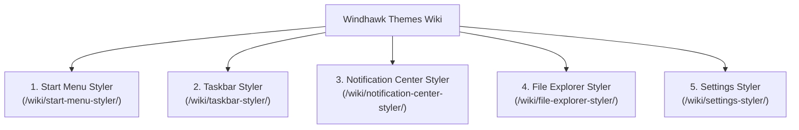

# Windhawk Styler Wiki: Targets & Configuration Options

Welcome to the **Windhawk Themes Community Wiki**. This living knowledge base is dedicated to cataloging every verified visual tree element target, dependency property, control hierarchy, and configuration directive across Windows 11 shell surfaces supported by Windhawk stylers.

> [!TIP]
> **Open for Community Contributions**:  
> As Windows 11 updates modify internal XAML templates and control namespaces, contributors can directly add or refine element selectors, visual states, and property behaviors. Each primary category in this wiki corresponds to one of the five base styler mods, and includes integrated companion mod settings where appropriate.

---

## 📚 Primary Wiki Categories

### 1. Start Menu Styler (`wiki/start-menu-styler/`)
* **[Start Menu Styler Overview & Targets](start-menu-styler/README.md)**: Mod specifications, top-level keys (`webContentStyles`), root frames, two-tone overlays, pinned grids, All Apps lists, and integrated flyout positioning.

### 2. Taskbar Styler (`wiki/taskbar-styler/`)
* **[Taskbar Styler Overview & Targets](taskbar-styler/README.md)**: WinUI 3 taskbar frames, task list button panels, active indicators, system tray components, clock presenters, and integrated companion settings (Taskbar Clock Customization, Tray Tweaks, Grid Spacing, Height & Icon Size).

### 3. Notification Center Styler (`wiki/notification-center-styler/`)
* **[Notification Center Styler Overview & Targets](notification-center-styler/README.md)**: `ShellHost.exe` / `ShellExperienceHost.exe` Quick Settings flyouts, quick action tiles, brightness/volume sliders, media controls, calendar day items, toast popups, and jump lists.

### 4. File Explorer Styler (`wiki/file-explorer-styler/`)
* **[File Explorer Styler Overview & Targets](file-explorer-styler/README.md)**: WinUI 3 tab controls, address bar, breadcrumbs, search box, command bar buttons, whole-window DWM backdrop effects (`backgroundTranslucentEffect`), and classic Win32 DirectUI boundary rules.

### 5. Settings Styler (`wiki/settings-styler/`)
* **[Settings Styler Overview & Targets](settings-styler/README.md)**: `SystemSettings.exe` navigation split view, setting cards, expander groups, hero banners, and search auto-suggest boxes.

---

## 🛠️ Inspection & Tooling References
* **[UWPSpy Manual Inspection Guide](../UWPSpy.md)**: Interactive GUI visual tree inspection for human designers.
* **[Hybrid C++/Python Toolchain Guide](../Toolchain.md)**: UI automation and structured JSON visual tree dumping for AI vibe coding.
* **[Target Evidence Protocol](../Evidence-Protocol.md)**: Sourced selector standards and verification tiers.
