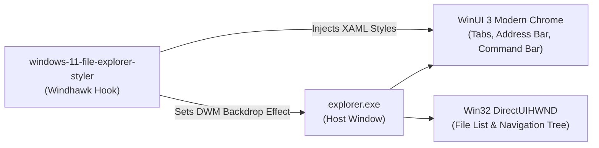

# Wiki: Windows 11 File Explorer Styler

Comprehensive development and styling guide for the **Windows 11 File Explorer Styler** mod (`windows-11-file-explorer-styler`), WinUI 3 tab controls, address bar, command bar, and whole-window DWM backdrops.

---

## 1. Mod Overview & Architecture

| Specification Attribute | Detail | Technical Notes |
|---|---|---|
| **Mod ID** | `windows-11-file-explorer-styler` | Official Windhawk repository mod |
| **Target Process** | `explorer.exe` | Windows Explorer process hosting File Explorer windows (`CabinetWClass`) |
| **XAML Framework** | `Microsoft.UI.Xaml` | Modern WinUI 3 runtime for top chrome |
| **Classic Shell Scope** | Win32 `DirectUIHWND` | Folder file list and tree view (styled via DWM attributes) |
| **Windhawk Mod Floor** | `v1.7+` | DirectComposition glass and whole-window DWM backdrop hooks |
| **Live Reload Capability** | Supported | Updates apply to newly opened or refreshed Explorer windows |



---

## 2. Detailed Wiki Subsections

For in-depth technical reference documentation, explore the dedicated subcategories:

* 🎯 **[Visual Tree Element Targets](targets/elements.md)**: Exhaustive catalog of every verified tab strip, `TabViewItem` states, address bar, search box, command bar buttons, and details pane target.
* ⚙️ **[Configuration Schema & Token Directives](configurations/schema.md)**: Complete specification of YAML top-level keys, whole-window DWM blur modes (`backgroundTranslucentEffect`), and Win32 DirectUI boundary rules.
* 🧩 **[Companion Mods & Settings Guide](companions/settings.md)**: Complete settings guide for Enhanced Disk Usage, File Operations Styler, and Fully Customizable Winver.

---

## 3. High-Level Hierarchy & Key Control Anchors

1. **Whole-Window DWM Backdrop (`backgroundTranslucentEffect: acrylic`)**:
   * Bridges the gap between modern XAML chrome and classic Win32 file views. Applying `acrylic` makes the entire window canvas translucent.
2. **WinUI 3 Tab Control (`FileExplorerExtensions.FileExplorerTabControl`)**:
   * Houses the open folder tabs. Individual tabs (`TabViewItem`) feature visual states (`Normal`, `PointerOver`, `Selected`, `Pressed`) that can be styled into floating glass pills.
3. **Address Bar & Search Box**:
   * `Grid#FileExplorerAddressBarGrid` and `AutoSuggestBox#FileExplorerSearchBox` can be styled with frosted fills, subtle rim borders, and rounded corners (`CornerRadius=6`).
4. **Command Bar Toolbar (`CommandBar#FileExplorerCommandBar`)**:
   * Modern replacement for the classic ribbon containing Cut, Copy, Paste, Share, and Delete actions.

---

## 4. Key Recipes: Applying Translucent Glass to File Explorer

```yaml
# Enable whole-window Acrylic blur via DWM
backgroundTranslucentEffect: acrylic
backgroundTranslucentEffectRegion: ""
explorerFrameContainerHeight: 0

styleConstants:
  - Frosted=<WindhawkBlur BlurAmount="20" TintColor="{ThemeResource SystemChromeMediumColor}" TintOpacity="0.7" />
  - Background=$Frosted
  - BorderBrush=<LinearGradientBrush StartPoint="0,0" EndPoint="0,1"><GradientStop Color="#60808080" Offset="0.0" /><GradientStop Color="#50404040" Offset="0.25" /><GradientStop Color="#40808080" Offset="1" /></LinearGradientBrush>
  - BorderThickness=0.3,1,0.3,1

controlStyles:
  # Floating address bar pill
  - target: Grid#FileExplorerAddressBarGrid
    styles:
      - Background:=$Background
      - BorderBrush:=$BorderBrush
      - BorderThickness=$BorderThickness
      - CornerRadius=6

  # Search box pill
  - target: AutoSuggestBox#FileExplorerSearchBox > Grid#LayoutRoot > TextBox#TextBox
    styles:
      - Background:=$Background
      - BorderBrush:=$BorderBrush
      - BorderThickness=$BorderThickness
      - CornerRadius=6
```
